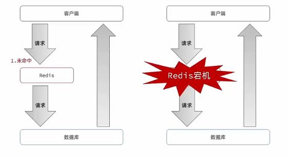
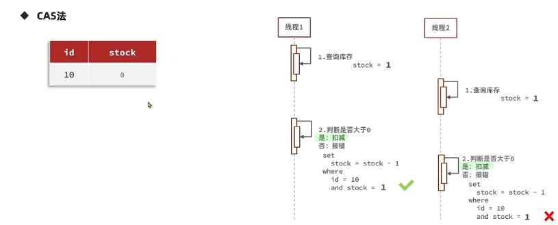

# REDIS

**REDIS---键值数据库**

## 一. 初识Redis

### 1. 认识NoSQL

非关系型数据库 vs 关系型数据库

|          |                             SQL                              |                            NoSQL                             |
| :------: | :----------------------------------------------------------: | :----------------------------------------------------------: |
| 数据结构 |                      结构化(Structured)                      |                           非结构化                           |
| 数据关联 |                      关联的(Relational)                      |                           无关联的                           |
| 查询方式 |                           SQL查询                            |                            非SQL                             |
| 事务特性 |                             ACID                             |                             BASE                             |
| 存储方式 |                             磁盘                             |                             内存                             |
|  扩展性  |                             垂直                             |                             水平                             |
| 使用场景 | (1) 数据结构固定;<br>(2) 相关业务对数据安全性, 一致性要求较高 | (1) 数据结构不固定; <br>(2) 对一致性, 安全性要求不高; <br>(3) 对性能要求高 |


## ２. 认识Redis

**Redis(Remote Dictionary Server)** --- 远程词典服务器, 基于内存的键值型NoSQL数据库

**特征:**

- 键值(key-value)型, value支持多种不同数据结构, 功能丰富
- 单线程, 每个命令具备原子性
- 低延迟, 速度快(基于内存, IO多路复用, 良好的编码)
- 支持数据持久化
- 支持主从集群, 分片集群
- 支持多语言客户端


## 3. 安装Redis


## 二. Redis常见命令


## 1. Redis通用命令

- KEYS: 查看符合模板的所有key, 不建议在生产环境设备上使用
- DEL: 删除指定的key, 可以批量删除
- EXISTS: 判断key是否存在
- EXPIRE: 给一个key设置有效期, 有效期到期时该key会自动被删除
- TTL: 查看一个key的剩余有效期, -2表示key已过期, -1表示key永久有效


## 2. Redis数据类型

### (1). String类型


**String的常见命令:**

- SET: 添加或者修改已经存在的一个String类型的键值对
- GET: 根据key获取String类型的value
- MSET: 批量添加多个String类型的键值对
- MGET: 根据多个key获取多个String类型的value
- INCR/DECR: 让一个整型的key自增/自减1
- INCRBY/DECRBY: 让一个整型的key自增/自减并指定步长, 例如: incrby num 2 让num值自增/自减2
- INCRBYFLOAT: 让一个浮点型的数字自增并指定步长
- SETNX: 添加一个String类型的键值对, 前提是这个key不存在, 否则不执行,  SETNX name tom == SET name tom NX
- SETEX: 添加一个String类型的键值对, 并且指定有效期


**Key的结构**

Redis的key允许有多个单词形成层级结构, 多个单词之间用' : '隔开. 格式如下

`项目名:业务名:类型:id`

格式不固定, 根据需求来删除或添加词条

示例:

- user相关的key: `project:user:1`
- product相关的key: `project:product:1`

Value是一个Java对象, 例如一个User对象, 则可以将对象序列化为JSON字符串后存储

|        KEY        |                  VALUE                  |
| :---------------: | :-------------------------------------: |
|  project:user:1   |   {"id":1, "name":"Jack", "age":21 }    |
| project:product:1 | {"id":1, "name":"小米11", "price":4999} |


### (3). Hash类型

Hash类型, 也叫散列, 其value是一个无序字典, 类似于Java中的HashMap结构.

Hash结构可以将对象的每个字段独立存储, 可以针对单个字段做CRUD:


|      KEY       | VALUE | VALUE |
| :------------: | :---: | :---: |
|                | filed | value |
| project:user:1 | name  | jack  |
|                |  age  |  21   |
| project:user:2 | name  | Rose  |
|                |  age  |  18   |


**Hash的常见命令:**

- HSET: 添加或者修改已经存在的一个Hash类型key的filed的值
- HGET: 根据key获取Hash类型key的filed值
- HMSET: 批量添加Hash类型key的filed值
- HMGET: 批量获取Hash类型key的filed值
- HGETALL: 获取一个Hash类型的key中所有的filed和value
- HKEYS: 获取一个Hash类型的key中的所有的filed
- HVALS: 获取一个Hash类型的key中的所有的value
- HINCR/HDECR: 让一个Hash类型型的key自增/自减1
- HINCRBY/HDECRBY: 让一个Hash类型的key自增/自减并指定步长
- HSETNX: 添加一个Hash类型的key的field值, 前提是这个filed不存在, 否则不执行


### (4). List类型

Redis中的List类型与Java中的LinkedList类型类似, 可以看做是一个双向链表结构, 既可以支持正向检索和也可以支持反向检索.

特征与LinkedList类似:

- 有序

- 元素可以重复

- 插入和删除快

- 查询速度一般


常用来存储一个有序的列表如: `朋友圈点赞列表, 评论列表`等.


**List的常见命令:**

- LPUSH key element...: 向列表左侧插入一个或多个元素
- LPOP key: 移除并返回列表左侧的第一个元素, 没有则返回null
- RPUSH key element...: 想列表右侧插入一个或多个元素
- RPOP key: 移除并返回列表右侧的第一个元素, 没有则返回null
- LRANGE key star end: 返回一段角标范围内的所有元素
- BLPOP和BRPOP: 与LPOP和RPOP类似., 只不过在没有元素时等待指定时间, 而不是直接返回nil


1. 如何利用List结构模拟一个栈?
    - 入口和出口在同一边 (LPUS, LPOP)
2. 如何利用List结构模拟一个队列?
    - 入口和出口在不同边 (LPUSH, RPOP)
3. 如何利用List结构模拟一个阻塞队列?
    - 入口和出口在不同边
    - 出队时采用BLPOP或BRPOP


### (5). Set类型

Redis的Set结构与Java中的HashSet类似, 可以看做是一个value为null的HashMap. 因为也是一个hash表, 因此具备与HashSet类似的特征:

- 无序
- 元素不可重复
- 查找快
- 支持交集, 并集, 差集等功能


**Set类型的常见命令:**

- SADD key member... : 向set中添加一个或多个元素

- SREM key member... : 移除set中的指定元素
- SCARD key: 返回set中元素的个数
- SISMEMBER key member: 判断一个元素是否存在与set中
- SMEMBERS: 获取set中的所有元素
- SINTER key1 key2... : 求key1与key2的交集
- SDIFF key1 key2... : 求key1与key2的差集
- SUNION key1 key2... : 求key1与key2的并集


### (6). SortedSet类型

Redis的SortedSet是一个可排序的set集合, 与Java中的TreeSet有些类似, 但底层数据结构却差别很大, SortedSet中的每一个元素都带有一个score属性, 可以基于score属性对元素排序, 底层的实现是一个跳表(SkipList)加hash表.

SortedSet具备下列特性:

- 可排序
- 元素不重复
- 查询速度快

因为SorteSet的可排序特性, 经常用来实现`排行榜`这样的功能.


**SortedSet类型的常见命令:**

- ZADD key score member: 添加一个或多个元素到sorted set, 如果已经存在则更新其score值
- ZREM key member: 删除sorted set中的一个指定元素
- ZSCORE key member: 获取sorted set中的指定元素的score值
- ZRANK key member: 获取sorted set中的指定元素的排名
- ZCARD key: 获取sorted set中的元素个数
- ZCOUNT key min max: 统计score值在给定范围内的所有元素的个数
- ZINCRBY key increment member: 让sorted set中的指定元素自增, 步长为指定的increment值
- ZRANGE key min max: 按照score排序后, 获取指定排名范围内的元素
- ZRANGEBYSCORE key min max: 按照score排序后, 获取指定score范围内的元素
- ZDIFF, ZINTER, ZUNION: 求差集, 交集, 并集

**注意: 所有的排名默认都是升序, 如果要降序则在命令的Z后面添加REV即可, 例如ZRANGE ==> ZREVRANGE**


## 三. Redis的Java客户端


### 1. Jedis


**代码测试示例:**

``````java
public class JedisTest {
    private Jedis jedis;

    @Before
    public void setUp() {
        jedis = new Jedis("127.0.0.1", 6379);
        jedis.auth("12345678");
        jedis.select(0);
    }

    @Test
    public void testJedis() {
        String set = jedis.set("name", "张三");
        System.out.println("result=" + set);
        String name = jedis.get("name");
        System.out.println("name=" + name);
    }

    @After
    public void tearDown() {
        if (jedis != null) {
            jedis.close();
        }
    }
}

``````


**Jedis使用的基本步骤:**

1. 引入依赖
2. 创建Jedis对象建立连接
3. 使用Jedis, 方法名与Redis命令一致
4. 释放资源


**Jedis连接池**

Jedis本身是线程不安全的, 并且频繁的创建和销毁连接会有性能损耗, 因此推荐使用Jedis连接池代替Jedis的直连方式.


``````java
public class JedisConnectionFactory {
    private static final JedisPool JEDIS_POOL;

    static {
        JedisPoolConfig jedisPoolConfig = new JedisPoolConfig();
        /*最大连接*/
        jedisPoolConfig.setMaxTotal(8);
        /*最大空闲连接*/
        jedisPoolConfig.setMaxIdle(8);
        /*最小空闲连接*/
        jedisPoolConfig.setMinIdle(0);
        /*设置最长等待时间*/
        jedisPoolConfig.setMaxWait(Duration.ofMillis(200));
        JEDIS_POOL = new JedisPool(jedisPoolConfig, "127.0.0.1", 6379, 1000, "12345678");
    }

    /**
     * Description: getJedis 获取Jedis对象
     * @return redis.clients.jedis.Jedis
     * @author jinhui-huang
     * @Date 2023/10/5
     * */
    public static Jedis getJedis() {
        return JEDIS_POOL.getResource();
    }
}

``````


### 2. SpringDataRedis

SpringData是Spring中数据操作的模块, 包含对各种数据库的集成, 其中对Redis的集成模块就叫做SpringDataRedis

**SpringDataRedis API:**


使用SprngBoot整合SpringDataRedis

``````xml
<?xml version="1.0" encoding="UTF-8"?>
<project xmlns="http://maven.apache.org/POM/4.0.0"
         xmlns:xsi="http://www.w3.org/2001/XMLSchema-instance"
         xsi:schemaLocation="http://maven.apache.org/POM/4.0.0 http://maven.apache.org/xsd/maven-4.0.0.xsd">
    <modelVersion>4.0.0</modelVersion>
    <parent>
        <groupId>org.springframework.boot</groupId>
        <artifactId>spring-boot-starter-parent</artifactId>
        <version>2.7.13</version>
        <relativePath/> <!-- lookup parent from repository -->
    </parent>

    <groupId>com.myhd</groupId>
    <artifactId>jedis-demo</artifactId>
    <version>1.0-SNAPSHOT</version>
    <name>jedis-demo</name>
    <description>jedis-demo</description>

    <properties>
        <maven.compiler.source>8</maven.compiler.source>
        <maven.compiler.target>8</maven.compiler.target>
        <project.build.sourceEncoding>UTF-8</project.build.sourceEncoding>
    </properties>

    <dependencies>
        <dependency>
            <groupId>org.springframework.boot</groupId>
            <artifactId>spring-boot-starter-test</artifactId>
            <scope>test</scope>
        </dependency>

        <!--TODO: redis依赖-->
        <dependency>
            <groupId>org.springframework.boot</groupId>
            <artifactId>spring-boot-starter-data-redis</artifactId>
        </dependency>

        <!--TODO common-pool依赖-->
        <dependency>
            <groupId>org.apache.commons</groupId>
            <artifactId>commons-pool2</artifactId>
        </dependency>

        <!-- https://mvnrepository.com/artifact/redis.clients/jedis -->
        <!--<dependency>
            <groupId>redis.clients</groupId>
            <artifactId>jedis</artifactId>
            <version>5.0.1</version>
        </dependency>-->

        <!--TODO lombok-->
        <dependency>
            <groupId>org.projectlombok</groupId>
            <artifactId>lombok</artifactId>
            <optional>true</optional>
        </dependency>

    </dependencies>

    <build>
        <plugins>
            <plugin>
                <groupId>org.springframework.boot</groupId>
                <artifactId>spring-boot-maven-plugin</artifactId>
                <configuration>
                    <executable>true</executable>
                </configuration>
            </plugin>
            <plugin>
                <groupId>org.apache.maven.plugins</groupId>
                <artifactId>maven-resources-plugin</artifactId>
                <version>3.2.0</version>
                <configuration>
                    <encoding>UTF-8</encoding>
                    <useDefaultDelimiters>true</useDefaultDelimiters>
                </configuration>
            </plugin>
            <plugin>
                <groupId>org.apache.maven.plugins</groupId>
                <artifactId>maven-surefire-plugin</artifactId>
                <version>3.0.0</version>
                <configuration>
                    <skipTests>false</skipTests>
                    <!--排除掉不参与测试的内容-->
                    <excludes>
                        <exclude>**/BookServiceTest.java</exclude>
                    </excludes>
                </configuration>
            </plugin>
        </plugins>
    </build>

</project>
``````


编写测试类进行Redis链接测试

``````java
@SpringBootTest
public class RedisDemoApplicationTest {
    @Autowired
    private RedisTemplate<?, ?> redisTemplate;

    @Test
    void testString() {
        /*写入一条数据*/
        redisTemplate.opsForValue().set("name", "虎哥");
        /*获取数据*/
        Object name = redisTemplate.opsForValue().get("name");
        System.out.println("name=" + name);
    }

}

``````


RedisTemplate可以接收任意Object作为值写入Redis, 只不过写入前会把Object序列化为字节形式, 默认采用JDK序列化, 得到的结果是一串乱码

缺点:

- 可读性差
- 内存占用较大


**SpringDataRedis的序列化方式:**

``````java
@Configuration
public class RedisConfig {

    @Bean
    public RedisTemplate<String, Object> redisTemplate(RedisConnectionFactory redisConnectionFactory) {
        /*创建RedisTemplate*/
        RedisTemplate<String, Object> redisTemplate = new RedisTemplate<>();
        /*设置连接工厂*/
        redisTemplate.setConnectionFactory(redisConnectionFactory);
        /*设置序列化工具*/
        GenericJackson2JsonRedisSerializer jsonRedisSerializer = new GenericJackson2JsonRedisSerializer();
        /*key接hashKey采用string序列化*/
        redisTemplate.setKeySerializer(RedisSerializer.string());
        redisTemplate.setHashKeySerializer(RedisSerializer.string());

        /*value和hashValue采用JSON序列化*/
        redisTemplate.setValueSerializer(jsonRedisSerializer);
        redisTemplate.setHashValueSerializer(jsonRedisSerializer);
        return redisTemplate;

    }
}

``````

尽管JSON的序列化方式可以满足我们的需求, 但依然存在一些问题, 为了在反序列化时知道对象的类型, JSON序列化器会将类的class类型写入json结果中, 存入Redis, 会带来额外的内存开销.

为了节省内存空间, 我们并不会使用JSON序列化器来处理value, 而是统一使用String序列化器, 要求只能存储String类型的key和value. 当需要存储Java对象时, 手动完成对象的序列化和反序列化


``````java
public class DemoTest{
@Test
void testSaveUser() throws JsonProcessingException {
        user saveUser = new user("张三", 22);
        /*序列化对象*/
        String userString = MAPPER.writeValueAsString(saveUser);
        stringRedisTemplate.opsForValue().set("user:300", userString);

        String jsonUser = stringRedisTemplate.opsForValue().get("user:300");

        /*反序列化对象*/
        user user = MAPPER.readValue(jsonUser, user.class);
        System.out.println(user);
    }
}
``````


## 四. Redis实战之短信登录

### 1. 导入项目文件

### 2. 基于Session实现登录


**服务层详细代码**

``````java
/**
 * <p>
 *  服务实现类
 * </p>
 *
 * @author Jinhui-Huang
 * @since 2023-10-05
 */
@Slf4j
@Service
public class UserServiceImpl extends ServiceImpl<UserMapper, User> implements IUserService {

    /**
     * Description: sendCode 发送手机验证码
     * @return com.myhd.dto.Result
     * @author jinhui-huang
     * @Date 2023/10/6
     * */
    @Override
    public Result sendCode(String phone, HttpSession session) {
        /*1. 校验手机号*/
        if (RegexUtils.isPhoneInvalid(phone)) {
            /*2. 如果不符合, 返回错误信息*/
            return Result.fail("手机号格式错误");
        }
        /*3. 符合, 生成验证码*/
        String code = RandomUtil.randomNumbers(6);
        log.info("发送验证码成功, 验证码: {}", code);
        /*4. 保存验证码到session*/
        session.setAttribute("code", code);
        session.setAttribute("phone", phone);
        /*5分钟后过期*/
        session.setMaxInactiveInterval(300);
        /*5. 发送验证码*/
        try {
            AliSms.sendPhoneCode(phone, code, true);
        } catch (Exception e) {
            log.error(e.getMessage(), e);
            return Result.fail("服务忙请稍后再试");
        }
        /*6. 返回ok*/
        return Result.ok();
    }

    /**
     * Description: login 校验手机验证码
     * @return com.myhd.dto.Result
     * @author jinhui-huang
     * @Date 2023/10/6
     * */
    @Override
    public Result login(LoginFormDTO loginForm, HttpSession session) {
        /*1. 校验手机号*/
        String phone = loginForm.getPhone();
        if (RegexUtils.isPhoneInvalid(phone)) {
            /*2. 如果不符合, 返回错误信息*/
            return Result.fail("手机号格式错误");
        }
        /*2. 校验验证码*/
        String cacheCode = (String) session.getAttribute("code");
        String cachePhone = (String) session.getAttribute("phone");
        String code = loginForm.getCode();
        if (cacheCode == null || !cacheCode.equals(code) ) {
            /*3. 不一致, 报错*/
            return Result.fail("验证码错误");
        }
        if (cachePhone == null || !cachePhone.equals(phone)) {
            /*3. 不一致, 报错*/
            return Result.fail("登录的手机号前后不一致");
        }
        /*4. 一致, 根据手机号查询用户*/
        User user = query().eq("phone", phone).one();
        /*5. 判断用户是否存在*/
        if (user == null) {
            /*6. 不存在, 创建新用户并保存*/
            user = createUserWithPhone(phone);
        }
        /*7. 存在, 保存用户信息到session中*/
        session.setAttribute("user", BeanUtil.copyProperties(user, UserDTO.class));
        /*两天后过期*/
        session.setMaxInactiveInterval(3600*24*2);
        return Result.ok();
    }

    /**
     * Description: createUserWithPhone 创建新用户
     * @return com.myhd.entity.User
     * @author jinhui-huang
     * @Date 2023/10/6
     * */
    private User createUserWithPhone(String phone) {
        /*1. 创建用户*/
        User user = new User();
        user.setPhone(phone);
        user.setNickName(USER_NICK_NAME_PREFIX + RandomUtil.randomNumbers(10));
        /*2. 保存用户*/
        boolean save = save(user);
        log.info("保存用户: " + save);
        return user;
    }
}

``````


**控制层详细代码**

``````java
/**
 * <p>
 *  前端控制器
 * </p>
 *
 * @author Jinhui-Huang
 * @since 2023-10-05
 */
@RestController
@RequestMapping("/user")
public class UserController {

    @Resource
    private IUserService userService;

    @Resource
    private IUserInfoService userInfoService;

    /**
     * 发送手机验证码
     */
    @PostMapping("code")
    public Result sendCode(@RequestParam("phone") String phone, HttpSession session) {
        // TODO 发送短信验证码并保存验证码
        return userService.sendCode(phone, session);
    }

    /**
     * 登录功能
     * @param loginForm 登录参数，包含手机号、验证码；或者手机号、密码
     */
    @PostMapping("/login")
    public Result login(@RequestBody LoginFormDTO loginForm, HttpSession session){
        // TODO 实现登录功能
        return userService.login(loginForm, session);
    }

    /**
     * 登出功能
     * @return 无
     */
    @PostMapping("/logout")
    public Result logout(){
        // TODO 实现登出功能
        return Result.fail("功能未完成");
    }

    @GetMapping("/me")
    public Result me(){
        // TODO 获取当前登录的用户并返回
        UserDTO user = UserHolder.getUser(UserDTO.class);
        return Result.ok(user);
    }
}
``````


**配置拦截器校验session**

``````java
/**
 * Description: LoginInterceptor
 * <br></br>
 * className: LoginInterceptor
 * <br></br>
 * packageName: com.myhd.utils
 *
 * @author jinhui-huang
 * @version 1.0
 * @email 2634692718@qq.com
 * @Date: 2023/10/6 18:04
 */
@Component
public class LoginInterceptor implements HandlerInterceptor {

    /**
     * Description: preHandle 前置拦截器
     * @return boolean
     * @author jinhui-huang
     * @Date 2023/10/6
     * */
    @Override
    public boolean preHandle(HttpServletRequest request, HttpServletResponse response, Object handler) throws Exception {
        /*1. 获取session*/
        HttpSession session = request.getSession();
        /*2. 获取Session中的用户*/
        Object user = session.getAttribute("user");
        /*3. 判断用户是否存在*/
        if (user == null) {
            /*4. 不存在, 拦截, 返回401状态码*/
            response.setStatus(401);
            return false;
        }
        /*5. 存在, 保存用户信息到ThreadLocal*/
        UserHolder.saveUser(user);
        return true;
    }

    /**
     * Description: afterCompletion 请求之后
     * @return void
     * @author jinhui-huang
     * @Date 2023/10/6
     * */
    @Override
    public void afterCompletion(HttpServletRequest request, HttpServletResponse response, Object handler, Exception ex) throws Exception {
        UserHolder.removeUser();
    }
}
``````


**集群的Session共享问题:**

多台Tomcat并不共享Session存储空间, 当请求切换到不同tomcat服务时导致数据丢失的问题

session的替代方案应该满足:

- 数据共享

- 内存存储

- key, value结构


### 3. 基于Redis实现共享Session登录


**UserServiceImpl**

``````java
@Service
public class UserServiceImpl extends ServiceImpl<UserMapper, User> implements IUserService {

    @Resource
    private StringRedisTemplate stringRedisTemplate;

    /**
     * Description: sendCode 发送手机验证码
     * @return com.myhd.dto.Result
     * @author jinhui-huang
     * @Date 2023/10/6
     * */
    @Override
    public Result sendCode(String phone, HttpSession session) {
        /*1. 校验手机号*/
        if (RegexUtils.isPhoneInvalid(phone)) {
            /*2. 如果不符合, 返回错误信息*/
            return Result.fail("手机号格式错误");
        }
        /*3. 符合, 生成验证码*/
        String code = RandomUtil.randomNumbers(6);
        log.info("发送验证码成功, 验证码: {}", code);

        /*4. 保存验证码到Redis, 5分钟后过期*/
        stringRedisTemplate.opsForValue().set(LOGIN_CODE_KEY + phone, code, Duration.ofMinutes(LOGIN_CODE_TTL));

        /*5. 发送验证码*/
        try {
            AliSms.sendPhoneCode(phone, code, true);
        } catch (Exception e) {
            log.error(e.getMessage(), e);
            return Result.fail("服务忙请稍后再试");
        }
        /*6. 返回ok*/
        return Result.ok();
    }

    /**
     * Description: login 校验手机验证码
     * @return com.myhd.dto.Result
     * @author jinhui-huang
     * @Date 2023/10/6
     * */
    @Override
    public Result login(LoginFormDTO loginForm, HttpSession session) {
        /*1. 校验手机号*/
        String phone = loginForm.getPhone();
        if (RegexUtils.isPhoneInvalid(phone)) {
            /* 如果不符合, 返回错误信息*/
            return Result.fail("手机号格式错误");
        }
        /*2. TODO 从Redis获取验证码来校验验证码*/
        String cacheCode = stringRedisTemplate.opsForValue().get(LOGIN_CODE_KEY + phone);
        if (cacheCode == null) {
            /*3. 不一致, 报错*/
            return Result.fail("登录的手机号前后不一致");
        }

        String code = loginForm.getCode();
        if (!cacheCode.equals(code) ) {
            /*3. 不一致, 报错*/
            return Result.fail("验证码错误");
        }

        /*4. 一致, 根据手机号查询用户*/
        User user = query().eq("phone", phone).one();
        /*5. 判断用户是否存在*/
        if (user == null) {
            /*6. 不存在, 创建新用户并保存*/
            user = createUserWithPhone(phone);
        }
        /*7. TODO 存在, 保存用户信息到Redis中*/
        /*7.1. TODO 随机生成token, 作为登录令牌*/
        String token = UUID.randomUUID(true).toString(true);
        UserDTO userDTO = BeanUtil.copyProperties(user, UserDTO.class);
        /*7.2. TODO 将User对象转为Hash存储*/
        String tokenKey = LOGIN_USER_KEY + token;
        stringRedisTemplate.opsForHash().putAll(tokenKey, BeanUtil.beanToMap(userDTO, new HashMap<>(), CopyOptions.create().setIgnoreNullValue(true).setFieldValueEditor((filedName, filedValue) -> filedValue.toString())));
        /*7.3. 30分钟后过期*/
        stringRedisTemplate.expire(tokenKey, Duration.ofMinutes(LOGIN_USER_TTL));

        /*8. TODO 返回token*/
        return Result.ok(token);
    }

    /**
     * Description: createUserWithPhone 创建新用户
     * @return com.myhd.entity.User
     * @author jinhui-huang
     * @Date 2023/10/6
     * */
    private User createUserWithPhone(String phone) {
        /*1. 创建用户*/
        User user = new User();
        user.setPhone(phone);
        user.setNickName(USER_NICK_NAME_PREFIX + RandomUtil.randomNumbers(10));
        save(user);
        return user;
    }
}
``````


**LoginInterceptor**

``````java
@Component
public class LoginInterceptor implements HandlerInterceptor {

    @Autowired
    private StringRedisTemplate stringRedisTemplate;

    /**
     * Description: preHandle 前置拦截器
     * @return boolean
     * @author jinhui-huang
     * @Date 2023/10/6
     * */
    @Override
    public boolean preHandle(HttpServletRequest request, HttpServletResponse response, Object handler) throws Exception {
        /*TODO 1. 获取header中的token*/
        Object token = request.getHeader("authorization");
        if (StrUtil.isBlankIfStr(token)) {
            /*4. 不存在, 拦截, 返回401状态码*/
            response.setStatus(401);
            return false;
        }
        /*TODO 2. 基于token获取redis中的用户*/
        String key = LOGIN_USER_KEY + token;
        Map<Object, Object> userMap = stringRedisTemplate.opsForHash().entries(key);
        /*TODO 3. 判断用户是否存在*/
        if (userMap.isEmpty()) {
            /*4. 不存在, 拦截, 返回401状态码*/
            response.setStatus(401);
            return false;
        }
        /*TODO 5. 存在, 保存用户信息到ThreadLocal*/
        UserHolder.saveUser(BeanUtil.fillBeanWithMap(userMap, new UserDTO(), false));
        /*TODO 6. 刷新token有效期*/
        stringRedisTemplate.expire(key, Duration.ofMinutes(LOGIN_USER_TTL));
        return true;
    }

    /**
     * Description: afterCompletion 请求之后
     * @return void
     * @author jinhui-huang
     * @Date 2023/10/6
     * */
    @Override
    public void afterCompletion(HttpServletRequest request, HttpServletResponse response, Object handler, Exception ex) throws Exception {
        UserHolder.removeUser();
    }
}
``````


Redis代替session需要考虑的问题:

- 选择合适的数据结构
- 选择合适的key
- 选择合适的存储粒度


### 4. 登录拦截器优化

确保一切请求都能出发redis token刷新


## 四. 商户查询缓存

### 1. 什么是缓存

**缓存**就是数据交换的缓冲区(称作Cache), 是存贮数据的临时地方, 一般读写性能较高.

- 缓存的作用
    - 降低后端负载
    - 提高读写效率, 降低响应时间
- 缓存的成本
    - 数据一致性成本
    - 代码维护成本
    - 运维成本

### 2. 添加Redis缓存


**商品服务实现类**

``````java
@Service
public class ShopServiceImpl extends ServiceImpl<ShopMapper, Shop> implements IShopService {

    @Resource
    private StringRedisTemplate stringRedisTemplate;

    @Override
    public Result queryById(Long id) {
        String key = CACHE_SHOP_KEY + id;
        /*1. 从Redis查询商铺缓存*/
        String shopJson = stringRedisTemplate.opsForValue().get(key);
        /*2. 判断是否存在*/
        if (StringUtils.isNotBlank(shopJson)) {
            /*3. 存在直接返回*/
            Shop shop = JSONUtil.toBean(shopJson, Shop.class);
            return Result.ok(shop);
        }
        /*4. 不存在, 根据id查询数据库*/
        Shop shop = getById(id);
        /*5. 不存在, 返回错误*/
        if (shop == null) {
            return Result.fail("店铺不存在!");
        }
        /*6. 存在, 写入Redis*/
        stringRedisTemplate.opsForValue().set(key, JSONUtil.toJsonStr(shop));

        /*7. 返回对象*/
        return Result.ok(shop);
    }
}
``````


### 3. 缓存更新策略

|          |                           内存淘汰                           |                           超时剔除                           |                  主动更新                  |
| :------: | :----------------------------------------------------------: | :----------------------------------------------------------: | :----------------------------------------: |
|   说明   | 不用自己维护利用Redis的内存淘汰机制, 当内存不足时自动淘汰部分数据, 下次查询时更新缓存 | 给缓存数据添加TTL时间, 到期后自动删除缓存, 下次查询时更新缓存 | 编写业务逻辑, 在修改数据库的同时, 更新缓存 |
|  一致性  |                              差                              |                             一般                             |                     好                     |
| 维护成本 |                              无                              |                              低                              |                     高                     |

**业务场景:**

- 低一致性需求: 使用内存淘汰机制, 例如店铺类型的查询缓存
- 高一致性需求: 主动更新, 并以超时剔除作为兜底方案, 例如店铺详情查询的缓存


**主动更新策略:**

`01 Cache Asid Pattern`(由缓存的调用者, 在更新数据库的同时更新缓存) =>

`02 Read/Write Through Pattern`(缓存与数据库整合为一个服务,有服务来维护一致性,调用者调用该服务, 无需关心缓存一致性问题) =>

`03 Write Behind Caching Pattern`(调用这只操作缓存, 有其他线程异步的将缓存数据持久化到数据库, 保证最终一致)


操作缓存和数据库时有三个问题需要考虑:

1. 删除缓存还是更新缓存?

    - 更新缓存: 每次更新数据库都更新缓存, 无效写操作较多
    - 删除缓存: 更新数据库时让缓存失效, 查询时再更新缓存

2. 如何保证缓存与数据库的操作的同时成功或失败?

    - 单体系统, 将缓存与数据库操作放在一个事务
    - 分布式系统, 利用TCC等分布式事务方案

3. 先操作缓存还是先操作数据库?

    - 先删除缓存, 再操作数据库
    - 先操作数据库, 再删除缓存

   

先操作数据库, 再删除缓存发生线程安全的概率极低, 但也是会发生, 只是概率极低, 极大程度上可以保证数据库与缓存操作的原子性

**代码实现**

``````java
@Service
public class ShopServiceImpl extends ServiceImpl<ShopMapper, Shop> implements IShopService {

    @Resource
    private StringRedisTemplate stringRedisTemplate; 
/**
     * Description: update 为了实现数据库与Redis的数据一致性, 采用了高一致性原则, 在数据库需要更新数据时, 先更新数据库,
     * 在删除Redis的缓存
     * @return com.myhd.dto.Result
     * @author jinhui-huang
     * @Date 2023/10/8
     * */
    @Override
    @Transactional
    public Result update(Shop shop) {
        Long id = shop.getId();
        if (id == null) {
            return Result.fail("店铺id不能为空");
        }
        /*1. 更新数据库*/
        updateById(shop);
        /*2. 删除缓存*/
        stringRedisTemplate.delete(CACHE_SHOP_KEY + shop.getId());
        return Result.ok();
    }
}
``````


### 4. 缓存穿透

**缓存穿透:** 是指客户端请求的数据在缓存中和数据库中都不存在, 这样缓存永远不会生效, 这些请求都会达到数据库

常见的解决方案有两种:

- 缓存空对象

  

    - 优点: 实现简单, 维护方便
    - 缺点:
        - 额外的内存消耗
        - 可能造成短期的不一致

- 布隆过滤

  

    - 优点: 内存占用较少, 没有多余key

    - 缺点:

        - 实现复杂

        - 存在误判可能

        - 无法删除布隆过滤器里的数据


**缓存穿透产生的原因是什么?**

- 用户请求的数据在缓存中和数据库中都不存在, 不断发起这样的请求, 给数据库带来巨大压力

**缓存穿透的解决方案有哪些?**

- 缓存null值

- 布隆过滤

- 增强id的复杂度, 避免被猜测id规律

- 做好数据的基础格式校验

- 加强用户权限校验

- 做好热点参数的限流


**基于缓存空对象实现业务逻辑**

  ``````java
  @Service
  public class ShopServiceImpl extends ServiceImpl<ShopMapper, Shop> implements IShopService {
  
      @Resource
      private StringRedisTemplate stringRedisTemplate;
  	
      @Override
      public Result queryById(Long id) {
          String key = CACHE_SHOP_KEY + id;
          /*1. 从Redis查询商铺缓存*/
          String shopJson = stringRedisTemplate.opsForValue().get(key);
          /*2. 判断是否存在*/
          if (StringUtils.isNotBlank(shopJson)) {
              /*3. 存在直接返回*/
              Shop shop = JSONUtil.toBean(shopJson, Shop.class);
              return Result.ok(shop);
          }
  
          /*判断命中的是否是空值, 因为空值""不为null会被isNotBlank排除掉*/
          if (shopJson != null) {
              /*返回一个错误信息*/
              return Result.fail("店铺不存在!");
          }
  
          /*4. 不存在为null, 则根据id查询数据库*/
          Shop shop = getById(id);
          /*5. 不存在, 返回错误*/
          if (shop == null) {
              /* TODO 防止缓存穿透, 设置空值的保存时间为2分钟*/
              stringRedisTemplate.opsForValue().set(key, "", Duration.ofMinutes(CACHE_NULL_TTL));
              return Result.fail("店铺不存在!");
          }
          /*6. 存在, 写入Redis*/
          /* TODO 防止大量缓存同时失效导致缓存雪崩, 给保存时间再附加一个随机时间让存储时间在30~40*/
          stringRedisTemplate.opsForValue().set(key, JSONUtil.toJsonStr(shop), Duration.ofMinutes(CACHE_SHOP_TTL + random.nextInt(11)));
  
          /*7. 返回对象*/
          return Result.ok(shop);
      }
  }
  
  ``````


### 5. 缓存雪崩

**缓存雪崩:** 是指在同一时段大量的缓存key同时失效或者Redis服务宕机, 导致大量强求到达数据库, 带来巨大压力



**解决方案: **

- 给不同的Key的TTL添加随机值
- 利用Redis集群提高服务的可用性
- 给缓存业务添加降级限流策略
- 给业务添加多级缓存

### 6. 缓存击穿

**缓存击穿问题**也叫热点key问题, 就是一个被`高并发访问`并且`缓存重建业务较复杂`的key突然失效了, 无数的请求访问会在瞬间给数据库带来巨大的冲击


**常见的解决方案有两种:**

- 互斥锁
- 逻辑过期


| 解决方案 |                     优点                     |                    缺点                    |
| :------: | :------------------------------------------: | :----------------------------------------: |
|  互斥锁  | 没有额外的内存消耗<br>保证一致性<br>实现简单 | 线程需要等待, 性能受影响<br>可能有死锁风险 |
| 逻辑过期 |            线程无需等待, 性能较好            | 不保证一致性<br>有额外内存消耗<br>实现复杂 |

#### (1).  基于互斥锁方式解决缓存击穿问题


**代码实现**

``````java
@Slf4j
@Service
public class ShopServiceImpl extends ServiceImpl<ShopMapper, Shop> implements IShopService {

    @Resource
    private StringRedisTemplate stringRedisTemplate;

    @Resource
    private Random random;

    /**
     * Description: queryById Redis缓存核心代码, 热点key的缓存穿透, 缓存雪崩, 缓存击穿等问题的解决方案
     * @return com.myhd.dto.Result
     * @author jinhui-huang
     * @Date 2023/10/8
     * */
    @Override
    public Result queryById(Long id) {
        String key = CACHE_SHOP_KEY + id;
        /*1. 从Redis查询商铺缓存*/
        String shopJson = stringRedisTemplate.opsForValue().get(key);
        /*2. 判断是否存在*/
        if (StringUtils.isNotBlank(shopJson)) {
            /*3. 存在直接返回*/
            Shop shop = JSONUtil.toBean(shopJson, Shop.class);
            return Result.ok(shop);
        }

        /*判断命中的是否是空值, 因为空值""不为null会被isNotBlank排除掉*/
        if (shopJson != null) {
            /*返回一个错误信息*/
            return Result.fail("店铺不存在!");
        }

        /*4. 不存在为null, 则根据id查询数据库*/
        /*TODO 缓存击穿: 这里需要添加互斥锁, 防止缓存击穿*/
        /*4.1. 获取互斥锁*/
        String lockKey = LOCK_SHOP_KEY + id;
        Shop shop;
        try {
            /*4.2. 判断是否获取成功*/
            if (!tryLock(lockKey)) {
                /*4.3. 失败, 则休眠50ms重试*/
                Thread.sleep(50);
                return queryById(id);
            }
            /*TODO 获取锁成功应该再次检测Redis缓存是否存在, 做DoubleCheck. 如果存在则无需重建缓存*/
            String doubleCheckJson = stringRedisTemplate.opsForValue().get(key);
            /*2. TODO 二次判断缓存是否存在*/
            if (StringUtils.isNotBlank(doubleCheckJson)) {
                /*3. 存在直接返回*/
                shop = JSONUtil.toBean(doubleCheckJson, Shop.class);
                return Result.ok(shop);
            }
            /*判断命中的是否是空值"", 因为不为null说明是"", 之前已经被isNotBlank排除掉*/
            if (doubleCheckJson != null) {
                /*返回一个错误信息*/
                return Result.fail("店铺不存在!");
            }

            /*4.4 成功, 根据id查询数据库*/
            shop = getById(id);
            /*模拟重建的延时*/
            //Thread.sleep(200);
            /*5. 不存在, 返回错误*/
            if (shop == null) {
                /* TODO 缓存穿透: 防止缓存穿透, 设置空值的保存时间为2分钟*/
                stringRedisTemplate.opsForValue().set(key, "", Duration.ofMinutes(CACHE_NULL_TTL));
                return Result.fail("店铺不存在!");
            }
            /*6. 存在, 写入Redis*/
            /* TODO 缓存雪崩: 防止大量缓存同时失效导致缓存雪崩, 给保存时间再附加一个随机时间让存储时间在30~40*/
            stringRedisTemplate.opsForValue().set(key, JSONUtil.toJsonStr(shop), Duration.ofMinutes(CACHE_SHOP_TTL + random.nextInt(11)));
        } catch (InterruptedException e) {
            throw new RuntimeException(e);
        } finally {
            /*7. 释放互斥锁*/
            unlock(lockKey);
        }
        /*8. 返回对象*/
        return Result.ok(shop);
    }
}
``````


#### (2). 基于逻辑过期方式解决缓存击穿问题


**代码实现**

``````java
@Slf4j
@Service
public class ShopServiceImpl extends ServiceImpl<ShopMapper, Shop> implements IShopService {

    @Resource
    private StringRedisTemplate stringRedisTemplate;

    @Resource
    private Random random;

    @Resource
    private ExecutorService cacheRebuildExecutor;

	/**
     * Description: saveShop2Redis 将商铺数据写入Redis, 并设置逻辑过期时间单位秒
     * @return void
     * @author jinhui-huang
     * @Date 2023/10/8
     * */
    public void saveShop2Redis(Long id, Long expireSecond) {
        /*1. 查询店铺数据*/
        Shop shop = getById(id);
        if (shop == null) {
            /*缓存空字符串两分钟*/
            stringRedisTemplate.opsForValue().set(CACHE_SHOP_KEY + id, JSONUtil.toJsonStr(""), Duration.ofMinutes(CACHE_NULL_TTL));
            return;
        }
        /*不为空缓存数据*/
        /*2. 封装存储数据和逻辑过期时间*/
        RedisData redisData = new RedisData();
        /*如果数据库为空, 缓存空字符串*/
        redisData.setData(shop);
        redisData.setExpireTime(LocalDateTime.now().plusSeconds(expireSecond + random.nextInt(600)));
        /*3. 写入Redis*/
        stringRedisTemplate.opsForValue().set(CACHE_SHOP_KEY + id, JSONUtil.toJsonStr(redisData));
    }


    /**
     * Description: queryByIdWithLogic Redis缓存核心代码, 热点key的缓存穿透, 缓存雪崩, 缓存击穿等问题的解决方案, 这个方法采取了逻辑过期的方案, 需要在项目启动时把数据库里的热点key导入Redis中
     * 解决了缓存击穿问题
     * @return com.myhd.dto.Result
     * @author jinhui-huang
     * @Date 2023/10/8
     * */
    private Result queryByIdWithLogic(Long id) {
        String key = CACHE_SHOP_KEY + id;
        /*1. 从Redis查询商铺缓存*/
        String shopJson = stringRedisTemplate.opsForValue().get(key);
        /*2. 判断是否命中*/
        if (StringUtils.isBlank(shopJson) && shopJson != null) {
            /*3. 未命中且为"", 直接返回商铺不存在*/
            return Result.fail("商铺不存在!");
        }
        /*判断数据库中是否有数据*/
        if (shopJson == null) {
            saveShop2Redis(id, CACHE_SHOP_TTL_SECONDS);
            /*TODO 重新查询缓存, ""在字符串在上面返回, 下方是不为null有数据的json串*/
            return queryByIdWithLogic(id);
        }
        /*不为空判断过没过期*/
        /*4. 命中, 需要先把shopJson反序列化为对象, 获取里面的expireTime字段*/
        RedisData redisData = JSONUtil.toBean(shopJson, RedisData.class);
        LocalDateTime expireTime = redisData.getExpireTime();
        Shop shop = redisData.getData(Shop.class);
        /*5. 判断是否过期*/
        if (expireTime.isAfter(LocalDateTime.now())) {
            /*5.1 未过期, 直接返回店铺信息*/
            return Result.ok(shop);
        }

        /*5.2 TODO 已过期, 需要重建缓存, 这里是核心代码需要判断的地方*/
        /*6. 缓存重建*/
        /*6.1. 获取互斥锁*/
        String lockKey = LOCK_SHOP_KEY + id;
        /*6.2. 判断是否获取成功*/
        if (tryLock(lockKey)){
            /*TODO 获取锁成功应该再次检测Redis缓存是否存在, 做DoubleCheck. 如果存在则无需重建缓存*/
            Result result = queryByIdWithLogic(id);
            if (result.getSuccess()) {
                return result;
            }

            /*6.3. TODO 成功, 开启独立线程, 实现缓存重建*/
            cacheRebuildExecutor.submit(() -> {
                try {
                    saveShop2Redis(id, CACHE_SHOP_TTL_SECONDS);
                } catch (Exception e) {
                    throw new RuntimeException(e);
                } finally {
                    /*释放锁*/
                    unlock(lockKey);
                }
            });
        }
        /*锁未获取成功*/
        /*6.4. 返回过期的商铺信息*/
        return Result.ok(shop);
    }
}
``````


### 7. 缓存工具封装

基于StringRedisTemplate封装一个缓存工具类, 满足下列需求:

- 方法1: 将任意Java对象序列化为json并存储在String类型的key中, 并且可以设置TTL过期时间
- 方法2: 将任意Java对象序列化为json并存储在string类型的key中, 并且可以设置逻辑过期时间, 用于处理缓存击穿问题
- 方法3: 根据指定的key查询缓存, 并反序列化为指定类型, 利用缓存空值的方式解决缓存穿透问题
- 方法4: 根据指定的key查询缓存, 并反序列化为指定类型, 需要利用逻辑过期解决缓存击穿问题


**RedisClient**

``````java
@Slf4j
@Component
public class CacheClient {

    private final StringRedisTemplate stringRedisTemplate;

    private final ExecutorService cacheRebuildExecutor;


    public CacheClient(StringRedisTemplate stringRedisTemplate, ExecutorService cacheRebuildExecutor) {
        this.stringRedisTemplate = stringRedisTemplate;
        this.cacheRebuildExecutor = cacheRebuildExecutor;
    }

    /**
     * Description: set 设置key string缓存格式
     *
     * @return void
     * @author jinhui-huang
     * @Date 2023/10/8
     */
    public void set(String key, Object value, Duration duration) {
        stringRedisTemplate.opsForValue().set(key, JSONUtil.toJsonStr(value), duration);
    }

    public String getJson(String key) {
        return stringRedisTemplate.opsForValue().get(key);
    }

    /**
     * Description: setWithLogicExpire 普通的设置逻辑过期
     *
     * @return void
     * @author jinhui-huang
     * @Date 2023/10/8
     */
    public void setWithLogicExpire(String key, Object value, Duration duration) {
        /*设置逻辑过期*/
        RedisData redisData = new RedisData();
        redisData.setData(value);
        redisData.setExpireTime(LocalDateTime.now().plusSeconds(duration.getSeconds()));
        stringRedisTemplate.opsForValue().set(key, JSONUtil.toJsonStr(redisData));
    }

    /**
     * Description: 将数据存入Redis同时设置逻辑过期时间, 能够解决缓存穿透问题
     *
     * @return void
     * @author jinhui-huang
     * @Date 2023/10/8
     */
    public <R, ID> void saveShop2Redis(String keyPrefix, ID id, Function<ID, R> dbFallback, Duration duration) {
        String key = keyPrefix + id;
        /*设置逻辑过期*/
        R r = dbFallback.apply(id);
        if (r == null) {
            this.set(key, "", Duration.ofMinutes(CACHE_NULL_TTL));
            return;
        }
        /*不为空缓存数据*/
        /*封装存储数据和逻辑过期时间*/
        this.setWithLogicExpire(key, r, duration);
    }

    /**
     * Description: 查询数据同时解决缓存穿透问题, 但不能解决缓存击穿问题
     *
     * @return R
     * @author jinhui-huang
     * @Date 2023/10/8
     */
    public <R, ID> R queryWithPassThrough(String keyPrefix, ID id, Class<R> clazz, Function<ID, R> dbFallback, Duration duration) {
        String key = keyPrefix + id;
        String json = this.getJson(key);
        if (StringUtils.isNotBlank(json)) {
            return JSONUtil.toBean(json, clazz);
        }

        /*json为非null的 blank字符串*/
        if (json != null) {
            return null;
        }

        R r = dbFallback.apply(id);

        if (r == null) {
            /*防止缓存穿透, 需要将空值""字符串写入*/
            this.set(key, "", Duration.ofMinutes(CACHE_NULL_TTL));
            return null;
        }
        /*存在写入Redis*/
        this.set(key, r, duration);
        return r;
    }

    /**
     * Description: 查询数据同时解决缓存穿透问题, 包括缓存击穿问题, 基于互斥锁方案
     *
     * @return R
     * @author jinhui-huang
     * @Date 2023/10/8
     */
    public <R, ID> R queryWithPassThroughLock(String keyPrefix, String lockKeyPrefix, ID id, Class<R> clazz, Function<ID, R> dbFallback, Duration duration) {
        String key = keyPrefix + id;

        String json = this.getJson(key);

        if (StringUtils.isNotBlank(json)) {
            return JSONUtil.toBean(json, clazz);
        }

        /*json为非null的 blank字符串*/
        if (json != null) {
            return null;
        }

        /*不存在为null, 则根据id查询数据库*/
        /*TODO 缓存击穿: 这里需要添加互斥锁, 防止缓存击穿*/
        /*获取互斥锁*/
        String lockKey = lockKeyPrefix + id;
        R r;
        try {
            /*4.2. 判断是否获取成功*/
            if (!tryLock(lockKey)) {
                /*4.3. 失败, 则休眠50ms重试*/
                Thread.sleep(50);
                return queryWithPassThroughLock(keyPrefix, lockKeyPrefix, id, clazz, dbFallback, duration);
            }
            /*TODO 获取锁成功应该再次检测Redis缓存是否存在, 做DoubleCheck. 如果存在则无需重建缓存*/
            json = this.getJson(key);
            /*TODO 二次判断缓存是否存在*/
            if (StringUtils.isNotBlank(json)) {
                return JSONUtil.toBean(json, clazz);
            }
            /*json为非null的 blank字符串*/
            if (json != null) {
                return null;
            }

            /*获取锁成功开始重建缓存*/
            r = dbFallback.apply(id);
            if (r == null) {
                /*防止缓存穿透, 需要将空值""字符串写入*/
                this.set(key, "", Duration.ofMinutes(CACHE_NULL_TTL));
                return null;
            }
            /*存在写入Redis*/
            this.set(key, r, duration);
        } catch (Exception e) {
            throw new RuntimeException(e);
        } finally {
            /*7. 释放互斥锁*/
            unlock(lockKey);
        }
        return r;
    }


    /**
     * Description: 查询数据同时解决缓存穿透问题, 包括缓存击穿问题, 基于逻辑过期方案
     *
     * @return R
     * @author jinhui-huang
     * @Date 2023/10/8
     */
    public <R, ID> R queryWithPassThroughLogic(String keyPrefix, String lockKeyPrefix, ID id, Class<R> clazz, Function<ID, R> dbFallback, Duration duration) {
        String key = keyPrefix + id;
        String json = this.getJson(key);
        /*2. 判断是否命中, json为""*/
        if (json != null && StringUtils.isBlank(json)) {
            return null;
        }

        /*json为null的时候*/
        if (json == null) {
            /*更根据数据库判断是存入空值还是非空值*/
            this.saveShop2Redis(keyPrefix, id, dbFallback, duration);
            /*TODO 重新查询缓存, ""在字符串在上面返回, 下方是不为null有数据的json串*/
            return queryWithPassThroughLogic(keyPrefix, lockKeyPrefix, id, clazz, dbFallback, duration);
        }

        /*命中*/
        RedisData redisData = JSONUtil.toBean(json, RedisData.class);
        LocalDateTime expireTime = redisData.getExpireTime();
        R data = redisData.getData(clazz);

        /*5. 判断是否过期*/
        if (expireTime.isAfter(LocalDateTime.now())) {
            /*5.1 未过期, 直接返回店铺信息*/
            return data;
        }

        /*5.2 TODO 已过期, 需要重建缓存, 这里是核心代码需要判断的地方*/
        /*6. 缓存重建*/
        /*6.1. 获取互斥锁*/
        String lockKey = lockKeyPrefix + id;
        /*6.3. TODO 成功, 开启独立线程, 实现缓存重建*/
        if (tryLock(lockKey)) {
            /*TODO 获取锁成功应该再次检测Redis缓存是否存在, 做DoubleCheck. 如果存在则无需重建缓存*/
            json = this.getJson(key);
            if (StringUtils.isBlank(json) && json != null) {
                return null;
            }
            if (json == null) {
                this.saveShop2Redis(keyPrefix, id, dbFallback, duration);
                return queryWithPassThroughLogic(keyPrefix, lockKeyPrefix, id, clazz, dbFallback, duration);
            }
            /*TODO 成功, 开启独立线程, 实现缓存重建*/
            cacheRebuildExecutor.submit(() -> {
                try {
                    this.saveShop2Redis(keyPrefix, id, dbFallback, duration);
                } catch (Exception e) {
                    throw new RuntimeException(e);
                } finally {
                    /*释放锁*/
                    unlock(lockKey);
                }
            });
        }
        /*锁未获取成功*/
        /*返回过期的商铺信息*/
        return data;
    }


    /**
     * Description: tryLock 编写代码基于Redis的SETNX指令来实现互斥锁
     *
     * @return boolean
     * @author jinhui-huang
     * @Date 2023/10/8
     */
    private boolean tryLock(String key) {
        Boolean flag = stringRedisTemplate.opsForValue().setIfAbsent(key, LOCK_SHOP_VALUE, Duration.ofSeconds(LOCK_SHOP_TTL));
        return BooleanUtils.isTrue(flag);

    }

    /**
     * Description: unlock 释放互斥锁
     *
     * @return void
     * @author jinhui-huang
     * @Date 2023/10/8
     */
    private void unlock(String key) {
        stringRedisTemplate.delete(key);
    }
}

``````

## 五. 优惠券全局秒杀

### 1. 全局唯一ID

**全局ID生成器**

当用户抢购时, 就会生产订单并保存到tb_voucher_order这张表中, 而订单表如果使用数据库自增
ID就存在一些问题:

- id的规律性太明显
- 受单表数据量的限制

`全局ID生成器, 是一种在分布式系统下用来生成全局唯一ID的工具, 一般要满足下列特性: `

- 唯一性

- 高可用

- 高性能

- 递增性

- 安全性


为了增加ID的安全性, 我们可以不直接使用Redis自增的数值, 而是拼接一些其他信息:


ID的组成部分: 

- 符号位: 1bit, 永远为0
- 时间戳: 31bit, 以秒为单位, 可以使用69年
- 序列号: 32bit, 秒内的计数器, 支持每秒产生2^32个不同ID

全局唯一ID生成策略:

- UUID
- Redis自增
- snowflake算法
- 数据库自增

Redis自增ID策略:

- 每天一个key, 方便统计订单量
- ID构造是 时间戳 +计数器

**RedisIdWorker**

``````java
@Component
public class RedisIdWorker {

    /**开始时间戳*/
    private static final long BEGIN_TIMESTAMP = 1640995200L;

    private static final long COUNT_BITS = 32L;

    private StringRedisTemplate stringRedisTemplate;

    public RedisIdWorker(StringRedisTemplate stringRedisTemplate) {
        this.stringRedisTemplate = stringRedisTemplate;
    }


    public long nextId(String keyPrefix) {
        /*1. 生成时间戳*/
        LocalDateTime now = LocalDateTime.now();
        long nowSecond = now.toEpochSecond(ZoneOffset.UTC);
        long timestamp = nowSecond - BEGIN_TIMESTAMP;

        /*2. 生成序列号*/
        /*2.1 获取当前日期, 精确到天*/
        String date = now.format(DateTimeFormatter.ofPattern("yyyyMMdd"));
        long count = stringRedisTemplate.opsForValue().increment("icr:" + keyPrefix + ":" + date);

        /*3. 拼接并返回*/
        return timestamp << COUNT_BITS | count;
    }
}

``````


### 2. 实现优惠卷秒杀下单

每个店铺都可以发布优惠卷, 分为卷和特价卷, 评价卷可以任意购买, 而特价卷需要秒杀抢购

下单时需要判断两点:

- 秒杀是否开始或结束, 如果尚未开始或已经结束则无法下单
- 库存是否充足, 不足则无法下单


**VoucherOrderServiceImpl**

``````java
@Service
public class VoucherOrderServiceImpl extends ServiceImpl<VoucherOrderMapper, VoucherOrder> implements IVoucherOrderService {

    @Resource
    private ISeckillVoucherService seckillVoucherService;

    @Resource
    private RedisIdWorker redisIdWorker;

    @Override
    @Transactional
    public Result scekillVoucher(Long voucherId) {
        /*1. 查询优惠卷*/
        SeckillVoucher seckillVoucher = seckillVoucherService.getById(voucherId);
        /*2. 判断秒杀是否开始*/
        if (seckillVoucher.getBeginTime().isAfter(LocalDateTime.now())) {
            /*尚未开始秒杀*/
            return Result.fail("秒杀尚未开始!");
        }
        /*3. 判断秒杀是否已经结束*/
        if (seckillVoucher.getEndTime().isBefore(LocalDateTime.now())) {
            /*尚未开始秒杀*/
            return Result.fail("秒杀已经结束!");
        }
        /*4. 判断库存是否充足*/
        if (seckillVoucher.getStock() < 1) {
            /*库存不足*/
            return Result.fail("库存不足");
        }
        /*5. 扣减库存*/
        boolean success = seckillVoucherService.update()
                .setSql("stock = stock - 1")
                .eq("voucher_id", voucherId).update();
        if (!success) {
            /*扣减失败*/
            return Result.fail("库存不足!");
        }
        /*6. 创建订单*/
        VoucherOrder voucherOrder = new VoucherOrder();
        /*6.1 订单id*/
        long orderId = redisIdWorker.nextId("order");
        voucherOrder.setId(orderId);
        /*6.2 用户id*/
        Long userId = UserHolder.getUser(UserDTO.class).getId();
        voucherOrder.setUserId(userId);
        /*6.3 代金卷id*/
        voucherOrder.setVoucherId(voucherId);

        save(voucherOrder);

        /*7. 返回订单id*/
        return Result.ok(orderId);
    }
}
``````


### 3. 超卖问题


#### 超卖解决方法: 悲观锁 vs 乐观锁

超卖问题是典型的多线程安全问题, 针对这一问题的常见解决方案就是加锁: 

- 悲观锁:  认为线程安全问题一定会发生, 因此在操作数据之前先获取锁, 确保线程串行执行.
  - 例如Synchronized, Lock都属于悲观锁
- 乐观锁: 认为线程安全问题不一定会发生, 因此不加锁, 只是在更新数据时去判断有没有其他线程对数据做了更改.
  - 如果没有修改则认为是安全的, 自己才更新数据.
  - 如果已经被其他线程修改说明发生了安全问题, 此时可以重试或异常


**乐观锁**

乐观锁的关键是判断之前查询得到的数据是否有被修改过, 常见的方式有两种: 

- 版本号法: 

  


- CAS法

  

**乐观锁的弊端:**

一旦前后版本号或数值不一致就失败了, 存在成功率低的问题, 当前业务只要满足优惠卷大于0即可, 因此可以把两次相等的条件改为优惠卷的数量大于0即可, 只要库存不小0就不会发生超卖问题.


**乐观锁的实现**

``````java
@Service
public class VoucherOrderServiceImpl extends ServiceImpl<VoucherOrderMapper, VoucherOrder> implements IVoucherOrderService {

    @Resource
    private ISeckillVoucherService seckillVoucherService;

    @Resource
    private RedisIdWorker redisIdWorker;

    @Override
    @Transactional
    public Result scekillVoucher(Long voucherId) {
        /*1. 查询优惠卷*/
        SeckillVoucher seckillVoucher = seckillVoucherService.getById(voucherId);
        /*2. 判断秒杀是否开始*/
        if (seckillVoucher.getBeginTime().isAfter(LocalDateTime.now())) {
            /*尚未开始秒杀*/
            return Result.fail("秒杀尚未开始!");
        }
        /*3. 判断秒杀是否已经结束*/
        if (seckillVoucher.getEndTime().isBefore(LocalDateTime.now())) {
            /*尚未开始秒杀*/
            return Result.fail("秒杀已经结束!");
        }
        /*4. 判断库存是否充足*/
        if (seckillVoucher.getStock() < 1) {
            /*库存不足*/
            return Result.fail("库存不足");
        }
        /*5. 扣减库存*/
        /*TODO 扣减前加个sql条件判断一下查询到stock的值前后是否一致*/
        boolean success = seckillVoucherService.update()
                .setSql("stock = stock - 1")
                .eq("voucher_id", voucherId)
                .gt("stock", 0) /*where id = ? and stock > 0*/
                .update();

        if (!success) {
            /*扣减失败*/
            return Result.fail("库存不足!");
        }
        /*6. 创建订单*/
        VoucherOrder voucherOrder = new VoucherOrder();
        /*6.1 订单id*/
        long orderId = redisIdWorker.nextId("order");
        voucherOrder.setId(orderId);
        /*6.2 用户id*/
        Long userId = UserHolder.getUser(UserDTO.class).getId();
        voucherOrder.setUserId(userId);
        /*6.3 代金卷id*/
        voucherOrder.setVoucherId(voucherId);

        save(voucherOrder);

        /*7. 返回订单id*/
        return Result.ok(orderId);
    }
}
``````


### 4. 一人一单

需求: 修改秒杀业务, 要求同一个优惠卷只能下一个单

实现代码: 

``````java
@Service
public class VoucherOrderServiceImpl extends ServiceImpl<VoucherOrderMapper, VoucherOrder> implements IVoucherOrderService {

    @Resource
    private ISeckillVoucherService seckillVoucherService;

    @Resource
    private RedisIdWorker redisIdWorker;

    @Override
    public Result scekillVoucher(Long voucherId) {
        /*1. 查询优惠卷*/
        SeckillVoucher seckillVoucher = seckillVoucherService.getById(voucherId);
        /*2. 判断秒杀是否开始*/
        if (seckillVoucher.getBeginTime().isAfter(LocalDateTime.now())) {
            /*尚未开始秒杀*/
            return Result.fail("秒杀尚未开始!");
        }
        /*3. 判断秒杀是否已经结束*/
        if (seckillVoucher.getEndTime().isBefore(LocalDateTime.now())) {
            /*尚未开始秒杀*/
            return Result.fail("秒杀已经结束!");
        }
        /*4. 判断库存是否充足*/
        if (seckillVoucher.getStock() < 1) {
            /*库存不足*/
            return Result.fail("库存不足");
        }
        /*TODO: 注意spring事务实在synchronized释放锁后再提交事务的, 但是在synchronized释放锁后
         *  有可能导致其他线程进来执行代码同时也执行sql语句了, 从而导致线程并发安全, 所以必须在事务提交之后再释放锁*/
        /*6.0. 一人一单*/
        Long userId = UserHolder.getUser(UserDTO.class).getId();
        /*一个用户一把锁, 保证所对象只针对这个用户, 所对象对当前用户唯一*/
        synchronized (userId.toString().intern()) {
            /*获取事务的代理对象*/
            IVoucherOrderService proxy = (IVoucherOrderService) AopContext.currentProxy();
            return proxy.createVoucherOrder(voucherId, userId);
        }
    }

    /**
     * Description: createVoucherOrder 封装创建订单的方法, 使用spring管理的事务
     * @return com.myhd.dto.Result
     * @author jinhui-huang
     * @Date 2023/10/10
     * */
    @Transactional
    @Override
    public Result createVoucherOrder(Long voucherId, Long userId) {

        /*6.1. 查询订单*/
        int count = query().eq("user_id", userId).eq("voucher_id", voucherId).count();
        /*6.2. 判断是否存在*/
        if (count > 0) {
            /*用户已经购买过了*/
            return Result.fail("用户已经购买过了");
        }

        /*5. 扣减库存*/
        /*TODO 扣减前加个sql条件判断一下查询到stock的值是否大于0*/
        boolean success = seckillVoucherService.update()
                .setSql("stock = stock - 1")
                .eq("voucher_id", voucherId)
                .gt("stock", 0) /*where id = ? and stock > 0*/
                .update();

        if (!success) {
            /*扣减失败*/
            return Result.fail("库存不足!");
        }

        /*6. 创建订单*/
        VoucherOrder voucherOrder = new VoucherOrder();
        /*6.1 订单id*/
        long orderId = redisIdWorker.nextId("order");
        voucherOrder.setId(orderId);
        /*6.2 用户id*/
        voucherOrder.setUserId(userId);
        /*6.3 代金卷id*/
        voucherOrder.setVoucherId(voucherId);

        save(voucherOrder);
        /*7. 返回订单id*/
        return Result.ok(orderId);

    }
}
``````


### 5. 分布式锁

通过加锁可以解决在单机情况下的一人一单安全问题, 但是在集群模式下就不行了

解决方式就是必须要使用一个集群的锁监视器


**分布式锁:** 满足分布式系统或集群模式下多进程可见并且互斥的锁.


**分布式锁的实现**

分布式锁的核心是实现多进程之间互斥, 而满足这一点的方式有很多, 常见的有三种: 

|        |           MySQL           |          Redis           |            Zookeeper             |
| :----: | :-----------------------: | :----------------------: | :------------------------------: |
|  互斥  | 利用mysql本身的互斥锁机制 | 利用setnx这样的互斥命令  | 利用节点的唯一性和有序性实现互斥 |
| 高可用 |            好             |            好            |                好                |
| 高性能 |           一般            |            好            |               一般               |
| 安全性 |   断开连接, 自动释放锁    | 利用锁超时时间, 到期释放 |    临时节点, 断开连接自动释放    |


**基于Redis的分布式锁**

实现分布式锁时需要实现的两个基本方式:

- 获取锁: 

  - 互斥: 确保只能有一个线程获取锁

  - 非阻塞: 尝试一次, 成功返回true, 失败返回false

    ``````cmd
    # 添加锁, 同时添加锁过期时间, 避免服务宕机引起
    SETNX lock thread1 NX EX 10
    ``````

- 释放锁: 

  - 手动释放锁

  - 超时释放锁: 获取锁时添加一个超时时间

    ``````cmd
    # 释放锁, 删除即可
    DEL key
    ``````

    

#### (1). 基于Redis实现分布式锁的初级版本

``````java
@Service
public class VoucherOrderServiceImpl extends ServiceImpl<VoucherOrderMapper, VoucherOrder> implements IVoucherOrderService {

    @Resource
    private ISeckillVoucherService seckillVoucherService;

    @Resource
    private RedisIdWorker redisIdWorker;

    @Resource
    private StringRedisTemplate stringRedisTemplate;

    @Override
    public Result scekillVoucher(Long voucherId) {
        /*1. 查询优惠卷*/
        SeckillVoucher seckillVoucher = seckillVoucherService.getById(voucherId);
        /*2. 判断秒杀是否开始*/
        if (seckillVoucher.getBeginTime().isAfter(LocalDateTime.now())) {
            /*尚未开始秒杀*/
            return Result.fail("秒杀尚未开始!");
        }
        /*3. 判断秒杀是否已经结束*/
        if (seckillVoucher.getEndTime().isBefore(LocalDateTime.now())) {
            /*尚未开始秒杀*/
            return Result.fail("秒杀已经结束!");
        }
        /*4. 判断库存是否充足*/
        if (seckillVoucher.getStock() < 1) {
            /*库存不足*/
            return Result.fail("库存不足");
        }
        /*TODO: 注意spring事务实在synchronized释放锁后再提交事务的, 但是在synchronized释放锁后
         *  有可能导致其他线程进来执行代码同时也执行sql语句了, 从而导致线程并发安全, 所以必须在事务提交之后再释放锁*/
        /*6.0. 一人一单*/
        Long userId = UserHolder.getUser(UserDTO.class).getId();
        /*一个用户一把锁, 保证所对象只针对这个用户, 所对象对当前用户唯一*/
        /*创建锁对象*/
        SimpleRedisLock lock = new SimpleRedisLock("order:" + userId, stringRedisTemplate);
        /*获取锁*/
        boolean isLock = lock.tryLock(5);
        /*判断是否获取锁成功*/
        if (!isLock) {
            /*获取锁失败, 返回错误信息或重试*/
            return Result.fail("不允许重复下单");
        }
        /*获取锁成功*/
        try {
            /*获取事务的代理对象*/
            IVoucherOrderService proxy = (IVoucherOrderService) AopContext.currentProxy();
            return proxy.createVoucherOrder(voucherId, userId);
        } finally {
            lock.unlock();
        }


    }

    /**
     * Description: createVoucherOrder 封装创建订单的方法, 使用spring管理的事务
     * @return com.myhd.dto.Result
     * @author jinhui-huang
     * @Date 2023/10/10
     * */
    @Transactional
    @Override
    public Result createVoucherOrder(Long voucherId, Long userId) {

        /*6.1. 查询订单*/
        int count = query().eq("user_id", userId).eq("voucher_id", voucherId).count();
        /*6.2. 判断是否存在*/
        if (count > 0) {
            /*用户已经购买过了*/
            return Result.fail("用户已经购买过了");
        }

        /*5. 扣减库存*/
        /*TODO 扣减前加个sql条件判断一下查询到stock的值是否大于0*/
        boolean success = seckillVoucherService.update()
                .setSql("stock = stock - 1")
                .eq("voucher_id", voucherId)
                .gt("stock", 0) /*where id = ? and stock > 0*/
                .update();

        if (!success) {
            /*扣减失败*/
            return Result.fail("库存不足!");
        }

        /*6. 创建订单*/
        VoucherOrder voucherOrder = new VoucherOrder();
        /*6.1 订单id*/
        long orderId = redisIdWorker.nextId("order");
        voucherOrder.setId(orderId);
        /*6.2 用户id*/
        voucherOrder.setUserId(userId);
        /*6.3 代金卷id*/
        voucherOrder.setVoucherId(voucherId);

        save(voucherOrder);
        /*7. 返回订单id*/
        return Result.ok(orderId);

    }
}
``````


锁的实现代码: 

``````java
public class SimpleRedisLock implements ILock{

    private static final String KEY_PREFIX = "lock:";

    /**业务名称*/
    private String name;

    private StringRedisTemplate stringRedisTemplate;

    public SimpleRedisLock(String name, StringRedisTemplate stringRedisTemplate) {
        this.name = name;
        this.stringRedisTemplate = stringRedisTemplate;
    }

    /**
     * Description: tryLock 尝试获取锁
     *
     * @param timeoutSec 锁持有的超时时间, 过期后自动释放锁
     * @return boolean true代表获取锁成功, false代表获取锁失败
     * @author jinhui-huang
     * @Date 2023/10/10
     */
    @Override
    public boolean tryLock(long timeoutSec) {
        /*获取线程标识*/
        long threadId = Thread.currentThread().getId();

        /*获取锁*/
        Boolean success = stringRedisTemplate.opsForValue()
                .setIfAbsent(KEY_PREFIX + name, String.valueOf(threadId), Duration.ofSeconds(timeoutSec));
        return Boolean.TRUE.equals(success);
    }

    /**
     * Description: unlock 释放锁
     *
     * @return void
     * @author jinhui-huang
     * @Date 2023/10/10
     */
    @Override
    public void unlock() {
        /*释放锁*/
        stringRedisTemplate.delete(KEY_PREFIX + name);
    }
}
``````


#### (2). Redis分布式锁初级版本的问题

业务太复杂, 导致获取锁的线程阻塞时间太长, 以至于超过了锁的过期时间, 这时候其他线程又能拿到锁进入业务了, 产生并发安全问题, 当初第一次线程执行完业务时, 又删除了锁, 导致又有新线程拿到锁进来执行业务

A. 锁误删(业务阻塞在获取锁后): 


**解决方案:**给锁加一个锁标示

B. 锁误删(业务阻塞在获取锁标示和锁释放之间)


**解决方案:**Lua脚本实现获取锁标示和锁释放的原子性

#### (3). Redis的Lua脚本

Redis提供了Lua脚本功能, 在一个脚本中编写多条Redis命令, 确保多条命令执行时的原子性. Lua是一种编程语言

**使用Redis提供的函数语法, 语法如下:** 

``````cmd
# 执行redis命令, 调用脚本
redis.call('命令名称', 'key', '其他参数', ....)
``````

例如: 执行set name jack, 参数0是因为这里参数写死了 则脚本如下: 

``````cmd
# 执行 set name jack
redis.call('set', 'name', 'jack')
``````

例如: 执行set name Rose, 在执行get name,  则脚本如下: 

``````cmd
# 先执行 set name jack
return redis.call('set', 'name', 'jack')
# 再执行 get name
local name = redis.call('get', 'name')
# 返回
return name
``````


**使用Redis的Lua脚本调用方法:**


#### (4). 改进Redis的分布式锁

要求: 修改之前的分布式锁实现, 满足: 

1.  在获取锁时存入线程标示 (可以用UUID表示)

2. 在释放锁时先获取锁中的线程标示, 判断是否与当前线程标示一致

   - 如果一致则释放锁
   - 如果不一致则不释放锁

3. 使用Lua脚本执行: 

   ``````lua
   -- 比较线程标示与锁中的标示是否一致
   if (redis.call('get', KEYS[1])== ARGV[1]) then
       -- 释放锁 del key
       return redis.call('del', KEYS[1])
   end
   return 0
   ``````
   
   

**改造SimpleRedisLock**

``````java
public class SimpleRedisLock implements ILock{

    private static final String KEY_PREFIX = "lock:";

    private static final String ID_PREFIX = UUID.randomUUID() + "-";

    private static final DefaultRedisScript<Long> UNLOCK_SCRIPT;

    /*初始化Lua脚本*/
    static {
        UNLOCK_SCRIPT = new DefaultRedisScript<>();
        UNLOCK_SCRIPT.setLocation(new ClassPathResource("unlock.lua"));
        UNLOCK_SCRIPT.setResultType(Long.class);
    }

    /**业务名称 + 用户id*/
    private String name;

    private StringRedisTemplate stringRedisTemplate;

    public SimpleRedisLock(String name, StringRedisTemplate stringRedisTemplate) {
        this.name = name;
        this.stringRedisTemplate = stringRedisTemplate;
    }

    /**
     * Description: tryLock 尝试获取锁
     *
     * @param timeoutSec 锁持有的超时时间, 过期后自动释放锁
     * @return boolean true代表获取锁成功, false代表获取锁失败
     * @author jinhui-huang
     * @Date 2023/10/10
     */
    @Override
    public boolean tryLock(long timeoutSec) {
        /*获取线程标识*/
        String threadId = ID_PREFIX + Thread.currentThread().getId();

        /*获取锁*/
        Boolean success = stringRedisTemplate.opsForValue()
                .setIfAbsent(KEY_PREFIX + name, threadId, Duration.ofSeconds(timeoutSec));
        return Boolean.TRUE.equals(success);
    }

    /**
     * Description: unlock 释放锁
     *
     * @return void
     * @author jinhui-huang
     * @Date 2023/10/10
     */
    @Override
    public void unlockNoLua() {
        /*获取线程标示*/
        String threadId = ID_PREFIX + Thread.currentThread().getId();
        String id = stringRedisTemplate.opsForValue().get(KEY_PREFIX + name);
        if (threadId.equals(id)) {
            /*释放锁*/
            stringRedisTemplate.delete(KEY_PREFIX + name);
        }
    }

    @Override
    public void unlock() {
        /*调用lua脚本*/
        stringRedisTemplate.execute(
                UNLOCK_SCRIPT,
                Collections.singletonList(KEY_PREFIX + name),
                ID_PREFIX + Thread.currentThread().getId()
        );
    }
}
``````


**基于Redis的分布式锁实现思路:**

- 利用set nx ex获取锁, 并设置过期时间, 保存线程标示
- 释放锁时先判断线程标示是否与自己一致, 一致则删除锁

**特性:**

- 利用set nx满足互斥性
- 利用set nx保证故障时锁依然能释放, 避免死锁, 提高安全性
- 利用Redis集群保证高可用和高并发特性

#### (5). 基于Redis的分布式锁优化

基于setnx实现的分布式锁存在下面的问题: 

- 不可重入: 同一个线程无法多次获取同一把锁
- 不可重试: 获取锁只尝试一次就返回false, 没有重试机制
- 超时释放: 超市释放虽然可以避免死锁, 但如果是业务执行耗时比较长, 也会导致锁释放, 存在安全隐患
- 主从一致性: 如果Redis提供了主从集群, 主从同步存在延迟, 当主宕机时, 如果从一并同步主中的锁数据, 则会出现锁实现

#### (6). Redisson

Redisson是一个在Redis的基础上实现的Java驻内存数据网络(In-Memory Data Grid). 它不仅提供了一系列的分布式的Java常用对象, 还提供了许多分布式服务, 其中就包含了各种分布式锁的实现.

- 分布式锁(Lock) 和同步器 (Synchronizer)
  - 可重入锁 (Reentrant Lock)
  - 公平锁 (Fair Lock)
  - 联锁 (MultiLock)
  - 红锁 (RedLock)
  - 读写锁 (ReadWriteLock)
  - 信号量 (Semaphore)
  - 可过期性信号量 (PermitExpirableSemaphore)
  - 闭锁 (CountDownLatch)

**Redisson入门:**

1.  引入依赖: 

   ``````xml
   <!-- TODO Redisson: https://mvnrepository.com/artifact/org.redisson/redisson -->
           <dependency>
               <groupId>org.redisson</groupId>
               <artifactId>redisson</artifactId>
               <version>3.23.5</version>
           </dependency>
   ``````

   

2. 配置Redisson客户端:

   ``````java
   @Configuration
   public class RedissonConfig {
   
       @Bean
       public RedissonClient redissonClient(){
           /*配置*/
           Config config = new Config();
           config.useSingleServer().setAddress("redis://192.168.43.33:6379").setPassword("12345678hjh");
           /*创建RedissonClient对象*/
           return Redisson.create(config);
       }
   }
   ``````

   

3. 使用Redisson的分布式锁

   ``````txt
   RLock lock = redissonClient.getLock(LOCK_ORDER_KEY + userId);
   /*获取锁*/
   /*失败不等待, 默认参数为: 锁释放时间为30s*/
   boolean isLock = lock.tryLock();
   ``````


**Redisson可重入锁原理**

实现同一个线程里获取到多个同一把锁的机制: 当线程一拿到锁的时候将锁的进入次数+1, 当释放锁的时候将锁的进入次数-1, 这时候当锁的次数为0时就表示这个线程已经执行完业务, 可以将这把锁给删除了


Lua实现获取锁

``````lua
-- 锁获取的脚本
local key = KEYS[1]; -- 锁的key
local threadId = ARGV[1]; -- 线程的唯一标识
local releaseTime = ARGV[2]; -- 锁的自动释放时间

-- 判断是否存在
if(redis.call('exists', key) == 0) then
    -- 不存在, 获取锁
    redis.call('hset', key, threadId, '1')
    -- 设置有效期
    redis.call('expire', key, releaseTime);
    return 1; -- 返回结果
end;
-- 锁已经存在, 判断threadId是否是自己
if(redis.call('hexists', key, thread) == 1) then
    -- 不存在, 获取锁, 重入次数+1
    redis.call('hincrby', key, threadId, '1');
    -- 设置有效期
    redis.call('expire', key, releaseTime);
    return 1; -- 返回结果
end
return 0; -- 代码走到这里, 说明获取锁的不是自己, 获取锁失败
``````


Lua实现释放锁

``````lua
-- 释放锁的脚本
local key = KEYS[1]; -- 锁的key
local threadId = ARGV[1]; -- 线程的唯一标识
local releaseTime = ARGV[2]; -- 锁的自动释放时间
-- 判断当前锁是否还是被自己持有
if (redis.call('HEXISTS', key, threadId) == 0) then
    return nil; -- 如果已经不是自己, 则直接返回
end;
-- 是自己的锁, 则重入次数-1return
local count = redis.call('HINCRBY', key, threadId, -1);
-- 判断是否重入次数是否已经为0
if (count > 0) then
    -- 大于0说明不能释放锁, 重置有效期然后返回
    redis.call('EXPIRE', key, releaseTime);
    return nil;
else -- 等于0说明可以释放锁, 直接删除
    redis.call('DEL', key);
    return nil;
end;

``````


**Redisson可重试锁原理:**

lock.tryLock(long waitTime, long leaseTime, TimeUnit unit)

- waitTime: 在等待时间内不断去尝试获得锁, 这个时间还未获取成功, 则返回false

- leaseTime: 锁超时释放的时间

- TimeUnit: 时间单位

- 获取锁逻辑: 

  

- 释放锁逻辑

  

**Redisson分布式锁原理总结:**

- 可重入: 利用hash结构记录线程id和重入次数
- 可重试: 利用信号量和PubSub功能实现等待, 唤醒, 获取锁失败的重试机制
- 超时续约: 利用watchDog机制, 每隔一段时间(releaseTime / 3), 重置超时时间


**Redisson分布式锁主从一致性问题:**

- multiLock(联锁解决主从一致性问题)


**总结:**

- **不可重入Redis分布式锁:**
  - 原理: 利用setnx的互斥性; 利用ex避免死锁; 释放锁时判断线程标示
  - 缺陷: 不可重入, 无法重试, 锁超时失效
- **可重入的Redis分布式锁:**
  - 原理: 可用hash结构, 记录线程标示和重入次数; 利用watchDog延续锁时间; 利用信号量控制锁重试等待
  - 缺陷: redis宕机引起锁失效问题
- **Redisson的multiLock:**
  - 原理: 多个独立的Redis节点, 必须在所有节点都获取重入锁, 才算获取锁成功
  - 缺点: 运维成本高, 实现复杂


### 6. Redis优化秒杀


每一个业务都是同步执行, 所以需要使用异步秒杀机制, 同时结合Redis的缓存功能


**需求:**

1. 新增秒杀优惠卷的同时, 将优惠卷信息保存到Redis中
2. 基于Lua脚本, 判断秒杀库存, 一人一单, 决定用户是否抢购成功
3. 如果抢购成功, 将优惠卷id和用户id封装后存入阻塞队列
4. 开启线程任务, 不断从阻塞队列中获取信息, 实现异步下单功能


#### (1). 改造优惠卷增加的业务

``````java
public class Demo{
	@Override
    @Transactional
    public void addSeckillVoucher(Voucher voucher) {
        // 保存优惠券
        save(voucher);
        // 保存秒杀信息
        SeckillVoucher seckillVoucher = new SeckillVoucher();
        seckillVoucher.setVoucherId(voucher.getId());
        seckillVoucher.setStock(voucher.getStock());
        seckillVoucher.setBeginTime(voucher.getBeginTime());
        seckillVoucher.setEndTime(voucher.getEndTime());
        seckillVoucherService.save(seckillVoucher);

        /*保存秒杀库存到Redis中*/
        stringRedisTemplate.opsForValue().set(SECKILL_STOCK_KEY + voucher.getId(), voucher.getStock().toString());
    }
}
``````


#### (2). 编写Lua脚本

``````lua
-- 1. 参数列表
-- 1.1. 优惠卷id'
local voucherId = ARGV[1]
-- 1.2. 用户id
local userId = ARGV[2]

-- 2. 数据key
-- 2.1. 库存key
local voucherKey = 'seckill:voucher:' .. voucherId
-- 2.2. 订单key
local orderKey = 'seckill:order:' .. voucherId

-- 3. 脚本业务
-- 3.1. 判断库存是否充足 HGET voucherKey stock
if(tonumber(redis.call('hget', voucherKey, 'stock')) <= 0) then
    -- 3.2. 库存不足, 返回1
    return 1
end
-- 3.2. 判断用户是否下单 SISMEMBER orderKey userId
if (redis.call('sismember', orderKey, userId) == 1) then
    -- 3.3. 存在, 说明重复下单, 返回2
    return 2
end
-- 3.4. 扣库存 HINCRBY voucherKey stock -1
redis.call('hincrby', voucherKey, 'stock', -1)
-- 3.5. 下单 (保存用户) sadd orderKey userId
redis.call('sadd', orderKey, userId)
return 0
``````


**重构秒杀业务:**

**VoucherOrderServiceImpl**:

``````java
    @Service
public class VoucherOrderServiceImpl extends ServiceImpl<VoucherOrderMapper, VoucherOrder> implements IVoucherOrderService {

    @Resource
    private ISeckillVoucherService seckillVoucherService;

    @Resource
    private RedisIdWorker redisIdWorker;

    @Resource
    private RedissonClient redissonClient;

    @Resource
    private StringRedisTemplate stringRedisTemplate;

    /**线程池*/
    @Resource
    private ExecutorService executorService;

    /**阻塞队列*/
    private BlockingQueue<VoucherOrder> orderTasks = new ArrayBlockingQueue<>(1024 * 1024);

    /**代理对象*/
    private IVoucherOrderService proxy;

    private static final DefaultRedisScript<Long> SECKILL_SCRIPT;

    /*初始化Lua脚本*/
    static {
        SECKILL_SCRIPT = new DefaultRedisScript<>();
        SECKILL_SCRIPT.setLocation(new ClassPathResource("seckill.lua"));
        SECKILL_SCRIPT.setResultType(Long.class);
    }

    /**执行任务的成员内部类*/
    private class VoucherOrderHandler implements Runnable {
        @Override
        public void run() {
            while (true) {
                try {
                    /*1. 获取队列中的订单信息*/
                    VoucherOrder voucherOrder = orderTasks.take();
                    /*2. 处理订单*/
                    handleVoucherOrder(voucherOrder);
                } catch (Exception e) {
                    log.error("处理订单异常", e);
                }

            }
        }
    }

    /**
     * Description: handleVoucherOrder 处理订单的逻辑业务
     * @return void
     * @author jinhui-huang
     * @Date 2023/10/15
     * */
    private void handleVoucherOrder(VoucherOrder voucherOrder) {
        /*获取用户id*/
        Long userId = voucherOrder.getUserId();
        /*一个用户一把锁, 保证所对象只针对这个用户, 所对象对当前用户唯一*/
        /*创建锁对象*/
        /*使用RedissonClient提供的可重入锁机制解决锁提前释放问题, 以及不可重入问题*/
        RLock lock = redissonClient.getLock(LOCK_ORDER_KEY + userId);
        /*获取锁*/
        /*失败不等待, 默认参数为: 锁释放时间为30s*/
        boolean isLock = lock.tryLock();
        /*判断是否获取锁成功*/
        if (!isLock) {
            /*获取锁失败, 返回错误信息或重试*/
            log.error("不允许重复判断");
        }
        /*获取锁成功*/
        /*获取锁之后发生了阻塞会产生误删锁的情况*/
        try {
            /*获取事务的代理对象*/
            proxy.createVoucherOrder(voucherOrder);
        } finally {
            /*在释放所之前, 获取所版本号发生了阻塞也会产生锁误删的情况*/
            lock.unlock();
        }

    }

    /**
     * Description: init 在Spring初始化完后执行的方法
     * @return void
     * @author jinhui-huang
     * @Date 2023/10/15
     * */
    @PostConstruct
    private void init() {
        executorService.submit(new VoucherOrderHandler());
    }
    
	/*基于Lua脚本的秒杀业务*/
    @Override
    public Result scekillVoucherByLua(Long voucherId) {
        String key = SECKILL_VOUCHER_KEY + voucherId;
        /*1. 从Redis查询优惠卷的信息*/
        String beginTimeStr = (String) stringRedisTemplate.opsForHash().get(key, "beginTime");
        String endTimeStr = (String) stringRedisTemplate.opsForHash().get(key, "endTime");
        if (StringUtils.isAllBlank(beginTimeStr, endTimeStr)) {
            return Result.fail("没有该优惠卷");
        }
        assert beginTimeStr != null;
        LocalDateTime beginTime = LocalDateTime.parse(beginTimeStr);
        assert endTimeStr != null;
        LocalDateTime endTime = LocalDateTime.parse(endTimeStr);

        /*2. 判断秒杀是否开始*/
        if (beginTime.isAfter(LocalDateTime.now())) {
            /*尚未开始秒杀*/
            return Result.fail("秒杀尚未开始!");
        }
        /*3. 判断秒杀是否已经结束*/
        if (endTime.isBefore(LocalDateTime.now())) {
            /*尚未开始秒杀*/
            return Result.fail("秒杀已经结束!");
        }
        /*获取用户*/
        Long userId = UserHolder.getUser(UserDTO.class).getId();
        /*1. 执行lua脚本*/
        Long result = stringRedisTemplate.execute(
                SECKILL_SCRIPT, /*脚本文件*/
                Collections.emptyList(), /*空集合*/
                voucherId.toString(), /*优惠卷id*/
                userId.toString() /*用户id*/
        );
        /*2. 判断结果是否为0*/
        assert result != null;
        int r = result.intValue();
        if (r != 0) {
            /*2.1. 不为0, 代表没有购买资格*/
            return Result.fail(r == 1 ? "库存不足" : "不能重复下单");
        }
        /*2.2. 为0, 有购买资格, 把下单信息保存到阻塞队列*/
        /*TODO 保存阻塞队列*/
        /*6. 创建订单*/
        VoucherOrder voucherOrder = new VoucherOrder();
        /*6.1 订单id*/
        long orderId = redisIdWorker.nextId("order");
        voucherOrder.setId(orderId);
        /*6.2 用户id*/
        voucherOrder.setUserId(userId);
        /*6.3 代金卷id*/
        voucherOrder.setVoucherId(voucherId);
        /*TODO 放入阻塞队列*/
        orderTasks.add(voucherOrder);

        /*获取事务的代理对象*/
        proxy = (IVoucherOrderService) AopContext.currentProxy();

        /*3. 返回订单id*/
        return Result.ok(orderId);
    }

    /**
     * Description: createVoucherOrder 重载创建订单的方法
     * @return com.myhd.dto.Result
     * @author jinhui-huang
     * @Date 2023/10/15
     * */
    @Transactional
    @Override
    public void createVoucherOrder(VoucherOrder voucherOrder) {
        /*1. 一人一单*/
        Long userId = voucherOrder.getUserId();
        Long voucherId = voucherOrder.getVoucherId();
        /*2. 查询订单*/
        int count = query().eq("user_id", userId).eq("voucher_id", voucherId).count();

        /*6.2. 判断是否存在*/
        if (count > 0) {
            /*用户已经购买过了*/
            log.error("用户已经购买过了");
        }

        /*5. 扣减库存*/
        /*TODO 扣减前加个sql条件判断一下查询到stock的值是否大于0*/
        boolean success = seckillVoucherService.update()
                .setSql("stock = stock - 1")
                .eq("voucher_id", voucherId)
                .gt("stock", 0) /*where id = ? and stock > 0*/
                .update();

        if (!success) {
            /*扣减失败*/
            log.error("库存不足!");
        }

        /*保存订单*/
        save(voucherOrder);
    }
}

``````

**秒杀业务的优化思路是什么?**

1. 先利用Redis完成库存余量, 一人一单判断, 完成抢单业务
2. 再将下单业务放入阻塞队列, 利用独立线程异步下单

**基于阻塞队列的异步秒杀存在哪些问题?**

- 内存限制问题
- 数据安全问题


### 7. Redis消息队列实现异步秒杀

**消息队列(Message Queue)**, 字面意思就是存放消息的队列, 最简单的消息队列模型包括3个角色:

- 消息队列: 存储和管理消息, 也称为消息代理(Mesage Broker)
- 生产者: 发送消息到消息队列
- 消费者: 从消息队列获取消息并处理消息


