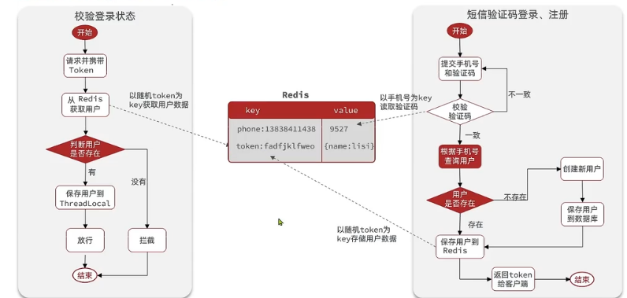
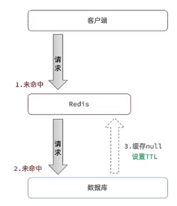
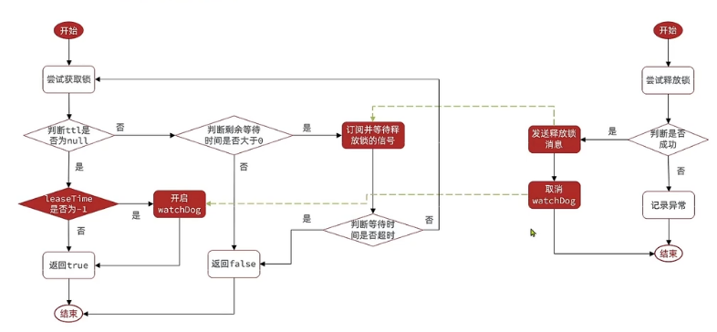
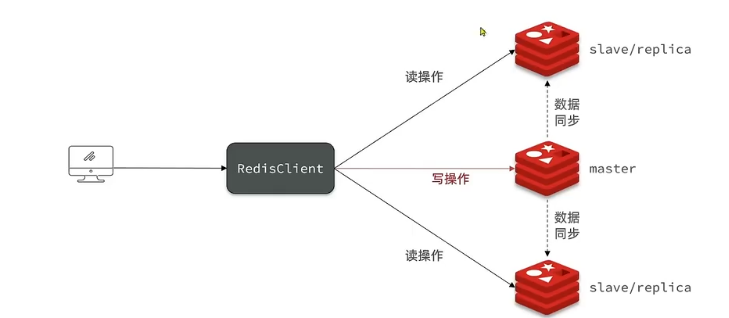
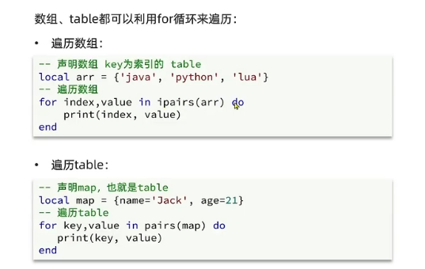
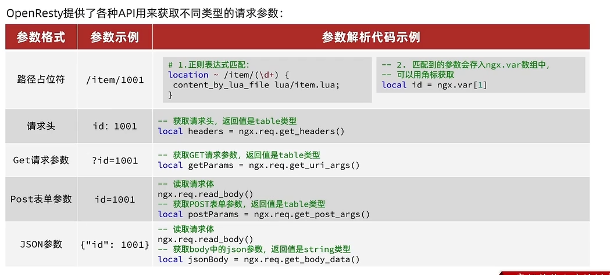

# REDIS

**REDIS---键值数据库**

## 一. 初识Redis

### 1. 认识NoSQL

非关系型数据库 vs 关系型数据库

|          |                             SQL                              |                            NoSQL                             |
| :------: | :----------------------------------------------------------: | :----------------------------------------------------------: |
| 数据结构 |                      结构化(Structured)                      |                           非结构化                           |
| 数据关联 |                      关联的(Relational)                      |                           无关联的                           |
| 查询方式 |                           SQL查询                            |                            非SQL                             |
| 事务特性 |                             ACID                             |                             BASE                             |
| 存储方式 |                             磁盘                             |                             内存                             |
|  扩展性  |                             垂直                             |                             水平                             |
| 使用场景 | (1) 数据结构固定;<br>(2) 相关业务对数据安全性, 一致性要求较高 | (1) 数据结构不固定; <br>(2) 对一致性, 安全性要求不高; <br>(3) 对性能要求高 |


## ２. 认识Redis

**Redis(Remote Dictionary Server)** --- 远程词典服务器, 基于内存的键值型NoSQL数据库

**特征:**

- 键值(key-value)型, value支持多种不同数据结构, 功能丰富
- 单线程, 每个命令具备原子性
- 低延迟, 速度快(基于内存, IO多路复用, 良好的编码)
- 支持数据持久化
- 支持主从集群, 分片集群
- 支持多语言客户端


## 3. 安装Redis

[Redis集群](src/main/resources/Redis集群.md)


## 二. Redis常见命令


## 1. Redis通用命令

- KEYS: 查看符合模板的所有key, 不建议在生产环境设备上使用
- DEL: 删除指定的key, 可以批量删除
- EXISTS: 判断key是否存在
- EXPIRE: 给一个key设置有效期, 有效期到期时该key会自动被删除
- TTL: 查看一个key的剩余有效期, -2表示key已过期, -1表示key永久有效


## 2. Redis数据类型

### (1). String类型


**String的常见命令:**

- SET: 添加或者修改已经存在的一个String类型的键值对
- GET: 根据key获取String类型的value
- MSET: 批量添加多个String类型的键值对
- MGET: 根据多个key获取多个String类型的value
- INCR/DECR: 让一个整型的key自增/自减1
- INCRBY/DECRBY: 让一个整型的key自增/自减并指定步长, 例如: incrby num 2 让num值自增/自减2
- INCRBYFLOAT: 让一个浮点型的数字自增并指定步长
- SETNX: 添加一个String类型的键值对, 前提是这个key不存在, 否则不执行,  SETNX name tom == SET name tom NX
- SETEX: 添加一个String类型的键值对, 并且指定有效期


**Key的结构**

Redis的key允许有多个单词形成层级结构, 多个单词之间用' : '隔开. 格式如下

`项目名:业务名:类型:id`

格式不固定, 根据需求来删除或添加词条

示例:

- user相关的key: `project:user:1`
- product相关的key: `project:product:1`

Value是一个Java对象, 例如一个User对象, 则可以将对象序列化为JSON字符串后存储

|        KEY        |                  VALUE                  |
| :---------------: | :-------------------------------------: |
|  project:user:1   |   {"id":1, "name":"Jack", "age":21 }    |
| project:product:1 | {"id":1, "name":"小米11", "price":4999} |


### (3). Hash类型

Hash类型, 也叫散列, 其value是一个无序字典, 类似于Java中的HashMap结构.

Hash结构可以将对象的每个字段独立存储, 可以针对单个字段做CRUD:


|      KEY       | VALUE | VALUE |
| :------------: | :---: | :---: |
|                | filed | value |
| project:user:1 | name  | jack  |
|                |  age  |  21   |
| project:user:2 | name  | Rose  |
|                |  age  |  18   |


**Hash的常见命令:**

- HSET: 添加或者修改已经存在的一个Hash类型key的filed的值
- HGET: 根据key获取Hash类型key的filed值
- HMSET: 批量添加Hash类型key的filed值
- HMGET: 批量获取Hash类型key的filed值
- HGETALL: 获取一个Hash类型的key中所有的filed和value
- HKEYS: 获取一个Hash类型的key中的所有的filed
- HVALS: 获取一个Hash类型的key中的所有的value
- HINCR/HDECR: 让一个Hash类型型的key自增/自减1
- HINCRBY/HDECRBY: 让一个Hash类型的key自增/自减并指定步长
- HSETNX: 添加一个Hash类型的key的field值, 前提是这个filed不存在, 否则不执行


### (4). List类型

Redis中的List类型与Java中的LinkedList类型类似, 可以看做是一个双向链表结构, 既可以支持正向检索和也可以支持反向检索.

特征与LinkedList类似:

- 有序

- 元素可以重复

- 插入和删除快

- 查询速度一般


常用来存储一个有序的列表如: `朋友圈点赞列表, 评论列表`等.


**List的常见命令:**

- LPUSH key element...: 向列表左侧插入一个或多个元素
- LPOP key: 移除并返回列表左侧的第一个元素, 没有则返回null
- RPUSH key element...: 想列表右侧插入一个或多个元素
- RPOP key: 移除并返回列表右侧的第一个元素, 没有则返回null
- LRANGE key star end: 返回一段角标范围内的所有元素
- BLPOP和BRPOP: 与LPOP和RPOP类似., 只不过在没有元素时等待指定时间, 而不是直接返回nil


1. 如何利用List结构模拟一个栈?
    - 入口和出口在同一边 (LPUS, LPOP)
2. 如何利用List结构模拟一个队列?
    - 入口和出口在不同边 (LPUSH, RPOP)
3. 如何利用List结构模拟一个阻塞队列?
    - 入口和出口在不同边
    - 出队时采用BLPOP或BRPOP


### (5). Set类型

Redis的Set结构与Java中的HashSet类似, 可以看做是一个value为null的HashMap. 因为也是一个hash表, 因此具备与HashSet类似的特征:

- 无序
- 元素不可重复
- 查找快
- 支持交集, 并集, 差集等功能


**Set类型的常见命令:**

- SADD key member... : 向set中添加一个或多个元素

- SREM key member... : 移除set中的指定元素
- SCARD key: 返回set中元素的个数
- SISMEMBER key member: 判断一个元素是否存在与set中
- SMEMBERS: 获取set中的所有元素
- SINTER key1 key2... : 求key1与key2的交集
- SDIFF key1 key2... : 求key1与key2的差集
- SUNION key1 key2... : 求key1与key2的并集


### (6). SortedSet类型

Redis的SortedSet是一个可排序的set集合, 与Java中的TreeSet有些类似, 但底层数据结构却差别很大, SortedSet中的每一个元素都带有一个score属性, 可以基于score属性对元素排序, 底层的实现是一个跳表(SkipList)加hash表.

SortedSet具备下列特性:

- 可排序
- 元素不重复
- 查询速度快

因为SorteSet的可排序特性, 经常用来实现`排行榜`这样的功能.


**SortedSet类型的常见命令:**

- ZADD key score member: 添加一个或多个元素到sorted set, 如果已经存在则更新其score值
- ZREM key member: 删除sorted set中的一个指定元素
- ZSCORE key member: 获取sorted set中的指定元素的score值
- ZRANK key member: 获取sorted set中的指定元素的排名
- ZCARD key: 获取sorted set中的元素个数
- ZCOUNT key min max: 统计score值在给定范围内的所有元素的个数
- ZINCRBY key increment member: 让sorted set中的指定元素自增, 步长为指定的increment值
- ZRANGE key min max: 按照score排序后, 获取指定排名范围内的元素
- ZRANGEBYSCORE key min max: 按照score排序后, 获取指定score范围内的元素
- ZDIFF, ZINTER, ZUNION: 求差集, 交集, 并集

**注意: 所有的排名默认都是升序, 如果要降序则在命令的Z后面添加REV即可, 例如ZRANGE ==> ZREVRANGE**


## 三. Redis的Java客户端


### 1. Jedis


**代码测试示例:**

``````java
public class JedisTest {
    private Jedis jedis;

    @Before
    public void setUp() {
        jedis = new Jedis("127.0.0.1", 6379);
        jedis.auth("12345678");
        jedis.select(0);
    }

    @Test
    public void testJedis() {
        String set = jedis.set("name", "张三");
        System.out.println("result=" + set);
        String name = jedis.get("name");
        System.out.println("name=" + name);
    }

    @After
    public void tearDown() {
        if (jedis != null) {
            jedis.close();
        }
    }
}

``````


**Jedis使用的基本步骤:**

1. 引入依赖
2. 创建Jedis对象建立连接
3. 使用Jedis, 方法名与Redis命令一致
4. 释放资源


**Jedis连接池**

Jedis本身是线程不安全的, 并且频繁的创建和销毁连接会有性能损耗, 因此推荐使用Jedis连接池代替Jedis的直连方式.


``````java
public class JedisConnectionFactory {
    private static final JedisPool JEDIS_POOL;

    static {
        JedisPoolConfig jedisPoolConfig = new JedisPoolConfig();
        /*最大连接*/
        jedisPoolConfig.setMaxTotal(8);
        /*最大空闲连接*/
        jedisPoolConfig.setMaxIdle(8);
        /*最小空闲连接*/
        jedisPoolConfig.setMinIdle(0);
        /*设置最长等待时间*/
        jedisPoolConfig.setMaxWait(Duration.ofMillis(200));
        JEDIS_POOL = new JedisPool(jedisPoolConfig, "127.0.0.1", 6379, 1000, "12345678");
    }

    /**
     * Description: getJedis 获取Jedis对象
     * @return redis.clients.jedis.Jedis
     * @author jinhui-huang
     * @Date 2023/10/5
     * */
    public static Jedis getJedis() {
        return JEDIS_POOL.getResource();
    }
}

``````


### 2. SpringDataRedis

SpringData是Spring中数据操作的模块, 包含对各种数据库的集成, 其中对Redis的集成模块就叫做SpringDataRedis

**SpringDataRedis API:**


使用SprngBoot整合SpringDataRedis

``````xml
<?xml version="1.0" encoding="UTF-8"?>
<project xmlns="http://maven.apache.org/POM/4.0.0"
         xmlns:xsi="http://www.w3.org/2001/XMLSchema-instance"
         xsi:schemaLocation="http://maven.apache.org/POM/4.0.0 http://maven.apache.org/xsd/maven-4.0.0.xsd">
    <modelVersion>4.0.0</modelVersion>
    <parent>
        <groupId>org.springframework.boot</groupId>
        <artifactId>spring-boot-starter-parent</artifactId>
        <version>2.7.13</version>
        <relativePath/> <!-- lookup parent from repository -->
    </parent>

    <groupId>com.myhd</groupId>
    <artifactId>jedis-demo</artifactId>
    <version>1.0-SNAPSHOT</version>
    <name>jedis-demo</name>
    <description>jedis-demo</description>

    <properties>
        <maven.compiler.source>8</maven.compiler.source>
        <maven.compiler.target>8</maven.compiler.target>
        <project.build.sourceEncoding>UTF-8</project.build.sourceEncoding>
    </properties>

    <dependencies>
        <dependency>
            <groupId>org.springframework.boot</groupId>
            <artifactId>spring-boot-starter-test</artifactId>
            <scope>test</scope>
        </dependency>

        <!--TODO: redis依赖-->
        <dependency>
            <groupId>org.springframework.boot</groupId>
            <artifactId>spring-boot-starter-data-redis</artifactId>
        </dependency>

        <!--TODO common-pool依赖-->
        <dependency>
            <groupId>org.apache.commons</groupId>
            <artifactId>commons-pool2</artifactId>
        </dependency>

        <!-- https://mvnrepository.com/artifact/redis.clients/jedis -->
        <!--<dependency>
            <groupId>redis.clients</groupId>
            <artifactId>jedis</artifactId>
            <version>5.0.1</version>
        </dependency>-->

        <!--TODO lombok-->
        <dependency>
            <groupId>org.projectlombok</groupId>
            <artifactId>lombok</artifactId>
            <optional>true</optional>
        </dependency>

    </dependencies>

    <build>
        <plugins>
            <plugin>
                <groupId>org.springframework.boot</groupId>
                <artifactId>spring-boot-maven-plugin</artifactId>
                <configuration>
                    <executable>true</executable>
                </configuration>
            </plugin>
            <plugin>
                <groupId>org.apache.maven.plugins</groupId>
                <artifactId>maven-resources-plugin</artifactId>
                <version>3.2.0</version>
                <configuration>
                    <encoding>UTF-8</encoding>
                    <useDefaultDelimiters>true</useDefaultDelimiters>
                </configuration>
            </plugin>
            <plugin>
                <groupId>org.apache.maven.plugins</groupId>
                <artifactId>maven-surefire-plugin</artifactId>
                <version>3.0.0</version>
                <configuration>
                    <skipTests>false</skipTests>
                    <!--排除掉不参与测试的内容-->
                    <excludes>
                        <exclude>**/BookServiceTest.java</exclude>
                    </excludes>
                </configuration>
            </plugin>
        </plugins>
    </build>

</project>
``````


编写测试类进行Redis链接测试

``````java
@SpringBootTest
public class RedisDemoApplicationTest {
    @Autowired
    private RedisTemplate<?, ?> redisTemplate;

    @Test
    void testString() {
        /*写入一条数据*/
        redisTemplate.opsForValue().set("name", "虎哥");
        /*获取数据*/
        Object name = redisTemplate.opsForValue().get("name");
        System.out.println("name=" + name);
    }

}

``````


RedisTemplate可以接收任意Object作为值写入Redis, 只不过写入前会把Object序列化为字节形式, 默认采用JDK序列化, 得到的结果是一串乱码

缺点:

- 可读性差
- 内存占用较大


**SpringDataRedis的序列化方式:**

``````java
@Configuration
public class RedisConfig {

    @Bean
    public RedisTemplate<String, Object> redisTemplate(RedisConnectionFactory redisConnectionFactory) {
        /*创建RedisTemplate*/
        RedisTemplate<String, Object> redisTemplate = new RedisTemplate<>();
        /*设置连接工厂*/
        redisTemplate.setConnectionFactory(redisConnectionFactory);
        /*设置序列化工具*/
        GenericJackson2JsonRedisSerializer jsonRedisSerializer = new GenericJackson2JsonRedisSerializer();
        /*key接hashKey采用string序列化*/
        redisTemplate.setKeySerializer(RedisSerializer.string());
        redisTemplate.setHashKeySerializer(RedisSerializer.string());

        /*value和hashValue采用JSON序列化*/
        redisTemplate.setValueSerializer(jsonRedisSerializer);
        redisTemplate.setHashValueSerializer(jsonRedisSerializer);
        return redisTemplate;

    }
}

``````

尽管JSON的序列化方式可以满足我们的需求, 但依然存在一些问题, 为了在反序列化时知道对象的类型, JSON序列化器会将类的class类型写入json结果中, 存入Redis, 会带来额外的内存开销.

为了节省内存空间, 我们并不会使用JSON序列化器来处理value, 而是统一使用String序列化器, 要求只能存储String类型的key和value. 当需要存储Java对象时, 手动完成对象的序列化和反序列化


``````java
public class DemoTest{
@Test
void testSaveUser() throws JsonProcessingException {
        user saveUser = new user("张三", 22);
        /*序列化对象*/
        String userString = MAPPER.writeValueAsString(saveUser);
        stringRedisTemplate.opsForValue().set("user:300", userString);

        String jsonUser = stringRedisTemplate.opsForValue().get("user:300");

        /*反序列化对象*/
        user user = MAPPER.readValue(jsonUser, user.class);
        System.out.println(user);
    }
}
``````


## 四. Redis实战之短信登录

### 1. 导入项目文件

### 2. 基于Session实现登录


**服务层详细代码**

``````java
/**
 * <p>
 *  服务实现类
 * </p>
 *
 * @author Jinhui-Huang
 * @since 2023-10-05
 */
@Slf4j
@Service
public class UserServiceImpl extends ServiceImpl<UserMapper, User> implements IUserService {

    /**
     * Description: sendCode 发送手机验证码
     * @return com.myhd.dto.Result
     * @author jinhui-huang
     * @Date 2023/10/6
     * */
    @Override
    public Result sendCode(String phone, HttpSession session) {
        /*1. 校验手机号*/
        if (RegexUtils.isPhoneInvalid(phone)) {
            /*2. 如果不符合, 返回错误信息*/
            return Result.fail("手机号格式错误");
        }
        /*3. 符合, 生成验证码*/
        String code = RandomUtil.randomNumbers(6);
        log.info("发送验证码成功, 验证码: {}", code);
        /*4. 保存验证码到session*/
        session.setAttribute("code", code);
        session.setAttribute("phone", phone);
        /*5分钟后过期*/
        session.setMaxInactiveInterval(300);
        /*5. 发送验证码*/
        try {
            AliSms.sendPhoneCode(phone, code, true);
        } catch (Exception e) {
            log.error(e.getMessage(), e);
            return Result.fail("服务忙请稍后再试");
        }
        /*6. 返回ok*/
        return Result.ok();
    }

    /**
     * Description: login 校验手机验证码
     * @return com.myhd.dto.Result
     * @author jinhui-huang
     * @Date 2023/10/6
     * */
    @Override
    public Result login(LoginFormDTO loginForm, HttpSession session) {
        /*1. 校验手机号*/
        String phone = loginForm.getPhone();
        if (RegexUtils.isPhoneInvalid(phone)) {
            /*2. 如果不符合, 返回错误信息*/
            return Result.fail("手机号格式错误");
        }
        /*2. 校验验证码*/
        String cacheCode = (String) session.getAttribute("code");
        String cachePhone = (String) session.getAttribute("phone");
        String code = loginForm.getCode();
        if (cacheCode == null || !cacheCode.equals(code) ) {
            /*3. 不一致, 报错*/
            return Result.fail("验证码错误");
        }
        if (cachePhone == null || !cachePhone.equals(phone)) {
            /*3. 不一致, 报错*/
            return Result.fail("登录的手机号前后不一致");
        }
        /*4. 一致, 根据手机号查询用户*/
        User user = query().eq("phone", phone).one();
        /*5. 判断用户是否存在*/
        if (user == null) {
            /*6. 不存在, 创建新用户并保存*/
            user = createUserWithPhone(phone);
        }
        /*7. 存在, 保存用户信息到session中*/
        session.setAttribute("user", BeanUtil.copyProperties(user, UserDTO.class));
        /*两天后过期*/
        session.setMaxInactiveInterval(3600*24*2);
        return Result.ok();
    }

    /**
     * Description: createUserWithPhone 创建新用户
     * @return com.myhd.entity.User
     * @author jinhui-huang
     * @Date 2023/10/6
     * */
    private User createUserWithPhone(String phone) {
        /*1. 创建用户*/
        User user = new User();
        user.setPhone(phone);
        user.setNickName(USER_NICK_NAME_PREFIX + RandomUtil.randomNumbers(10));
        /*2. 保存用户*/
        boolean save = save(user);
        log.info("保存用户: " + save);
        return user;
    }
}

``````


**控制层详细代码**

``````java
/**
 * <p>
 *  前端控制器
 * </p>
 *
 * @author Jinhui-Huang
 * @since 2023-10-05
 */
@RestController
@RequestMapping("/user")
public class UserController {

    @Resource
    private IUserService userService;

    @Resource
    private IUserInfoService userInfoService;

    /**
     * 发送手机验证码
     */
    @PostMapping("code")
    public Result sendCode(@RequestParam("phone") String phone, HttpSession session) {
        // TODO 发送短信验证码并保存验证码
        return userService.sendCode(phone, session);
    }

    /**
     * 登录功能
     * @param loginForm 登录参数，包含手机号、验证码；或者手机号、密码
     */
    @PostMapping("/login")
    public Result login(@RequestBody LoginFormDTO loginForm, HttpSession session){
        // TODO 实现登录功能
        return userService.login(loginForm, session);
    }

    /**
     * 登出功能
     * @return 无
     */
    @PostMapping("/logout")
    public Result logout(){
        // TODO 实现登出功能
        return Result.fail("功能未完成");
    }

    @GetMapping("/me")
    public Result me(){
        // TODO 获取当前登录的用户并返回
        UserDTO user = UserHolder.getUser(UserDTO.class);
        return Result.ok(user);
    }
}
``````


**配置拦截器校验session**

``````java
/**
 * Description: LoginInterceptor
 * <br></br>
 * className: LoginInterceptor
 * <br></br>
 * packageName: com.myhd.utils
 *
 * @author jinhui-huang
 * @version 1.0
 * @email 2634692718@qq.com
 * @Date: 2023/10/6 18:04
 */
@Component
public class LoginInterceptor implements HandlerInterceptor {

    /**
     * Description: preHandle 前置拦截器
     * @return boolean
     * @author jinhui-huang
     * @Date 2023/10/6
     * */
    @Override
    public boolean preHandle(HttpServletRequest request, HttpServletResponse response, Object handler) throws Exception {
        /*1. 获取session*/
        HttpSession session = request.getSession();
        /*2. 获取Session中的用户*/
        Object user = session.getAttribute("user");
        /*3. 判断用户是否存在*/
        if (user == null) {
            /*4. 不存在, 拦截, 返回401状态码*/
            response.setStatus(401);
            return false;
        }
        /*5. 存在, 保存用户信息到ThreadLocal*/
        UserHolder.saveUser(user);
        return true;
    }

    /**
     * Description: afterCompletion 请求之后
     * @return void
     * @author jinhui-huang
     * @Date 2023/10/6
     * */
    @Override
    public void afterCompletion(HttpServletRequest request, HttpServletResponse response, Object handler, Exception ex) throws Exception {
        UserHolder.removeUser();
    }
}
``````


**集群的Session共享问题:**

多台Tomcat并不共享Session存储空间, 当请求切换到不同tomcat服务时导致数据丢失的问题

session的替代方案应该满足:

- 数据共享

- 内存存储

- key, value结构


### 3. 基于Redis实现共享Session登录





**UserServiceImpl**

``````java
@Service
public class UserServiceImpl extends ServiceImpl<UserMapper, User> implements IUserService {

    @Resource
    private StringRedisTemplate stringRedisTemplate;

    /**
     * Description: sendCode 发送手机验证码
     * @return com.myhd.dto.Result
     * @author jinhui-huang
     * @Date 2023/10/6
     * */
    @Override
    public Result sendCode(String phone, HttpSession session) {
        /*1. 校验手机号*/
        if (RegexUtils.isPhoneInvalid(phone)) {
            /*2. 如果不符合, 返回错误信息*/
            return Result.fail("手机号格式错误");
        }
        /*3. 符合, 生成验证码*/
        String code = RandomUtil.randomNumbers(6);
        log.info("发送验证码成功, 验证码: {}", code);

        /*4. 保存验证码到Redis, 5分钟后过期*/
        stringRedisTemplate.opsForValue().set(LOGIN_CODE_KEY + phone, code, Duration.ofMinutes(LOGIN_CODE_TTL));

        /*5. 发送验证码*/
        try {
            AliSms.sendPhoneCode(phone, code, true);
        } catch (Exception e) {
            log.error(e.getMessage(), e);
            return Result.fail("服务忙请稍后再试");
        }
        /*6. 返回ok*/
        return Result.ok();
    }

    /**
     * Description: login 校验手机验证码
     * @return com.myhd.dto.Result
     * @author jinhui-huang
     * @Date 2023/10/6
     * */
    @Override
    public Result login(LoginFormDTO loginForm, HttpSession session) {
        /*1. 校验手机号*/
        String phone = loginForm.getPhone();
        if (RegexUtils.isPhoneInvalid(phone)) {
            /* 如果不符合, 返回错误信息*/
            return Result.fail("手机号格式错误");
        }
        /*2. TODO 从Redis获取验证码来校验验证码*/
        String cacheCode = stringRedisTemplate.opsForValue().get(LOGIN_CODE_KEY + phone);
        if (cacheCode == null) {
            /*3. 不一致, 报错*/
            return Result.fail("登录的手机号前后不一致");
        }

        String code = loginForm.getCode();
        if (!cacheCode.equals(code) ) {
            /*3. 不一致, 报错*/
            return Result.fail("验证码错误");
        }

        /*4. 一致, 根据手机号查询用户*/
        User user = query().eq("phone", phone).one();
        /*5. 判断用户是否存在*/
        if (user == null) {
            /*6. 不存在, 创建新用户并保存*/
            user = createUserWithPhone(phone);
        }
        /*7. TODO 存在, 保存用户信息到Redis中*/
        /*7.1. TODO 随机生成token, 作为登录令牌*/
        String token = UUID.randomUUID(true).toString(true);
        UserDTO userDTO = BeanUtil.copyProperties(user, UserDTO.class);
        /*7.2. TODO 将User对象转为Hash存储*/
        String tokenKey = LOGIN_USER_KEY + token;
        stringRedisTemplate.opsForHash().putAll(tokenKey, BeanUtil.beanToMap(userDTO, new HashMap<>(), CopyOptions.create().setIgnoreNullValue(true).setFieldValueEditor((filedName, filedValue) -> filedValue.toString())));
        /*7.3. 30分钟后过期*/
        stringRedisTemplate.expire(tokenKey, Duration.ofMinutes(LOGIN_USER_TTL));

        /*8. TODO 返回token*/
        return Result.ok(token);
    }

    /**
     * Description: createUserWithPhone 创建新用户
     * @return com.myhd.entity.User
     * @author jinhui-huang
     * @Date 2023/10/6
     * */
    private User createUserWithPhone(String phone) {
        /*1. 创建用户*/
        User user = new User();
        user.setPhone(phone);
        user.setNickName(USER_NICK_NAME_PREFIX + RandomUtil.randomNumbers(10));
        save(user);
        return user;
    }
}
``````


**LoginInterceptor**

``````java
@Component
public class LoginInterceptor implements HandlerInterceptor {

    @Autowired
    private StringRedisTemplate stringRedisTemplate;

    /**
     * Description: preHandle 前置拦截器
     * @return boolean
     * @author jinhui-huang
     * @Date 2023/10/6
     * */
    @Override
    public boolean preHandle(HttpServletRequest request, HttpServletResponse response, Object handler) throws Exception {
        /*TODO 1. 获取header中的token*/
        Object token = request.getHeader("authorization");
        if (StrUtil.isBlankIfStr(token)) {
            /*4. 不存在, 拦截, 返回401状态码*/
            response.setStatus(401);
            return false;
        }
        /*TODO 2. 基于token获取redis中的用户*/
        String key = LOGIN_USER_KEY + token;
        Map<Object, Object> userMap = stringRedisTemplate.opsForHash().entries(key);
        /*TODO 3. 判断用户是否存在*/
        if (userMap.isEmpty()) {
            /*4. 不存在, 拦截, 返回401状态码*/
            response.setStatus(401);
            return false;
        }
        /*TODO 5. 存在, 保存用户信息到ThreadLocal*/
        UserHolder.saveUser(BeanUtil.fillBeanWithMap(userMap, new UserDTO(), false));
        /*TODO 6. 刷新token有效期*/
        stringRedisTemplate.expire(key, Duration.ofMinutes(LOGIN_USER_TTL));
        return true;
    }

    /**
     * Description: afterCompletion 请求之后
     * @return void
     * @author jinhui-huang
     * @Date 2023/10/6
     * */
    @Override
    public void afterCompletion(HttpServletRequest request, HttpServletResponse response, Object handler, Exception ex) throws Exception {
        UserHolder.removeUser();
    }
}
``````


Redis代替session需要考虑的问题:

- 选择合适的数据结构
- 选择合适的key
- 选择合适的存储粒度


### 4. 登录拦截器优化

确保一切请求都能出发redis token刷新


## 四. 商户查询缓存

### 1. 什么是缓存

**缓存**就是数据交换的缓冲区(称作Cache), 是存贮数据的临时地方, 一般读写性能较高.

- 缓存的作用
    - 降低后端负载
    - 提高读写效率, 降低响应时间
- 缓存的成本
    - 数据一致性成本
    - 代码维护成本
    - 运维成本

### 2. 添加Redis缓存


**商品服务实现类**

``````java
@Service
public class ShopServiceImpl extends ServiceImpl<ShopMapper, Shop> implements IShopService {

    @Resource
    private StringRedisTemplate stringRedisTemplate;

    @Override
    public Result queryById(Long id) {
        String key = CACHE_SHOP_KEY + id;
        /*1. 从Redis查询商铺缓存*/
        String shopJson = stringRedisTemplate.opsForValue().get(key);
        /*2. 判断是否存在*/
        if (StringUtils.isNotBlank(shopJson)) {
            /*3. 存在直接返回*/
            Shop shop = JSONUtil.toBean(shopJson, Shop.class);
            return Result.ok(shop);
        }
        /*4. 不存在, 根据id查询数据库*/
        Shop shop = getById(id);
        /*5. 不存在, 返回错误*/
        if (shop == null) {
            return Result.fail("店铺不存在!");
        }
        /*6. 存在, 写入Redis*/
        stringRedisTemplate.opsForValue().set(key, JSONUtil.toJsonStr(shop));

        /*7. 返回对象*/
        return Result.ok(shop);
    }
}
``````


### 3. 缓存更新策略

|          |                           内存淘汰                           |                           超时剔除                           |                  主动更新                  |
| :------: | :----------------------------------------------------------: | :----------------------------------------------------------: | :----------------------------------------: |
|   说明   | 不用自己维护利用Redis的内存淘汰机制, 当内存不足时自动淘汰部分数据, 下次查询时更新缓存 | 给缓存数据添加TTL时间, 到期后自动删除缓存, 下次查询时更新缓存 | 编写业务逻辑, 在修改数据库的同时, 更新缓存 |
|  一致性  |                              差                              |                             一般                             |                     好                     |
| 维护成本 |                              无                              |                              低                              |                     高                     |

**业务场景:**

- 低一致性需求: 使用内存淘汰机制, 例如店铺类型的查询缓存
- 高一致性需求: 主动更新, 并以超时剔除作为兜底方案, 例如店铺详情查询的缓存


**主动更新策略:**

`01 Cache Asid Pattern`(由缓存的调用者, 在更新数据库的同时更新缓存) =>

`02 Read/Write Through Pattern`(缓存与数据库整合为一个服务,有服务来维护一致性,调用者调用该服务, 无需关心缓存一致性问题) =>

`03 Write Behind Caching Pattern`(调用这只操作缓存, 有其他线程异步的将缓存数据持久化到数据库, 保证最终一致)


操作缓存和数据库时有三个问题需要考虑:

1. 删除缓存还是更新缓存?

    - 更新缓存: 每次更新数据库都更新缓存, 无效写操作较多
    - 删除缓存: 更新数据库时让缓存失效, 查询时再更新缓存

2. 如何保证缓存与数据库的操作的同时成功或失败?

    - 单体系统, 将缓存与数据库操作放在一个事务
    - 分布式系统, 利用TCC等分布式事务方案

3. 先操作缓存还是先操作数据库?

    - 先删除缓存, 再操作数据库
    - 先操作数据库, 再删除缓存

   

先操作数据库, 再删除缓存发生线程安全的概率极低, 但也是会发生, 只是概率极低, 极大程度上可以保证数据库与缓存操作的原子性

**代码实现**

``````java
@Service
public class ShopServiceImpl extends ServiceImpl<ShopMapper, Shop> implements IShopService {

    @Resource
    private StringRedisTemplate stringRedisTemplate; 
/**
     * Description: update 为了实现数据库与Redis的数据一致性, 采用了高一致性原则, 在数据库需要更新数据时, 先更新数据库,
     * 在删除Redis的缓存
     * @return com.myhd.dto.Result
     * @author jinhui-huang
     * @Date 2023/10/8
     * */
    @Override
    @Transactional
    public Result update(Shop shop) {
        Long id = shop.getId();
        if (id == null) {
            return Result.fail("店铺id不能为空");
        }
        /*1. 更新数据库*/
        updateById(shop);
        /*2. 删除缓存*/
        stringRedisTemplate.delete(CACHE_SHOP_KEY + shop.getId());
        return Result.ok();
    }
}
``````


### 4. 缓存穿透

**缓存穿透:** 是指客户端请求的数据在缓存中和数据库中都不存在, 这样缓存永远不会生效, 这些请求都会达到数据库

常见的解决方案有两种:

- 缓存空对象

  

    - 优点: 实现简单, 维护方便
    - 缺点:
        - 额外的内存消耗
        - 可能造成短期的不一致

- 布隆过滤

  

    - 优点: 内存占用较少, 没有多余key

    - 缺点:

        - 实现复杂

        - 存在误判可能

        - 无法删除布隆过滤器里的数据


**缓存穿透产生的原因是什么?**

- 用户请求的数据在缓存中和数据库中都不存在, 不断发起这样的请求, 给数据库带来巨大压力

**缓存穿透的解决方案有哪些?**

- 缓存null值

- 布隆过滤

- 增强id的复杂度, 避免被猜测id规律

- 做好数据的基础格式校验

- 加强用户权限校验

- 做好热点参数的限流


**基于缓存空对象实现业务逻辑**

  ``````java
  @Service
  public class ShopServiceImpl extends ServiceImpl<ShopMapper, Shop> implements IShopService {
  
      @Resource
      private StringRedisTemplate stringRedisTemplate;
  	
      @Override
      public Result queryById(Long id) {
          String key = CACHE_SHOP_KEY + id;
          /*1. 从Redis查询商铺缓存*/
          String shopJson = stringRedisTemplate.opsForValue().get(key);
          /*2. 判断是否存在*/
          if (StringUtils.isNotBlank(shopJson)) {
              /*3. 存在直接返回*/
              Shop shop = JSONUtil.toBean(shopJson, Shop.class);
              return Result.ok(shop);
          }
  
          /*判断命中的是否是空值, 因为空值""不为null会被isNotBlank排除掉*/
          if (shopJson != null) {
              /*返回一个错误信息*/
              return Result.fail("店铺不存在!");
          }
  
          /*4. 不存在为null, 则根据id查询数据库*/
          Shop shop = getById(id);
          /*5. 不存在, 返回错误*/
          if (shop == null) {
              /* TODO 防止缓存穿透, 设置空值的保存时间为2分钟*/
              stringRedisTemplate.opsForValue().set(key, "", Duration.ofMinutes(CACHE_NULL_TTL));
              return Result.fail("店铺不存在!");
          }
          /*6. 存在, 写入Redis*/
          /* TODO 防止大量缓存同时失效导致缓存雪崩, 给保存时间再附加一个随机时间让存储时间在30~40*/
          stringRedisTemplate.opsForValue().set(key, JSONUtil.toJsonStr(shop), Duration.ofMinutes(CACHE_SHOP_TTL + random.nextInt(11)));
  
          /*7. 返回对象*/
          return Result.ok(shop);
      }
  }
  
  ``````


### 5. 缓存雪崩

**缓存雪崩:** 是指在同一时段大量的缓存key同时失效或者Redis服务宕机, 导致大量强求到达数据库, 带来巨大压力


**解决方案: **

- 给不同的Key的TTL添加随机值
- 利用Redis集群提高服务的可用性
- 给缓存业务添加降级限流策略
- 给业务添加多级缓存

### 6. 缓存击穿

**缓存击穿问题**也叫热点key问题, 就是一个被`高并发访问`并且`缓存重建业务较复杂`的key突然失效了, 无数的请求访问会在瞬间给数据库带来巨大的冲击


**常见的解决方案有两种:**

- 互斥锁
- 逻辑过期


| 解决方案 |                     优点                     |                    缺点                    |
| :------: | :------------------------------------------: | :----------------------------------------: |
|  互斥锁  | 没有额外的内存消耗<br>保证一致性<br>实现简单 | 线程需要等待, 性能受影响<br>可能有死锁风险 |
| 逻辑过期 |            线程无需等待, 性能较好            | 不保证一致性<br>有额外内存消耗<br>实现复杂 |

#### (1).  基于互斥锁方式解决缓存击穿问题


**代码实现**

``````java
@Slf4j
@Service
public class ShopServiceImpl extends ServiceImpl<ShopMapper, Shop> implements IShopService {

    @Resource
    private StringRedisTemplate stringRedisTemplate;

    @Resource
    private Random random;

    /**
     * Description: queryById Redis缓存核心代码, 热点key的缓存穿透, 缓存雪崩, 缓存击穿等问题的解决方案
     * @return com.myhd.dto.Result
     * @author jinhui-huang
     * @Date 2023/10/8
     * */
    @Override
    public Result queryById(Long id) {
        String key = CACHE_SHOP_KEY + id;
        /*1. 从Redis查询商铺缓存*/
        String shopJson = stringRedisTemplate.opsForValue().get(key);
        /*2. 判断是否存在*/
        if (StringUtils.isNotBlank(shopJson)) {
            /*3. 存在直接返回*/
            Shop shop = JSONUtil.toBean(shopJson, Shop.class);
            return Result.ok(shop);
        }

        /*判断命中的是否是空值, 因为空值""不为null会被isNotBlank排除掉*/
        if (shopJson != null) {
            /*返回一个错误信息*/
            return Result.fail("店铺不存在!");
        }

        /*4. 不存在为null, 则根据id查询数据库*/
        /*TODO 缓存击穿: 这里需要添加互斥锁, 防止缓存击穿*/
        /*4.1. 获取互斥锁*/
        String lockKey = LOCK_SHOP_KEY + id;
        Shop shop;
        try {
            /*4.2. 判断是否获取成功*/
            if (!tryLock(lockKey)) {
                /*4.3. 失败, 则休眠50ms重试*/
                Thread.sleep(50);
                return queryById(id);
            }
            /*TODO 获取锁成功应该再次检测Redis缓存是否存在, 做DoubleCheck. 如果存在则无需重建缓存*/
            String doubleCheckJson = stringRedisTemplate.opsForValue().get(key);
            /*2. TODO 二次判断缓存是否存在*/
            if (StringUtils.isNotBlank(doubleCheckJson)) {
                /*3. 存在直接返回*/
                shop = JSONUtil.toBean(doubleCheckJson, Shop.class);
                return Result.ok(shop);
            }
            /*判断命中的是否是空值"", 因为不为null说明是"", 之前已经被isNotBlank排除掉*/
            if (doubleCheckJson != null) {
                /*返回一个错误信息*/
                return Result.fail("店铺不存在!");
            }

            /*4.4 成功, 根据id查询数据库*/
            shop = getById(id);
            /*模拟重建的延时*/
            //Thread.sleep(200);
            /*5. 不存在, 返回错误*/
            if (shop == null) {
                /* TODO 缓存穿透: 防止缓存穿透, 设置空值的保存时间为2分钟*/
                stringRedisTemplate.opsForValue().set(key, "", Duration.ofMinutes(CACHE_NULL_TTL));
                return Result.fail("店铺不存在!");
            }
            /*6. 存在, 写入Redis*/
            /* TODO 缓存雪崩: 防止大量缓存同时失效导致缓存雪崩, 给保存时间再附加一个随机时间让存储时间在30~40*/
            stringRedisTemplate.opsForValue().set(key, JSONUtil.toJsonStr(shop), Duration.ofMinutes(CACHE_SHOP_TTL + random.nextInt(11)));
        } catch (InterruptedException e) {
            throw new RuntimeException(e);
        } finally {
            /*7. 释放互斥锁*/
            unlock(lockKey);
        }
        /*8. 返回对象*/
        return Result.ok(shop);
    }
}
``````


#### (2). 基于逻辑过期方式解决缓存击穿问题


**代码实现**

``````java
@Slf4j
@Service
public class ShopServiceImpl extends ServiceImpl<ShopMapper, Shop> implements IShopService {

    @Resource
    private StringRedisTemplate stringRedisTemplate;

    @Resource
    private Random random;

    @Resource
    private ExecutorService cacheRebuildExecutor;

	/**
     * Description: saveShop2Redis 将商铺数据写入Redis, 并设置逻辑过期时间单位秒
     * @return void
     * @author jinhui-huang
     * @Date 2023/10/8
     * */
    public void saveShop2Redis(Long id, Long expireSecond) {
        /*1. 查询店铺数据*/
        Shop shop = getById(id);
        if (shop == null) {
            /*缓存空字符串两分钟*/
            stringRedisTemplate.opsForValue().set(CACHE_SHOP_KEY + id, JSONUtil.toJsonStr(""), Duration.ofMinutes(CACHE_NULL_TTL));
            return;
        }
        /*不为空缓存数据*/
        /*2. 封装存储数据和逻辑过期时间*/
        RedisData redisData = new RedisData();
        /*如果数据库为空, 缓存空字符串*/
        redisData.setData(shop);
        redisData.setExpireTime(LocalDateTime.now().plusSeconds(expireSecond + random.nextInt(600)));
        /*3. 写入Redis*/
        stringRedisTemplate.opsForValue().set(CACHE_SHOP_KEY + id, JSONUtil.toJsonStr(redisData));
    }


    /**
     * Description: queryByIdWithLogic Redis缓存核心代码, 热点key的缓存穿透, 缓存雪崩, 缓存击穿等问题的解决方案, 这个方法采取了逻辑过期的方案, 需要在项目启动时把数据库里的热点key导入Redis中
     * 解决了缓存击穿问题
     * @return com.myhd.dto.Result
     * @author jinhui-huang
     * @Date 2023/10/8
     * */
    private Result queryByIdWithLogic(Long id) {
        String key = CACHE_SHOP_KEY + id;
        /*1. 从Redis查询商铺缓存*/
        String shopJson = stringRedisTemplate.opsForValue().get(key);
        /*2. 判断是否命中*/
        if (StringUtils.isBlank(shopJson) && shopJson != null) {
            /*3. 未命中且为"", 直接返回商铺不存在*/
            return Result.fail("商铺不存在!");
        }
        /*判断数据库中是否有数据*/
        if (shopJson == null) {
            saveShop2Redis(id, CACHE_SHOP_TTL_SECONDS);
            /*TODO 重新查询缓存, ""在字符串在上面返回, 下方是不为null有数据的json串*/
            return queryByIdWithLogic(id);
        }
        /*不为空判断过没过期*/
        /*4. 命中, 需要先把shopJson反序列化为对象, 获取里面的expireTime字段*/
        RedisData redisData = JSONUtil.toBean(shopJson, RedisData.class);
        LocalDateTime expireTime = redisData.getExpireTime();
        Shop shop = redisData.getData(Shop.class);
        /*5. 判断是否过期*/
        if (expireTime.isAfter(LocalDateTime.now())) {
            /*5.1 未过期, 直接返回店铺信息*/
            return Result.ok(shop);
        }

        /*5.2 TODO 已过期, 需要重建缓存, 这里是核心代码需要判断的地方*/
        /*6. 缓存重建*/
        /*6.1. 获取互斥锁*/
        String lockKey = LOCK_SHOP_KEY + id;
        /*6.2. 判断是否获取成功*/
        if (tryLock(lockKey)){
            /*TODO 获取锁成功应该再次检测Redis缓存是否存在, 做DoubleCheck. 如果存在则无需重建缓存*/
            Result result = queryByIdWithLogic(id);
            if (result.getSuccess()) {
                return result;
            }

            /*6.3. TODO 成功, 开启独立线程, 实现缓存重建*/
            cacheRebuildExecutor.submit(() -> {
                try {
                    saveShop2Redis(id, CACHE_SHOP_TTL_SECONDS);
                } catch (Exception e) {
                    throw new RuntimeException(e);
                } finally {
                    /*释放锁*/
                    unlock(lockKey);
                }
            });
        }
        /*锁未获取成功*/
        /*6.4. 返回过期的商铺信息*/
        return Result.ok(shop);
    }
}
``````


### 7. 缓存工具封装

基于StringRedisTemplate封装一个缓存工具类, 满足下列需求:

- 方法1: 将任意Java对象序列化为json并存储在String类型的key中, 并且可以设置TTL过期时间
- 方法2: 将任意Java对象序列化为json并存储在string类型的key中, 并且可以设置逻辑过期时间, 用于处理缓存击穿问题
- 方法3: 根据指定的key查询缓存, 并反序列化为指定类型, 利用缓存空值的方式解决缓存穿透问题
- 方法4: 根据指定的key查询缓存, 并反序列化为指定类型, 需要利用逻辑过期解决缓存击穿问题


**RedisClient**

``````java
@Slf4j
@Component
public class CacheClient {

    private final StringRedisTemplate stringRedisTemplate;

    private final ExecutorService cacheRebuildExecutor;


    public CacheClient(StringRedisTemplate stringRedisTemplate, ExecutorService cacheRebuildExecutor) {
        this.stringRedisTemplate = stringRedisTemplate;
        this.cacheRebuildExecutor = cacheRebuildExecutor;
    }

    /**
     * Description: set 设置key string缓存格式
     *
     * @return void
     * @author jinhui-huang
     * @Date 2023/10/8
     */
    public void set(String key, Object value, Duration duration) {
        stringRedisTemplate.opsForValue().set(key, JSONUtil.toJsonStr(value), duration);
    }

    public String getJson(String key) {
        return stringRedisTemplate.opsForValue().get(key);
    }

    /**
     * Description: setWithLogicExpire 普通的设置逻辑过期
     *
     * @return void
     * @author jinhui-huang
     * @Date 2023/10/8
     */
    public void setWithLogicExpire(String key, Object value, Duration duration) {
        /*设置逻辑过期*/
        RedisData redisData = new RedisData();
        redisData.setData(value);
        redisData.setExpireTime(LocalDateTime.now().plusSeconds(duration.getSeconds()));
        stringRedisTemplate.opsForValue().set(key, JSONUtil.toJsonStr(redisData));
    }

    /**
     * Description: 将数据存入Redis同时设置逻辑过期时间, 能够解决缓存穿透问题
     *
     * @return void
     * @author jinhui-huang
     * @Date 2023/10/8
     */
    public <R, ID> void saveShop2Redis(String keyPrefix, ID id, Function<ID, R> dbFallback, Duration duration) {
        String key = keyPrefix + id;
        /*设置逻辑过期*/
        R r = dbFallback.apply(id);
        if (r == null) {
            this.set(key, "", Duration.ofMinutes(CACHE_NULL_TTL));
            return;
        }
        /*不为空缓存数据*/
        /*封装存储数据和逻辑过期时间*/
        this.setWithLogicExpire(key, r, duration);
    }

    /**
     * Description: 查询数据同时解决缓存穿透问题, 但不能解决缓存击穿问题
     *
     * @return R
     * @author jinhui-huang
     * @Date 2023/10/8
     */
    public <R, ID> R queryWithPassThrough(String keyPrefix, ID id, Class<R> clazz, Function<ID, R> dbFallback, Duration duration) {
        String key = keyPrefix + id;
        String json = this.getJson(key);
        if (StringUtils.isNotBlank(json)) {
            return JSONUtil.toBean(json, clazz);
        }

        /*json为非null的 blank字符串*/
        if (json != null) {
            return null;
        }

        R r = dbFallback.apply(id);

        if (r == null) {
            /*防止缓存穿透, 需要将空值""字符串写入*/
            this.set(key, "", Duration.ofMinutes(CACHE_NULL_TTL));
            return null;
        }
        /*存在写入Redis*/
        this.set(key, r, duration);
        return r;
    }

    /**
     * Description: 查询数据同时解决缓存穿透问题, 包括缓存击穿问题, 基于互斥锁方案
     *
     * @return R
     * @author jinhui-huang
     * @Date 2023/10/8
     */
    public <R, ID> R queryWithPassThroughLock(String keyPrefix, String lockKeyPrefix, ID id, Class<R> clazz, Function<ID, R> dbFallback, Duration duration) {
        String key = keyPrefix + id;

        String json = this.getJson(key);

        if (StringUtils.isNotBlank(json)) {
            return JSONUtil.toBean(json, clazz);
        }

        /*json为非null的 blank字符串*/
        if (json != null) {
            return null;
        }

        /*不存在为null, 则根据id查询数据库*/
        /*TODO 缓存击穿: 这里需要添加互斥锁, 防止缓存击穿*/
        /*获取互斥锁*/
        String lockKey = lockKeyPrefix + id;
        R r;
        try {
            /*4.2. 判断是否获取成功*/
            if (!tryLock(lockKey)) {
                /*4.3. 失败, 则休眠50ms重试*/
                Thread.sleep(50);
                return queryWithPassThroughLock(keyPrefix, lockKeyPrefix, id, clazz, dbFallback, duration);
            }
            /*TODO 获取锁成功应该再次检测Redis缓存是否存在, 做DoubleCheck. 如果存在则无需重建缓存*/
            json = this.getJson(key);
            /*TODO 二次判断缓存是否存在*/
            if (StringUtils.isNotBlank(json)) {
                return JSONUtil.toBean(json, clazz);
            }
            /*json为非null的 blank字符串*/
            if (json != null) {
                return null;
            }

            /*获取锁成功开始重建缓存*/
            r = dbFallback.apply(id);
            if (r == null) {
                /*防止缓存穿透, 需要将空值""字符串写入*/
                this.set(key, "", Duration.ofMinutes(CACHE_NULL_TTL));
                return null;
            }
            /*存在写入Redis*/
            this.set(key, r, duration);
        } catch (Exception e) {
            throw new RuntimeException(e);
        } finally {
            /*7. 释放互斥锁*/
            unlock(lockKey);
        }
        return r;
    }


    /**
     * Description: 查询数据同时解决缓存穿透问题, 包括缓存击穿问题, 基于逻辑过期方案
     *
     * @return R
     * @author jinhui-huang
     * @Date 2023/10/8
     */
    public <R, ID> R queryWithPassThroughLogic(String keyPrefix, String lockKeyPrefix, ID id, Class<R> clazz, Function<ID, R> dbFallback, Duration duration) {
        String key = keyPrefix + id;
        String json = this.getJson(key);
        /*2. 判断是否命中, json为""*/
        if (json != null && StringUtils.isBlank(json)) {
            return null;
        }

        /*json为null的时候*/
        if (json == null) {
            /*更根据数据库判断是存入空值还是非空值*/
            this.saveShop2Redis(keyPrefix, id, dbFallback, duration);
            /*TODO 重新查询缓存, ""在字符串在上面返回, 下方是不为null有数据的json串*/
            return queryWithPassThroughLogic(keyPrefix, lockKeyPrefix, id, clazz, dbFallback, duration);
        }

        /*命中*/
        RedisData redisData = JSONUtil.toBean(json, RedisData.class);
        LocalDateTime expireTime = redisData.getExpireTime();
        R data = redisData.getData(clazz);

        /*5. 判断是否过期*/
        if (expireTime.isAfter(LocalDateTime.now())) {
            /*5.1 未过期, 直接返回店铺信息*/
            return data;
        }

        /*5.2 TODO 已过期, 需要重建缓存, 这里是核心代码需要判断的地方*/
        /*6. 缓存重建*/
        /*6.1. 获取互斥锁*/
        String lockKey = lockKeyPrefix + id;
        /*6.3. TODO 成功, 开启独立线程, 实现缓存重建*/
        if (tryLock(lockKey)) {
            /*TODO 获取锁成功应该再次检测Redis缓存是否存在, 做DoubleCheck. 如果存在则无需重建缓存*/
            json = this.getJson(key);
            if (StringUtils.isBlank(json) && json != null) {
                return null;
            }
            if (json == null) {
                this.saveShop2Redis(keyPrefix, id, dbFallback, duration);
                return queryWithPassThroughLogic(keyPrefix, lockKeyPrefix, id, clazz, dbFallback, duration);
            }
            /*TODO 成功, 开启独立线程, 实现缓存重建*/
            cacheRebuildExecutor.submit(() -> {
                try {
                    this.saveShop2Redis(keyPrefix, id, dbFallback, duration);
                } catch (Exception e) {
                    throw new RuntimeException(e);
                } finally {
                    /*释放锁*/
                    unlock(lockKey);
                }
            });
        }
        /*锁未获取成功*/
        /*返回过期的商铺信息*/
        return data;
    }


    /**
     * Description: tryLock 编写代码基于Redis的SETNX指令来实现互斥锁
     *
     * @return boolean
     * @author jinhui-huang
     * @Date 2023/10/8
     */
    private boolean tryLock(String key) {
        Boolean flag = stringRedisTemplate.opsForValue().setIfAbsent(key, LOCK_SHOP_VALUE, Duration.ofSeconds(LOCK_SHOP_TTL));
        return BooleanUtils.isTrue(flag);

    }

    /**
     * Description: unlock 释放互斥锁
     *
     * @return void
     * @author jinhui-huang
     * @Date 2023/10/8
     */
    private void unlock(String key) {
        stringRedisTemplate.delete(key);
    }
}

``````

## 五. 优惠券全局秒杀

### 1. 全局唯一ID

**全局ID生成器**

当用户抢购时, 就会生产订单并保存到tb_voucher_order这张表中, 而订单表如果使用数据库自增
ID就存在一些问题:

- id的规律性太明显
- 受单表数据量的限制

`全局ID生成器, 是一种在分布式系统下用来生成全局唯一ID的工具, 一般要满足下列特性: `

- 唯一性

- 高可用

- 高性能

- 递增性

- 安全性


为了增加ID的安全性, 我们可以不直接使用Redis自增的数值, 而是拼接一些其他信息:


ID的组成部分: 

- 符号位: 1bit, 永远为0
- 时间戳: 31bit, 以秒为单位, 可以使用69年
- 序列号: 32bit, 秒内的计数器, 支持每秒产生2^32个不同ID

全局唯一ID生成策略:

- UUID
- Redis自增
- snowflake算法
- 数据库自增

Redis自增ID策略:

- 每天一个key, 方便统计订单量
- ID构造是 时间戳 +计数器

**RedisIdWorker**

``````java
@Component
public class RedisIdWorker {

    /**开始时间戳*/
    private static final long BEGIN_TIMESTAMP = 1640995200L;

    private static final long COUNT_BITS = 32L;

    private StringRedisTemplate stringRedisTemplate;

    public RedisIdWorker(StringRedisTemplate stringRedisTemplate) {
        this.stringRedisTemplate = stringRedisTemplate;
    }


    public long nextId(String keyPrefix) {
        /*1. 生成时间戳*/
        LocalDateTime now = LocalDateTime.now();
        long nowSecond = now.toEpochSecond(ZoneOffset.UTC);
        long timestamp = nowSecond - BEGIN_TIMESTAMP;

        /*2. 生成序列号*/
        /*2.1 获取当前日期, 精确到天*/
        String date = now.format(DateTimeFormatter.ofPattern("yyyyMMdd"));
        long count = stringRedisTemplate.opsForValue().increment("icr:" + keyPrefix + ":" + date);

        /*3. 拼接并返回*/
        return timestamp << COUNT_BITS | count;
    }
}

``````


### 2. 实现优惠卷秒杀下单

每个店铺都可以发布优惠卷, 分为卷和特价卷, 评价卷可以任意购买, 而特价卷需要秒杀抢购

下单时需要判断两点:

- 秒杀是否开始或结束, 如果尚未开始或已经结束则无法下单
- 库存是否充足, 不足则无法下单


**VoucherOrderServiceImpl**

``````java
@Service
public class VoucherOrderServiceImpl extends ServiceImpl<VoucherOrderMapper, VoucherOrder> implements IVoucherOrderService {

    @Resource
    private ISeckillVoucherService seckillVoucherService;

    @Resource
    private RedisIdWorker redisIdWorker;

    @Override
    @Transactional
    public Result scekillVoucher(Long voucherId) {
        /*1. 查询优惠卷*/
        SeckillVoucher seckillVoucher = seckillVoucherService.getById(voucherId);
        /*2. 判断秒杀是否开始*/
        if (seckillVoucher.getBeginTime().isAfter(LocalDateTime.now())) {
            /*尚未开始秒杀*/
            return Result.fail("秒杀尚未开始!");
        }
        /*3. 判断秒杀是否已经结束*/
        if (seckillVoucher.getEndTime().isBefore(LocalDateTime.now())) {
            /*尚未开始秒杀*/
            return Result.fail("秒杀已经结束!");
        }
        /*4. 判断库存是否充足*/
        if (seckillVoucher.getStock() < 1) {
            /*库存不足*/
            return Result.fail("库存不足");
        }
        /*5. 扣减库存*/
        boolean success = seckillVoucherService.update()
                .setSql("stock = stock - 1")
                .eq("voucher_id", voucherId).update();
        if (!success) {
            /*扣减失败*/
            return Result.fail("库存不足!");
        }
        /*6. 创建订单*/
        VoucherOrder voucherOrder = new VoucherOrder();
        /*6.1 订单id*/
        long orderId = redisIdWorker.nextId("order");
        voucherOrder.setId(orderId);
        /*6.2 用户id*/
        Long userId = UserHolder.getUser(UserDTO.class).getId();
        voucherOrder.setUserId(userId);
        /*6.3 代金卷id*/
        voucherOrder.setVoucherId(voucherId);

        save(voucherOrder);

        /*7. 返回订单id*/
        return Result.ok(orderId);
    }
}
``````


### 3. 超卖问题


#### 超卖解决方法: 悲观锁 vs 乐观锁

超卖问题是典型的多线程安全问题, 针对这一问题的常见解决方案就是加锁: 

- 悲观锁:  认为线程安全问题一定会发生, 因此在操作数据之前先获取锁, 确保线程串行执行.
  - 例如Synchronized, Lock都属于悲观锁
- 乐观锁: 认为线程安全问题不一定会发生, 因此不加锁, 只是在更新数据时去判断有没有其他线程对数据做了更改.
  - 如果没有修改则认为是安全的, 自己才更新数据.
  - 如果已经被其他线程修改说明发生了安全问题, 此时可以重试或异常


**乐观锁**

乐观锁的关键是判断之前查询得到的数据是否有被修改过, 常见的方式有两种: 

- 版本号法: 

  


- CAS法

  

**乐观锁的弊端:**

一旦前后版本号或数值不一致就失败了, 存在成功率低的问题, 当前业务只要满足优惠卷大于0即可, 因此可以把两次相等的条件改为优惠卷的数量大于0即可, 只要库存不小0就不会发生超卖问题.


**乐观锁的实现**

``````java
@Service
public class VoucherOrderServiceImpl extends ServiceImpl<VoucherOrderMapper, VoucherOrder> implements IVoucherOrderService {

    @Resource
    private ISeckillVoucherService seckillVoucherService;

    @Resource
    private RedisIdWorker redisIdWorker;

    @Override
    @Transactional
    public Result scekillVoucher(Long voucherId) {
        /*1. 查询优惠卷*/
        SeckillVoucher seckillVoucher = seckillVoucherService.getById(voucherId);
        /*2. 判断秒杀是否开始*/
        if (seckillVoucher.getBeginTime().isAfter(LocalDateTime.now())) {
            /*尚未开始秒杀*/
            return Result.fail("秒杀尚未开始!");
        }
        /*3. 判断秒杀是否已经结束*/
        if (seckillVoucher.getEndTime().isBefore(LocalDateTime.now())) {
            /*尚未开始秒杀*/
            return Result.fail("秒杀已经结束!");
        }
        /*4. 判断库存是否充足*/
        if (seckillVoucher.getStock() < 1) {
            /*库存不足*/
            return Result.fail("库存不足");
        }
        /*5. 扣减库存*/
        /*TODO 扣减前加个sql条件判断一下查询到stock的值前后是否一致*/
        boolean success = seckillVoucherService.update()
                .setSql("stock = stock - 1")
                .eq("voucher_id", voucherId)
                .gt("stock", 0) /*where id = ? and stock > 0*/
                .update();

        if (!success) {
            /*扣减失败*/
            return Result.fail("库存不足!");
        }
        /*6. 创建订单*/
        VoucherOrder voucherOrder = new VoucherOrder();
        /*6.1 订单id*/
        long orderId = redisIdWorker.nextId("order");
        voucherOrder.setId(orderId);
        /*6.2 用户id*/
        Long userId = UserHolder.getUser(UserDTO.class).getId();
        voucherOrder.setUserId(userId);
        /*6.3 代金卷id*/
        voucherOrder.setVoucherId(voucherId);

        save(voucherOrder);

        /*7. 返回订单id*/
        return Result.ok(orderId);
    }
}
``````


### 4. 一人一单

需求: 修改秒杀业务, 要求同一个优惠卷只能下一个单

实现代码: 

``````java
@Service
public class VoucherOrderServiceImpl extends ServiceImpl<VoucherOrderMapper, VoucherOrder> implements IVoucherOrderService {

    @Resource
    private ISeckillVoucherService seckillVoucherService;

    @Resource
    private RedisIdWorker redisIdWorker;

    @Override
    public Result scekillVoucher(Long voucherId) {
        /*1. 查询优惠卷*/
        SeckillVoucher seckillVoucher = seckillVoucherService.getById(voucherId);
        /*2. 判断秒杀是否开始*/
        if (seckillVoucher.getBeginTime().isAfter(LocalDateTime.now())) {
            /*尚未开始秒杀*/
            return Result.fail("秒杀尚未开始!");
        }
        /*3. 判断秒杀是否已经结束*/
        if (seckillVoucher.getEndTime().isBefore(LocalDateTime.now())) {
            /*尚未开始秒杀*/
            return Result.fail("秒杀已经结束!");
        }
        /*4. 判断库存是否充足*/
        if (seckillVoucher.getStock() < 1) {
            /*库存不足*/
            return Result.fail("库存不足");
        }
        /*TODO: 注意spring事务实在synchronized释放锁后再提交事务的, 但是在synchronized释放锁后
         *  有可能导致其他线程进来执行代码同时也执行sql语句了, 从而导致线程并发安全, 所以必须在事务提交之后再释放锁*/
        /*6.0. 一人一单*/
        Long userId = UserHolder.getUser(UserDTO.class).getId();
        /*一个用户一把锁, 保证所对象只针对这个用户, 所对象对当前用户唯一*/
        synchronized (userId.toString().intern()) {
            /*获取事务的代理对象*/
            IVoucherOrderService proxy = (IVoucherOrderService) AopContext.currentProxy();
            return proxy.createVoucherOrder(voucherId, userId);
        }
    }

    /**
     * Description: createVoucherOrder 封装创建订单的方法, 使用spring管理的事务
     * @return com.myhd.dto.Result
     * @author jinhui-huang
     * @Date 2023/10/10
     * */
    @Transactional
    @Override
    public Result createVoucherOrder(Long voucherId, Long userId) {

        /*6.1. 查询订单*/
        int count = query().eq("user_id", userId).eq("voucher_id", voucherId).count();
        /*6.2. 判断是否存在*/
        if (count > 0) {
            /*用户已经购买过了*/
            return Result.fail("用户已经购买过了");
        }

        /*5. 扣减库存*/
        /*TODO 扣减前加个sql条件判断一下查询到stock的值是否大于0*/
        boolean success = seckillVoucherService.update()
                .setSql("stock = stock - 1")
                .eq("voucher_id", voucherId)
                .gt("stock", 0) /*where id = ? and stock > 0*/
                .update();

        if (!success) {
            /*扣减失败*/
            return Result.fail("库存不足!");
        }

        /*6. 创建订单*/
        VoucherOrder voucherOrder = new VoucherOrder();
        /*6.1 订单id*/
        long orderId = redisIdWorker.nextId("order");
        voucherOrder.setId(orderId);
        /*6.2 用户id*/
        voucherOrder.setUserId(userId);
        /*6.3 代金卷id*/
        voucherOrder.setVoucherId(voucherId);

        save(voucherOrder);
        /*7. 返回订单id*/
        return Result.ok(orderId);

    }
}
``````


### 5. 分布式锁

通过加锁可以解决在单机情况下的一人一单安全问题, 但是在集群模式下就不行了

解决方式就是必须要使用一个集群的锁监视器


**分布式锁:** 满足分布式系统或集群模式下多进程可见并且互斥的锁.


**分布式锁的实现**

分布式锁的核心是实现多进程之间互斥, 而满足这一点的方式有很多, 常见的有三种: 

|        |           MySQL           |          Redis           |            Zookeeper             |
| :----: | :-----------------------: | :----------------------: | :------------------------------: |
|  互斥  | 利用mysql本身的互斥锁机制 | 利用setnx这样的互斥命令  | 利用节点的唯一性和有序性实现互斥 |
| 高可用 |            好             |            好            |                好                |
| 高性能 |           一般            |            好            |               一般               |
| 安全性 |   断开连接, 自动释放锁    | 利用锁超时时间, 到期释放 |    临时节点, 断开连接自动释放    |


**基于Redis的分布式锁**

实现分布式锁时需要实现的两个基本方式:

- 获取锁: 

  - 互斥: 确保只能有一个线程获取锁

  - 非阻塞: 尝试一次, 成功返回true, 失败返回false

    ``````cmd
    # 添加锁, 同时添加锁过期时间, 避免服务宕机引起
    SETNX lock thread1 NX EX 10
    ``````

- 释放锁: 

  - 手动释放锁

  - 超时释放锁: 获取锁时添加一个超时时间

    ``````cmd
    # 释放锁, 删除即可
    DEL key
    ``````

    

#### (1). 基于Redis实现分布式锁的初级版本

``````java
@Service
public class VoucherOrderServiceImpl extends ServiceImpl<VoucherOrderMapper, VoucherOrder> implements IVoucherOrderService {

    @Resource
    private ISeckillVoucherService seckillVoucherService;

    @Resource
    private RedisIdWorker redisIdWorker;

    @Resource
    private StringRedisTemplate stringRedisTemplate;

    @Override
    public Result scekillVoucher(Long voucherId) {
        /*1. 查询优惠卷*/
        SeckillVoucher seckillVoucher = seckillVoucherService.getById(voucherId);
        /*2. 判断秒杀是否开始*/
        if (seckillVoucher.getBeginTime().isAfter(LocalDateTime.now())) {
            /*尚未开始秒杀*/
            return Result.fail("秒杀尚未开始!");
        }
        /*3. 判断秒杀是否已经结束*/
        if (seckillVoucher.getEndTime().isBefore(LocalDateTime.now())) {
            /*尚未开始秒杀*/
            return Result.fail("秒杀已经结束!");
        }
        /*4. 判断库存是否充足*/
        if (seckillVoucher.getStock() < 1) {
            /*库存不足*/
            return Result.fail("库存不足");
        }
        /*TODO: 注意spring事务实在synchronized释放锁后再提交事务的, 但是在synchronized释放锁后
         *  有可能导致其他线程进来执行代码同时也执行sql语句了, 从而导致线程并发安全, 所以必须在事务提交之后再释放锁*/
        /*6.0. 一人一单*/
        Long userId = UserHolder.getUser(UserDTO.class).getId();
        /*一个用户一把锁, 保证所对象只针对这个用户, 所对象对当前用户唯一*/
        /*创建锁对象*/
        SimpleRedisLock lock = new SimpleRedisLock("order:" + userId, stringRedisTemplate);
        /*获取锁*/
        boolean isLock = lock.tryLock(5);
        /*判断是否获取锁成功*/
        if (!isLock) {
            /*获取锁失败, 返回错误信息或重试*/
            return Result.fail("不允许重复下单");
        }
        /*获取锁成功*/
        try {
            /*获取事务的代理对象*/
            IVoucherOrderService proxy = (IVoucherOrderService) AopContext.currentProxy();
            return proxy.createVoucherOrder(voucherId, userId);
        } finally {
            lock.unlock();
        }


    }

    /**
     * Description: createVoucherOrder 封装创建订单的方法, 使用spring管理的事务
     * @return com.myhd.dto.Result
     * @author jinhui-huang
     * @Date 2023/10/10
     * */
    @Transactional
    @Override
    public Result createVoucherOrder(Long voucherId, Long userId) {

        /*6.1. 查询订单*/
        int count = query().eq("user_id", userId).eq("voucher_id", voucherId).count();
        /*6.2. 判断是否存在*/
        if (count > 0) {
            /*用户已经购买过了*/
            return Result.fail("用户已经购买过了");
        }

        /*5. 扣减库存*/
        /*TODO 扣减前加个sql条件判断一下查询到stock的值是否大于0*/
        boolean success = seckillVoucherService.update()
                .setSql("stock = stock - 1")
                .eq("voucher_id", voucherId)
                .gt("stock", 0) /*where id = ? and stock > 0*/
                .update();

        if (!success) {
            /*扣减失败*/
            return Result.fail("库存不足!");
        }

        /*6. 创建订单*/
        VoucherOrder voucherOrder = new VoucherOrder();
        /*6.1 订单id*/
        long orderId = redisIdWorker.nextId("order");
        voucherOrder.setId(orderId);
        /*6.2 用户id*/
        voucherOrder.setUserId(userId);
        /*6.3 代金卷id*/
        voucherOrder.setVoucherId(voucherId);

        save(voucherOrder);
        /*7. 返回订单id*/
        return Result.ok(orderId);

    }
}
``````


锁的实现代码: 

``````java
public class SimpleRedisLock implements ILock{

    private static final String KEY_PREFIX = "lock:";

    /**业务名称*/
    private String name;

    private StringRedisTemplate stringRedisTemplate;

    public SimpleRedisLock(String name, StringRedisTemplate stringRedisTemplate) {
        this.name = name;
        this.stringRedisTemplate = stringRedisTemplate;
    }

    /**
     * Description: tryLock 尝试获取锁
     *
     * @param timeoutSec 锁持有的超时时间, 过期后自动释放锁
     * @return boolean true代表获取锁成功, false代表获取锁失败
     * @author jinhui-huang
     * @Date 2023/10/10
     */
    @Override
    public boolean tryLock(long timeoutSec) {
        /*获取线程标识*/
        long threadId = Thread.currentThread().getId();

        /*获取锁*/
        Boolean success = stringRedisTemplate.opsForValue()
                .setIfAbsent(KEY_PREFIX + name, String.valueOf(threadId), Duration.ofSeconds(timeoutSec));
        return Boolean.TRUE.equals(success);
    }

    /**
     * Description: unlock 释放锁
     *
     * @return void
     * @author jinhui-huang
     * @Date 2023/10/10
     */
    @Override
    public void unlock() {
        /*释放锁*/
        stringRedisTemplate.delete(KEY_PREFIX + name);
    }
}
``````


#### (2). Redis分布式锁初级版本的问题

业务太复杂, 导致获取锁的线程阻塞时间太长, 以至于超过了锁的过期时间, 这时候其他线程又能拿到锁进入业务了, 产生并发安全问题, 当初第一次线程执行完业务时, 又删除了锁, 导致又有新线程拿到锁进来执行业务

A. 锁误删(业务阻塞在获取锁后): 


**解决方案:**给锁加一个锁标示

B. 锁误删(业务阻塞在获取锁标示和锁释放之间)


**解决方案:**Lua脚本实现获取锁标示和锁释放的原子性

#### (3). Redis的Lua脚本

Redis提供了Lua脚本功能, 在一个脚本中编写多条Redis命令, 确保多条命令执行时的原子性. Lua是一种编程语言

**使用Redis提供的函数语法, 语法如下:** 

``````cmd
# 执行redis命令, 调用脚本
redis.call('命令名称', 'key', '其他参数', ....)
``````

例如: 执行set name jack, 参数0是因为这里参数写死了 则脚本如下: 

``````cmd
# 执行 set name jack
redis.call('set', 'name', 'jack')
``````

例如: 执行set name Rose, 在执行get name,  则脚本如下: 

``````cmd
# 先执行 set name jack
return redis.call('set', 'name', 'jack')
# 再执行 get name
local name = redis.call('get', 'name')
# 返回
return name
``````


**使用Redis的Lua脚本调用方法:**


#### (4). 改进Redis的分布式锁

要求: 修改之前的分布式锁实现, 满足: 

1.  在获取锁时存入线程标示 (可以用UUID表示)

2. 在释放锁时先获取锁中的线程标示, 判断是否与当前线程标示一致

   - 如果一致则释放锁
   - 如果不一致则不释放锁

3. 使用Lua脚本执行: 

   ``````lua
   -- 比较线程标示与锁中的标示是否一致
   if (redis.call('get', KEYS[1])== ARGV[1]) then
       -- 释放锁 del key
       return redis.call('del', KEYS[1])
   end
   return 0
   ``````
   
   

**改造SimpleRedisLock**

``````java
public class SimpleRedisLock implements ILock{

    private static final String KEY_PREFIX = "lock:";

    private static final String ID_PREFIX = UUID.randomUUID() + "-";

    private static final DefaultRedisScript<Long> UNLOCK_SCRIPT;

    /*初始化Lua脚本*/
    static {
        UNLOCK_SCRIPT = new DefaultRedisScript<>();
        UNLOCK_SCRIPT.setLocation(new ClassPathResource("unlock.lua"));
        UNLOCK_SCRIPT.setResultType(Long.class);
    }

    /**业务名称 + 用户id*/
    private String name;

    private StringRedisTemplate stringRedisTemplate;

    public SimpleRedisLock(String name, StringRedisTemplate stringRedisTemplate) {
        this.name = name;
        this.stringRedisTemplate = stringRedisTemplate;
    }

    /**
     * Description: tryLock 尝试获取锁
     *
     * @param timeoutSec 锁持有的超时时间, 过期后自动释放锁
     * @return boolean true代表获取锁成功, false代表获取锁失败
     * @author jinhui-huang
     * @Date 2023/10/10
     */
    @Override
    public boolean tryLock(long timeoutSec) {
        /*获取线程标识*/
        String threadId = ID_PREFIX + Thread.currentThread().getId();

        /*获取锁*/
        Boolean success = stringRedisTemplate.opsForValue()
                .setIfAbsent(KEY_PREFIX + name, threadId, Duration.ofSeconds(timeoutSec));
        return Boolean.TRUE.equals(success);
    }

    /**
     * Description: unlock 释放锁
     *
     * @return void
     * @author jinhui-huang
     * @Date 2023/10/10
     */
    @Override
    public void unlockNoLua() {
        /*获取线程标示*/
        String threadId = ID_PREFIX + Thread.currentThread().getId();
        String id = stringRedisTemplate.opsForValue().get(KEY_PREFIX + name);
        if (threadId.equals(id)) {
            /*释放锁*/
            stringRedisTemplate.delete(KEY_PREFIX + name);
        }
    }

    @Override
    public void unlock() {
        /*调用lua脚本*/
        stringRedisTemplate.execute(
                UNLOCK_SCRIPT,
                Collections.singletonList(KEY_PREFIX + name),
                ID_PREFIX + Thread.currentThread().getId()
        );
    }
}
``````


**基于Redis的分布式锁实现思路:**

- 利用set nx ex获取锁, 并设置过期时间, 保存线程标示
- 释放锁时先判断线程标示是否与自己一致, 一致则删除锁

**特性:**

- 利用set nx满足互斥性
- 利用set nx保证故障时锁依然能释放, 避免死锁, 提高安全性
- 利用Redis集群保证高可用和高并发特性

#### (5). 基于Redis的分布式锁优化

基于setnx实现的分布式锁存在下面的问题: 

- 不可重入: 同一个线程无法多次获取同一把锁
- 不可重试: 获取锁只尝试一次就返回false, 没有重试机制
- 超时释放: 超市释放虽然可以避免死锁, 但如果是业务执行耗时比较长, 也会导致锁释放, 存在安全隐患
- 主从一致性: 如果Redis提供了主从集群, 主从同步存在延迟, 当主宕机时, 如果从一并同步主中的锁数据, 则会出现锁实现

#### (6). Redisson

Redisson是一个在Redis的基础上实现的Java驻内存数据网络(In-Memory Data Grid). 它不仅提供了一系列的分布式的Java常用对象, 还提供了许多分布式服务, 其中就包含了各种分布式锁的实现.

- 分布式锁(Lock) 和同步器 (Synchronizer)
  - 可重入锁 (Reentrant Lock)
  - 公平锁 (Fair Lock)
  - 联锁 (MultiLock)
  - 红锁 (RedLock)
  - 读写锁 (ReadWriteLock)
  - 信号量 (Semaphore)
  - 可过期性信号量 (PermitExpirableSemaphore)
  - 闭锁 (CountDownLatch)

**Redisson入门:**

1.  引入依赖: 

   ``````xml
   <!-- TODO Redisson: https://mvnrepository.com/artifact/org.redisson/redisson -->
           <dependency>
               <groupId>org.redisson</groupId>
               <artifactId>redisson</artifactId>
               <version>3.23.5</version>
           </dependency>
   ``````

   

2. 配置Redisson客户端:

   ``````java
   @Configuration
   public class RedissonConfig {
   
       @Bean
       public RedissonClient redissonClient(){
           /*配置*/
           Config config = new Config();
           config.useSingleServer().setAddress("redis://192.168.43.33:6379").setPassword("12345678hjh");
           /*创建RedissonClient对象*/
           return Redisson.create(config);
       }
   }
   ``````

   

3. 使用Redisson的分布式锁

   ``````txt
   RLock lock = redissonClient.getLock(LOCK_ORDER_KEY + userId);
   /*获取锁*/
   /*失败不等待, 默认参数为: 锁释放时间为30s*/
   boolean isLock = lock.tryLock();
   ``````


**Redisson可重入锁原理**

实现同一个线程里获取到多个同一把锁的机制: 当线程一拿到锁的时候将锁的进入次数+1, 当释放锁的时候将锁的进入次数-1, 这时候当锁的次数为0时就表示这个线程已经执行完业务, 可以将这把锁给删除了


Lua实现获取锁

``````lua
-- 锁获取的脚本
local key = KEYS[1]; -- 锁的key
local threadId = ARGV[1]; -- 线程的唯一标识
local releaseTime = ARGV[2]; -- 锁的自动释放时间

-- 判断是否存在
if(redis.call('exists', key) == 0) then
    -- 不存在, 获取锁
    redis.call('hset', key, threadId, '1')
    -- 设置有效期
    redis.call('expire', key, releaseTime);
    return 1; -- 返回结果
end;
-- 锁已经存在, 判断threadId是否是自己
if(redis.call('hexists', key, thread) == 1) then
    -- 不存在, 获取锁, 重入次数+1
    redis.call('hincrby', key, threadId, '1');
    -- 设置有效期
    redis.call('expire', key, releaseTime);
    return 1; -- 返回结果
end
return 0; -- 代码走到这里, 说明获取锁的不是自己, 获取锁失败
``````


Lua实现释放锁

``````lua
-- 释放锁的脚本
local key = KEYS[1]; -- 锁的key
local threadId = ARGV[1]; -- 线程的唯一标识
local releaseTime = ARGV[2]; -- 锁的自动释放时间
-- 判断当前锁是否还是被自己持有
if (redis.call('HEXISTS', key, threadId) == 0) then
    return nil; -- 如果已经不是自己, 则直接返回
end;
-- 是自己的锁, 则重入次数-1return
local count = redis.call('HINCRBY', key, threadId, -1);
-- 判断是否重入次数是否已经为0
if (count > 0) then
    -- 大于0说明不能释放锁, 重置有效期然后返回
    redis.call('EXPIRE', key, releaseTime);
    return nil;
else -- 等于0说明可以释放锁, 直接删除
    redis.call('DEL', key);
    return nil;
end;

``````


**Redisson可重试锁原理:**

lock.tryLock(long waitTime, long leaseTime, TimeUnit unit)

- waitTime: 在等待时间内不断去尝试获得锁, 这个时间还未获取成功, 则返回false

- leaseTime: 锁超时释放的时间

- TimeUnit: 时间单位

- 获取锁逻辑: 

  

- 释放锁逻辑

  

**Redisson分布式锁原理总结:**

- 可重入: 利用hash结构记录线程id和重入次数
- 可重试: 利用信号量和PubSub功能实现等待, 唤醒, 获取锁失败的重试机制
- 超时续约: 利用watchDog机制, 每隔一段时间(releaseTime / 3), 重置超时时间


**Redisson分布式锁主从一致性问题:**

- multiLock(联锁解决主从一致性问题)


**总结:**

- **不可重入Redis分布式锁:**
  - 原理: 利用setnx的互斥性; 利用ex避免死锁; 释放锁时判断线程标示
  - 缺陷: 不可重入, 无法重试, 锁超时失效
- **可重入的Redis分布式锁:**
  - 原理: 可用hash结构, 记录线程标示和重入次数; 利用watchDog延续锁时间; 利用信号量控制锁重试等待
  - 缺陷: redis宕机引起锁失效问题
- **Redisson的multiLock:**
  - 原理: 多个独立的Redis节点, 必须在所有节点都获取重入锁, 才算获取锁成功
  - 缺点: 运维成本高, 实现复杂


### 6. Redis优化秒杀


每一个业务都是同步执行, 所以需要使用异步秒杀机制, 同时结合Redis的缓存功能


**需求:**

1. 新增秒杀优惠卷的同时, 将优惠卷信息保存到Redis中
2. 基于Lua脚本, 判断秒杀库存, 一人一单, 决定用户是否抢购成功
3. 如果抢购成功, 将优惠卷id和用户id封装后存入阻塞队列
4. 开启线程任务, 不断从阻塞队列中获取信息, 实现异步下单功能


#### (1). 改造优惠卷增加的业务

``````java
public class Demo{
	@Override
    @Transactional
    public void addSeckillVoucher(Voucher voucher) {
        // 保存优惠券
        save(voucher);
        // 保存秒杀信息
        SeckillVoucher seckillVoucher = new SeckillVoucher();
        seckillVoucher.setVoucherId(voucher.getId());
        seckillVoucher.setStock(voucher.getStock());
        seckillVoucher.setBeginTime(voucher.getBeginTime());
        seckillVoucher.setEndTime(voucher.getEndTime());
        seckillVoucherService.save(seckillVoucher);

        /*保存秒杀库存到Redis中*/
        stringRedisTemplate.opsForValue().set(SECKILL_STOCK_KEY + voucher.getId(), voucher.getStock().toString());
    }
}
``````


#### (2). 编写Lua脚本

``````lua
-- 1. 参数列表
-- 1.1. 优惠卷id'
local voucherId = ARGV[1]
-- 1.2. 用户id
local userId = ARGV[2]

-- 2. 数据key
-- 2.1. 库存key
local voucherKey = 'seckill:voucher:' .. voucherId
-- 2.2. 订单key
local orderKey = 'seckill:order:' .. voucherId

-- 3. 脚本业务
-- 3.1. 判断库存是否充足 HGET voucherKey stock
if(tonumber(redis.call('hget', voucherKey, 'stock')) <= 0) then
    -- 3.2. 库存不足, 返回1
    return 1
end
-- 3.2. 判断用户是否下单 SISMEMBER orderKey userId
if (redis.call('sismember', orderKey, userId) == 1) then
    -- 3.3. 存在, 说明重复下单, 返回2
    return 2
end
-- 3.4. 扣库存 HINCRBY voucherKey stock -1
redis.call('hincrby', voucherKey, 'stock', -1)
-- 3.5. 下单 (保存用户) sadd orderKey userId
redis.call('sadd', orderKey, userId)
return 0
``````


**重构秒杀业务:**

**VoucherOrderServiceImpl**:

``````java
    @Service
public class VoucherOrderServiceImpl extends ServiceImpl<VoucherOrderMapper, VoucherOrder> implements IVoucherOrderService {

    @Resource
    private ISeckillVoucherService seckillVoucherService;

    @Resource
    private RedisIdWorker redisIdWorker;

    @Resource
    private RedissonClient redissonClient;

    @Resource
    private StringRedisTemplate stringRedisTemplate;

    /**线程池*/
    @Resource
    private ExecutorService executorService;

    /**阻塞队列*/
    private BlockingQueue<VoucherOrder> orderTasks = new ArrayBlockingQueue<>(1024 * 1024);

    /**代理对象*/
    private IVoucherOrderService proxy;

    private static final DefaultRedisScript<Long> SECKILL_SCRIPT;

    /*初始化Lua脚本*/
    static {
        SECKILL_SCRIPT = new DefaultRedisScript<>();
        SECKILL_SCRIPT.setLocation(new ClassPathResource("seckill.lua"));
        SECKILL_SCRIPT.setResultType(Long.class);
    }

    /**执行任务的成员内部类*/
    private class VoucherOrderHandler implements Runnable {
        @Override
        public void run() {
            while (true) {
                try {
                    /*1. 获取队列中的订单信息*/
                    VoucherOrder voucherOrder = orderTasks.take();
                    /*2. 处理订单*/
                    handleVoucherOrder(voucherOrder);
                } catch (Exception e) {
                    log.error("处理订单异常", e);
                }

            }
        }
    }

    /**
     * Description: handleVoucherOrder 处理订单的逻辑业务
     * @return void
     * @author jinhui-huang
     * @Date 2023/10/15
     * */
    private void handleVoucherOrder(VoucherOrder voucherOrder) {
        /*获取用户id*/
        Long userId = voucherOrder.getUserId();
        /*一个用户一把锁, 保证所对象只针对这个用户, 所对象对当前用户唯一*/
        /*创建锁对象*/
        /*使用RedissonClient提供的可重入锁机制解决锁提前释放问题, 以及不可重入问题*/
        RLock lock = redissonClient.getLock(LOCK_ORDER_KEY + userId);
        /*获取锁*/
        /*失败不等待, 默认参数为: 锁释放时间为30s*/
        boolean isLock = lock.tryLock();
        /*判断是否获取锁成功*/
        if (!isLock) {
            /*获取锁失败, 返回错误信息或重试*/
            log.error("不允许重复判断");
        }
        /*获取锁成功*/
        /*获取锁之后发生了阻塞会产生误删锁的情况*/
        try {
            /*获取事务的代理对象*/
            proxy.createVoucherOrder(voucherOrder);
        } finally {
            /*在释放所之前, 获取所版本号发生了阻塞也会产生锁误删的情况*/
            lock.unlock();
        }

    }

    /**
     * Description: init 在Spring初始化完后执行的方法
     * @return void
     * @author jinhui-huang
     * @Date 2023/10/15
     * */
    @PostConstruct
    private void init() {
        executorService.submit(new VoucherOrderHandler());
    }
    
	/*基于Lua脚本的秒杀业务*/
    @Override
    public Result scekillVoucherByLua(Long voucherId) {
        String key = SECKILL_VOUCHER_KEY + voucherId;
        /*1. 从Redis查询优惠卷的信息*/
        String beginTimeStr = (String) stringRedisTemplate.opsForHash().get(key, "beginTime");
        String endTimeStr = (String) stringRedisTemplate.opsForHash().get(key, "endTime");
        if (StringUtils.isAllBlank(beginTimeStr, endTimeStr)) {
            return Result.fail("没有该优惠卷");
        }
        assert beginTimeStr != null;
        LocalDateTime beginTime = LocalDateTime.parse(beginTimeStr);
        assert endTimeStr != null;
        LocalDateTime endTime = LocalDateTime.parse(endTimeStr);

        /*2. 判断秒杀是否开始*/
        if (beginTime.isAfter(LocalDateTime.now())) {
            /*尚未开始秒杀*/
            return Result.fail("秒杀尚未开始!");
        }
        /*3. 判断秒杀是否已经结束*/
        if (endTime.isBefore(LocalDateTime.now())) {
            /*尚未开始秒杀*/
            return Result.fail("秒杀已经结束!");
        }
        /*获取用户*/
        Long userId = UserHolder.getUser(UserDTO.class).getId();
        /*1. 执行lua脚本*/
        Long result = stringRedisTemplate.execute(
                SECKILL_SCRIPT, /*脚本文件*/
                Collections.emptyList(), /*空集合*/
                voucherId.toString(), /*优惠卷id*/
                userId.toString() /*用户id*/
        );
        /*2. 判断结果是否为0*/
        assert result != null;
        int r = result.intValue();
        if (r != 0) {
            /*2.1. 不为0, 代表没有购买资格*/
            return Result.fail(r == 1 ? "库存不足" : "不能重复下单");
        }
        /*2.2. 为0, 有购买资格, 把下单信息保存到阻塞队列*/
        /*TODO 保存阻塞队列*/
        /*6. 创建订单*/
        VoucherOrder voucherOrder = new VoucherOrder();
        /*6.1 订单id*/
        long orderId = redisIdWorker.nextId("order");
        voucherOrder.setId(orderId);
        /*6.2 用户id*/
        voucherOrder.setUserId(userId);
        /*6.3 代金卷id*/
        voucherOrder.setVoucherId(voucherId);
        /*TODO 放入阻塞队列*/
        orderTasks.add(voucherOrder);

        /*获取事务的代理对象*/
        proxy = (IVoucherOrderService) AopContext.currentProxy();

        /*3. 返回订单id*/
        return Result.ok(orderId);
    }

    /**
     * Description: createVoucherOrder 重载创建订单的方法
     * @return com.myhd.dto.Result
     * @author jinhui-huang
     * @Date 2023/10/15
     * */
    @Transactional
    @Override
    public void createVoucherOrder(VoucherOrder voucherOrder) {
        /*1. 一人一单*/
        Long userId = voucherOrder.getUserId();
        Long voucherId = voucherOrder.getVoucherId();
        /*2. 查询订单*/
        int count = query().eq("user_id", userId).eq("voucher_id", voucherId).count();

        /*6.2. 判断是否存在*/
        if (count > 0) {
            /*用户已经购买过了*/
            log.error("用户已经购买过了");
        }

        /*5. 扣减库存*/
        /*TODO 扣减前加个sql条件判断一下查询到stock的值是否大于0*/
        boolean success = seckillVoucherService.update()
                .setSql("stock = stock - 1")
                .eq("voucher_id", voucherId)
                .gt("stock", 0) /*where id = ? and stock > 0*/
                .update();

        if (!success) {
            /*扣减失败*/
            log.error("库存不足!");
        }

        /*保存订单*/
        save(voucherOrder);
    }
}

``````

**秒杀业务的优化思路是什么?**

1. 先利用Redis完成库存余量, 一人一单判断, 完成抢单业务
2. 再将下单业务放入阻塞队列, 利用独立线程异步下单

**基于阻塞队列的异步秒杀存在哪些问题?**

- 内存限制问题
- 数据安全问题


### 7. Redis消息队列实现异步秒杀

**消息队列(Message Queue)**, 字面意思就是存放消息的队列, 最简单的消息队列模型包括3个角色:

- 消息队列: 存储和管理消息, 也称为消息代理(Mesage Broker)
- 生产者: 发送消息到消息队列
- 消费者: 从消息队列获取消息并处理消息


**Redis提供了三种不同的方法来实现消息队列:**

- List结构: 基于List结构模拟消息队列
- PubSub: 基本的点对点模型
- Stream: 比较完善的消息队列模型

#### (1). 基于List结构模拟消息队列

**消息队列(Message Queue)**, 字面意思就是存放消息的队列, 而Redis的list数据结构是一个双向链表, 很容易模拟出队列效果.

队列是入口和出口不在同一边, 因此我们可以利用: LPUSH结合RPOP, 或者RPUSH结合LPOP来实现

不过要注意的是, 当队列中没有消息时RPOP或LPOP操作返回null, 并不像JVM的阻塞队列并等待消息.

因此应该使用BRPOP或者BLPOP来实现阻塞效果


**优点:**

- 利用Redis存储, 不受限于JVM内存上限
- 基于Redis的持久化机制, 数据安全性有保证
- 可以满足消息有序性

**缺点:**

- 无法避免消息丢失
- 只支持单消费者


#### (2). 基于PubSub的消息队列

**PubSub (发布订阅)**是Redis2.0版本引入的消息传递模型. 顾名思义, 消费者可以订阅一个或多个channel, 生产者向对应channel发送消息后, 所有订阅者都能收到相关消息

- SUBSCRIBE channel[channel]: 订阅一个或多个频道
- PUBLISH channel msg: 向一个频道发送消息
- PSUBSCRIBE pattern[pattern]: 订阅与pattern格式匹配的所有频道


**基于PubSub的消息队列有哪些优缺点?**

优点: 

- 采用发布订阅模型, 支持多生产, 多消费

缺点: 

- 不支持数据持久化
- 无法避免消息丢失
- 消息堆积有上限, 超出时数据丢失

#### (3). 基于Stream的消息队列

Stream是Redis 5.0 引入的一种新数据类型, 可以实现一个功能非常完善的消息队列.


**STREAM类型消息队列的XREAD命令特点:**

- 消息可回溯
- 一个消息可以被多个消费者读取
- 可以阻塞读取
- 有消息漏读的风险


**消费者组(Consumer Group)**: 将多个消费者划分到一个组中, 监听同一个队列, 具备下列特点:

1. 消息分流: 队列中的消息会分流给组内的不同消费者, 而不是重复消费, 从而加快消息处理的速度

2. 消息标示: 消费组会维护一个标示, 记录最后一个被处理的消息, 哪怕消费者宕机重启, 还会从标示之后读取消息. 确保每一个消息都会被消费

3. 消息确认: 消费者获取消息后, 消息处于pending状态, 并存入一个pending-list. 当处理完成后需要通过XACK来确认消息, 标记消息为已处理, 才会从pending-list移除.

   ``````lua
   XGROUP CREATE key groupName ID [MKSTREAM]
   ``````

   - key: 队列名称
   - groupName: 消费者组名称
   - ID: 起始ID标示, $代表队列中最后一个消息, 0则代表队列中第一个消息
   - MKSTREAM: 队列不存在时自动创建队列

   其它常见命令: 

   ``````lua
   # 删除指定的消费者组
   XGROUP DESTORY key groupName
   
   # 给指定的消费者组添加消费者
   XGROUP CREATECONSUMER key groupname consumername
   
   # 删除消费者组中的指定消费者
   XGROUP DELCONSUMER key groupname consumername
   ``````

4. 从消费组获取消息: 

   

5. STREAM类型消息队列的XREADGROUP命令特点:
   - 消息可回溯
   - 可以多消费者争抢消息, 加快消费速度
   - 可以阻塞读取
   - 没有消息漏洞的风险
   - 有消息确认机制, 保证消息至少被消费一次


#### (6). 基于Redis的Stream结构作为消息队列, 实现异步秒杀下单

要求: 

1. 创建一个Stream类型的消息队列, 名为stream.orders
2. 修改之前的秒杀下单Lua脚本, 在认定有抢购资格后, 直接向stream.orders中添加消息, 内容包含voucherId, userId, orderId
3. 项目启动时, 开启一个线程任务, 尝试获取stream.orders中的消息, 完成下单

**Lua脚本**

``````lua
-- 1. 参数列表
-- 1.1. 优惠卷id'
local voucherId = ARGV[1]
-- 1.2. 用户id
local userId = ARGV[2]
-- 1.3 订单id
local orderId = ARGV[3]

-- 2. 数据key
-- 2.1. 库存key
local voucherKey = 'seckill:voucher:' .. voucherId
-- 2.2. 订单key
local orderKey = 'seckill:order:' .. voucherId

-- 3. 脚本业务
-- 3.1. 判断库存是否充足 HGET voucherKey stock
if(tonumber(redis.call('hget', voucherKey, 'stock')) <= 0) then
    -- 3.2. 库存不足, 返回1
    return 1
end
-- 3.2. 判断用户是否下单 SISMEMBER orderKey userId
if (redis.call('sismember', orderKey, userId) == 1) then
    -- 3.3. 存在, 说明重复下单, 返回2
    return 2
end
-- 3.4. 扣库存 HINCRBY voucherKey stock -1
redis.call('hincrby', voucherKey, 'stock', -1)
-- 3.5. 下单 (保存用户) sadd orderKey userId
redis.call('sadd', orderKey, userId)
-- 3.6 发送消息到队列中, XADD stream.orders * k1 v1 k2 v2 ...
redis.call('xadd', 'stream.orders', '*', 'userId', userId, 'voucherId', voucherId, 'id', orderId)
return 0
``````

**实现代码:**

``````java
@Service
public class VoucherOrderServiceImpl extends ServiceImpl<VoucherOrderMapper, VoucherOrder> implements IVoucherOrderService {
	/*基于Lua脚本的秒杀业务*/
    @Override
    public Result scekillVoucherByLua(Long voucherId) {
        String key = SECKILL_VOUCHER_KEY + voucherId;
        /*1. 从Redis查询优惠卷的信息*/
        String beginTimeStr = (String) stringRedisTemplate.opsForHash().get(key, "beginTime");
        String endTimeStr = (String) stringRedisTemplate.opsForHash().get(key, "endTime");
        if (StringUtils.isAllBlank(beginTimeStr, endTimeStr)) {
            return Result.fail("没有该优惠卷");
        }
        assert beginTimeStr != null;
        LocalDateTime beginTime = LocalDateTime.parse(beginTimeStr);
        assert endTimeStr != null;
        LocalDateTime endTime = LocalDateTime.parse(endTimeStr);

        /*2. 判断秒杀是否开始*/
        if (beginTime.isAfter(LocalDateTime.now())) {
            /*尚未开始秒杀*/
            return Result.fail("秒杀尚未开始!");
        }
        /*3. 判断秒杀是否已经结束*/
        if (endTime.isBefore(LocalDateTime.now())) {
            /*尚未开始秒杀*/
            return Result.fail("秒杀已经结束!");
        }
        /*获取用户*/
        Long userId = UserHolder.getUser(UserDTO.class).getId();
        /*获取订单id*/
        long orderId = redisIdWorker.nextId("order");
        /*1. 执行lua脚本*/
        Long result = stringRedisTemplate.execute(
                SECKILL_SCRIPT, /*脚本文件*/
                Collections.emptyList(), /*空集合*/
                voucherId.toString(), /*优惠卷id*/
                userId.toString(), /*用户id*/
                String.valueOf(orderId) /*订单id*/
        );
        /*2. 判断结果是否为0*/
        assert result != null;
        int r = result.intValue();
        if (r != 0) {
            /*2.1. 不为0, 代表没有购买资格*/
            return Result.fail(r == 1 ? "库存不足" : "不能重复下单");
        }
                /*2.2. 为0, 有购买资格, 下单信息在Lua脚本中已经保存到Redis队列*/

        /*获取事务的代理对象*/
        proxy = (IVoucherOrderService) AopContext.currentProxy();

        /*3. 返回订单id*/
        return Result.ok(orderId);
    }        

		@Override
        public void run() {
            while (true) {
                try {
                    /*1. 获取Redis消息队列中的订单信息 XREADGROUP GROUP g1 c1 COUNT 1 BLOCK 2000 STREAMS streams.order >*/
                    List<MapRecord<String, Object, Object>> list = stringRedisTemplate.opsForStream().read(
                            Consumer.from("g1", "c1"),
                            StreamReadOptions.empty().count(1).block(Duration.ofSeconds(2)),
                            StreamOffset.create(queueName, ReadOffset.lastConsumed())
                    );
                    /*2. 判断消息获取是否成功*/
                    if (list == null || list.isEmpty()) {
                        /*2.1. 如果获取失败, 说明没有消息, 继续下一次循环*/
                        continue;
                    }
                    /*3.0. 解析消息中的订单信息*/
                    MapRecord<String, Object, Object> record = list.get(0);
                    Map<Object, Object> values = record.getValue();
                    VoucherOrder voucherOrder = BeanUtil.fillBeanWithMap(values, new VoucherOrder(), true);
                    /*3. 如果获取成功, 可以下单*/
                    handleVoucherOrder(voucherOrder);
                    /*4. ACK确认 SACK stream.orders g1 id*/
                    stringRedisTemplate.opsForStream().acknowledge(queueName, "g1", record.getId());
                } catch (Exception e) {
                    log.error("处理订单异常", e);
                    handlePendingList();
                }
            }
        }

        private void handlePendingList() {
            while (true) {
                try {
                    /*1. 获取pending-list消息队列中的订单信息 XREADGROUP GROUP g1 c1 COUNT 1 BLOCK 2000 STREAMS streams.order >*/
                    List<MapRecord<String, Object, Object>> list = stringRedisTemplate.opsForStream().read(
                            Consumer.from("g1", "c1"),
                            StreamReadOptions.empty().count(1).block(Duration.ofSeconds(2)),
                            StreamOffset.create(queueName, ReadOffset.from("0"))
                    );
                    /*2. 判断消息获取是否成功*/
                    if (list == null || list.isEmpty()) {
                        /*2.1. 如果获取失败, 说明pending-list没有消息, 结束循环*/
                        break;
                    }
                    /*3.0. 解析消息中的订单信息*/
                    MapRecord<String, Object, Object> record = list.get(0);
                    Map<Object, Object> values = record.getValue();
                    VoucherOrder voucherOrder = BeanUtil.fillBeanWithMap(values, new VoucherOrder(), true);
                    /*3. 如果获取成功, 可以下单*/
                    handleVoucherOrder(voucherOrder);
                    /*4. ACK确认 SACK stream.orders g1 id*/
                    stringRedisTemplate.opsForStream().acknowledge(queueName, "g1", record.getId());
                } catch (Exception e) {
                    log.error("处理pending-list订单异常", e);
                    try {
                        Thread.sleep(20);
                    } catch (InterruptedException ex) {
                        throw new RuntimeException(ex);
                    }
                }
            }
        }
    }
}
``````


## 六. 达人探店

### 1. 发布探店笔记

**探店笔记类似点评网站的评价, 往往是图文结合, 对应的表有两个: **

- tb_blog: 探店笔记表, 包含笔记中的标题, 文字, 图片等
- tb_blog_comments: 其他用户对探店笔记的评价


**需求: 点击首页的探店笔记, 会进入详情页面, 实现该页面的查询接口: **

``````java
@Service
public class BlogServiceImpl extends ServiceImpl<BlogMapper, Blog> implements IBlogService {

    @Resource
    private IUserService userService;

    @Override
    public Result queryBlogById(Long id) {
        /*1. 查询blog*/
        Blog blog = getById(id);
        if (blog == null) {
            return Result.fail("笔记不存在");
        }
        /*2. 查询blog有关的用户*/
        queryBlogUser(blog);
        return Result.ok(blog);
    }

    @Override
    public Result queryHotBlog(Integer current) {
        // 根据用户查询
        Page<Blog> page = query()
                .orderByDesc("liked")
                .page(new Page<>(current, SystemConstants.MAX_PAGE_SIZE));
        // 获取当前页数据
        List<Blog> records = page.getRecords();
        // 查询用户
        records.forEach(this::queryBlogUser);
        return Result.ok(records);
    }

    private void queryBlogUser(Blog blog) {
        Long userId = blog.getUserId();
        User user = userService.getById(userId);
        blog.setName(user.getNickName());
        blog.setIcon(user.getIcon());
    }
}
``````


### 2. 点赞

在首页的探店笔记

排行榜和探店图文详情页面都有点赞的功能: 

#### (1). 完善点赞功能

需求: 

- 同一个用户只能点赞一次, 再次点赞则取消点赞
- 如果当前用户已经点赞, 则点赞按钮高亮显示 (前段通过判断字段Blog累的isLike属性实现)


实现步骤: 

- 给Blog累添加一个isLike字段, 标示是否被当前用户点赞
- 修改点赞功能, 利用Redis的set集合判断是否点赞过, 未点赞过则点赞数+1, 已点赞过则点赞数-1
- 修改根据id查询Blog的业务, 判断当前登录用户是否点赞过, 赋值给isLike字段
- 修改分页查询Blog业务, 判断当前登录用户是否点赞过, 赋值给isLike字段

### 3. 点赞排行榜

**在探店笔记的详情页面, 应该把给该笔记点赞的人显示出来, 比如最早点赞的TOP5, 形成点赞排行榜:**

#### 实现查询点赞排行榜的接口

需求: 按照点赞时间先后排序, 返回Top5的用户

|          |         List         |     Set      |    SortedSet    |
| :------: | :------------------: | :----------: | :-------------: |
| 排序方式 |    按添加顺序排序    |   无法排序   | 根据score值排序 |
|  唯一性  |        不唯一        |     唯一     |      唯一       |
| 查找方式 | 按索引查找或首尾查找 | 根据元素查找 |  根据元素查找   |

实现方式: 使用SortedSet

``````java
@Service
public class BlogServiceImpl extends ServiceImpl<BlogMapper, Blog> implements IBlogService {

    @Resource
    private IUserService userService;

    @Resource
    private StringRedisTemplate stringRedisTemplate;

    @Override
    public Result queryBlogById(Long id) {
        /*1. 查询blog*/
        Blog blog = getById(id);
        if (blog == null) {
            return Result.fail("笔记不存在");
        }
        /*2. 查询blog有关的用户*/
        queryBlogUser(blog);
        /*3. 查询blg是否被点赞*/
        isBlogLiked(blog);
        return Result.ok(blog);
    }

    private void isBlogLiked(Blog blog) {
        /*1. 获取登录用户*/
        UserDTO user = UserHolder.getUser(UserDTO.class);
        if (user != null) {
            Long userId = user.getId();
            /*2. 判断当前登录用户是否已经点赞*/
            String key = BLOG_LIKED_KEY + blog.getId();
            Boolean isMember = stringRedisTemplate.opsForZSet().score(key, userId.toString()) != null;
            blog.setIsLike(BooleanUtils.isTrue(isMember));
        }

    }


    @Override
    public Result likeBlog(Long id) {
        /*1. 获取登录用户*/
        Long userId = UserHolder.getUser(UserDTO.class).getId();
        /*2. 判断当前登录用户是否已经点赞, 为null则可以点赞*/
        String key = BLOG_LIKED_KEY + id;
        Boolean isMember = stringRedisTemplate.opsForZSet().score(key, userId.toString()) != null;
        /*判断是否点赞*/
        if (!BooleanUtils.isTrue(isMember)) {
            /*3. 如果未点赞, 可以点赞*/
            /*3.1. 数据库点赞数 + 1*/
            boolean isSuccess = update().setSql("liked = liked + 1").eq("id", id).update();
            /*3.2. 保存用户到Redis的SortedSet集合中去*/
            if (isSuccess) {
                /*zadd key value score*/
                stringRedisTemplate.opsForZSet().add(key, userId.toString(), System.currentTimeMillis());
            }
        } else {
            /*4. 如果已点赞, 取消点赞*/
            /*4.1. 数据库点赞数 -1*/
            boolean isSuccess = update().setSql("liked = liked - 1").eq("id", id).update();
            /*4.2. 把用户从Redis的SortedSet集合移除*/
            if (isSuccess) {
                stringRedisTemplate.opsForZSet().remove(key, userId.toString());
            }
        }
        return Result.ok();
    }

    @Override
    public Result queryBlogLikes(Long id) {
        String key = BLOG_LIKED_KEY + id;
        /*1. 查询top5的点赞用户 zrange key 0 4*/
        Set<String> top5 = stringRedisTemplate.opsForZSet().range(key, 0, 4);
        /*2. 解析用户id*/
        if (top5 == null || top5.isEmpty()) {
            return Result.ok(Collections.emptyList());
        }
        List<Long> ids = top5.stream().map(Long::valueOf).collect(Collectors.toList());
        String idStr = StrUtil.join(",", ids);
        /*3. 根据用户id查询用户 WHERE id IN(5, 1) ORDER BY FIELD(id, 5, 1)*/
        List<UserDTO> userDTOS = userService.query()
                .in("id", ids).last("ORDER BY FIELD(id, " + idStr + ")").list()
                .stream()
                .map(user -> BeanUtil.copyProperties(user, UserDTO.class))
                .collect(Collectors.toList());
        /*4. 返回*/
        return Result.ok(userDTOS);
    }
}

``````


## 七. 好友关注

### 1. 关注和取关

在探店图文的详情页面中, 可以关注发布笔记的作者: 

#### 需求: 基于该表数据结构, 实现两个接口:

- 关注和取关接口
- 判断是否关注的接口

关注是User之间的关系, 是博主与粉丝的关系, 数据库中有一张tb_follow表来标示

``````java
/**
 * <p>
 *  服务实现类
 * </p>
 *
 * @author Jinhui-Huang
 * @since 2023-10-05
 */
@Service
public class FollowServiceImpl extends ServiceImpl<FollowMapper, Follow> implements IFollowService {

    /**
     * Description: follow 关注和取关功能
     * @return com.myhd.dto.Result
     * @author jinhui-huang
     * @Date 2023/10/29
     * */
    @Override
    public Result follow(Long followUserId, Boolean isFollow) {
        /*0. 获取登录用户*/
        Long userId = UserHolder.getUser(UserDTO.class).getId();
        /*1. 判断到底是关注还是取关*/
        if (isFollow) {
            /*2. 关注, 新增数据*/
            Follow follow = new Follow();
            follow.setUserId(userId);
            follow.setFollowUserId(followUserId);
            save(follow);
        } else {
            /*3. 取关, 删除 delete from, tb_follow where userId = ? and follow_use_id = ?*/
            remove(new QueryWrapper<Follow>()
                    .eq("user_id", userId)
                    .eq("follow_user_id", followUserId));
        }
        return Result.ok();
    }

    /**
     * Description: isFollow 判断是否关注
     * @return com.myhd.dto.Result
     * @author jinhui-huang
     * @Date 2023/10/29
     * */
    @Override
    public Result isFollow(Long followUserId) {
        /*0. 获取登录用户*/
        Long userId = UserHolder.getUser(UserDTO.class).getId();
        /*1. 查询是否关注 select count(*) from, tb_follow where userId = ? and follow_use_id = ?*/
        Integer count = query().eq("user_id", userId)
                .eq("follow_user_id", followUserId)
                .count();
        /*判断count > 0 则关注*/
        return Result.ok(count > 0);
    }
}

``````


### 2. 共同关注

#### 需求: 利用Redis中恰当的数据结构, 实现共同关注功能.  在博主个人页面展示出当前用户与博主的共同好友.

**更新代码:** 

``````java
@Service
public class FollowServiceImpl extends ServiceImpl<FollowMapper, Follow> implements IFollowService {

    @Resource
    private StringRedisTemplate stringRedisTemplate;

    @Resource
    private IUserService userService;

    /**
     * Description: follow 关注和取关功能
     *
     * @return com.myhd.dto.Result
     * @author jinhui-huang
     * @Date 2023/10/29
     */
    @Override
    public Result follow(Long followUserId, Boolean isFollow) {
        /*0. 获取登录用户*/
        Long userId = UserHolder.getUser(UserDTO.class).getId();
        String key = FOLLOWS_KEY + userId;
        /*1. 判断到底是关注还是取关*/
        if (isFollow) {
            /*2. 关注, 新增数据*/
            Follow follow = new Follow();
            follow.setUserId(userId);
            follow.setFollowUserId(followUserId);
            boolean isSuccess = save(follow);
            if (isSuccess) {
                /*保存成功同时把关注用户的id, 存入Redis中去*/
                /*sadd userID followerUserId*/
                stringRedisTemplate.opsForSet().add(key, followUserId.toString());
            }
        } else {
            /*3. 取关, 删除 delete from, tb_follow where userId = ? and follow_use_id = ?*/
            boolean isSuccess = remove(new QueryWrapper<Follow>()
                    .eq("user_id", userId)
                    .eq("follow_user_id", followUserId));
            if (isSuccess) {
                /*把关注的用户id从redis从集合中移除*/
                stringRedisTemplate.opsForSet().remove(key, followUserId.toString());
            }
        }
        return Result.ok();
    }

    /**
     * Description: isFollow 判断是否关注
     *
     * @return com.myhd.dto.Result
     * @author jinhui-huang
     * @Date 2023/10/29
     */
    @Override
    public Result isFollow(Long followUserId) {
        /*0. 获取登录用户*/
        Long userId = UserHolder.getUser(UserDTO.class).getId();
        /*1. 查询是否关注 select count(*) from, tb_follow where userId = ? and follow_use_id = ?*/
        Integer count = query().eq("user_id", userId)
                .eq("follow_user_id", followUserId)
                .count();
        /*判断count > 0 则关注*/
        return Result.ok(count > 0);
    }

    @Override
    public Result followCommons(Long id) {
        /*1. 获取当前登录用户*/
        Long userId = UserHolder.getUser(UserDTO.class).getId();
        String userKey = FOLLOWS_KEY + userId;
        /*2. 求交集*/
        String followKey = FOLLOWS_KEY + id;
        Set<String> intersect = stringRedisTemplate.opsForSet().intersect(userKey, followKey);
        /*3. 解析id集合*/
        if (intersect == null || intersect.isEmpty()) {
            /*无交集*/
            return Result.ok(Collections.emptyList());
        }
        List<Long> ids = intersect.stream().map(Long::valueOf).collect(Collectors.toList());
        /*4. 查询用户*/
        List<UserDTO> users = userService.listByIds(ids)
                .stream()
                .map(user -> BeanUtil.copyProperties(user, UserDTO.class))
                .collect(Collectors.toList());
        /*返回用户*/
        return Result.ok(users);

    }
}

``````


### 3. 关注推送

**关注推送也叫作Feed流, 直译为投喂. 为用户持续的提供"沉浸式"的体验, 通过无线下拉刷新获取新的消息**


Feed流产品有两种常见模式: 

- **TimeLine:** 不做内容筛选, 简单的按照内容发布时间排序. 常用于好友或关注, 例如朋友圈
  - 优点: 信息全面, 不会有缺失, 并且实现也相对简单
  - 缺点: 信息噪音较多, 用户不一定感兴趣, 内容获取效率低
- **智能排序:** 利用智能算法屏蔽掉违规的, 用户不感兴趣的内容. 推送用户感兴趣信息来吸引用户
  - 优点: 投喂用户感兴趣信息, 用户粘度很高, 容易沉迷
  - 缺点: 如果算法不精准, 可能起到反作用

**本例中的个人页面, 是基于关注的好友来做Feed流, 因此采用TimeLine的模式, 该模式实现方案有三种: **

1. 拉模式: 也叫作读扩散

   

2. 推模式: 也叫作写扩散

   

3. 推拉结合: 也叫做读写混合, 兼具推和拉两种模式的优点.

   

|              |  拉模式  |      推模式       |       推拉结合        |
| :----------: | :------: | :---------------: | :-------------------: |
|    写比例    |    低    |        高         |          中           |
|    读比例    |    高    |        低         |          中           |
| 用户读取延迟 |    高    |        低         |          低           |
|   实现难度   |   复杂   |       简单        |        很复杂         |
|   使用场景   | 很少使用 | 用户量少, 没有大V | 过千万的用户量, 有大V |

#### (1). 基于推模式实现关注推送功能

**需求:**

1. 修改新增探店笔记的业务, 在保存blog到数据库的同时, 推送到粉丝的收件箱
2. 收件箱满足可以根据时间戳排序, 必须用Redis的数据结构实现
3. 查询收件箱数据时, 可以实现分页查询

**Feed流的分页问题**

Feed流中的数据会不断更新, 所以数据的角标也在变化, 因此不能采用传统的分页模式


**Feed流的滚动分页**

Feed流不采用角标作为分页依据, 而是设置一个lastId来记录每次读取分页数据时最后一条数据的id, 下次再读取数据时, 就可以根据上次分页的lastId来继续读取后面的分页数据


**BlogServiceImpl: **

``````java
@Service
public class BlogServiceImpl extends ServiceImpl<BlogMapper, Blog> implements IBlogService {

    @Resource
    private IUserService userService;

    @Resource
    private IFollowService followService;

    @Resource
    private StringRedisTemplate stringRedisTemplate;
    
	@Override
    public Result saveBlog(Blog blog) {
        /*1. 获取登录用户*/
        UserDTO user = UserHolder.getUser(UserDTO.class);
        blog.setUserId(user.getId());
        /*2. 保存探店博文*/
        boolean isSuccess = save(blog);
        if (!isSuccess) {
            return Result.fail("新增笔记失败!");
        }
        /*3. 查询笔记作者的所有粉丝*/
        /*select * from tb_follow where follow_user_id = ?*/
        List<Follow> follows = followService.query().eq("follow_user_id", user.getId()).list();
        /*4. 推送笔记id给所有粉丝*/
        for (Follow follow : follows) {
            /*4.1. 获取粉丝id*/
            Long userId = follow.getUserId();
            /*4.2. 推送到Redis的SortedSet*/
            String key = FEED_KEY + userId;
            stringRedisTemplate.opsForZSet().add(key, blog.getId().toString(), System.currentTimeMillis());
        }

        /*5. 返回id*/
        return Result.ok(blog.getId());
    }
}
``````


#### (2). 实现关注推送页面的分页查询

**需求: **在个人主页的"关注"卡片中, 查询并展示推送的Blog信息:

**滚动分页查询参数:**

- max: 当前时间戳 | 上一次查询的最小时间戳
- min: 0
- offset: 0 | 在上一次的结果中, 与最小值一样元素的个数
- count: 3


**代码实现:**

``````java
@Service
public class BlogServiceImpl extends ServiceImpl<BlogMapper, Blog> implements IBlogService {

    @Resource
    private IUserService userService;

    @Resource
    private IFollowService followService;

    @Resource
    private StringRedisTemplate stringRedisTemplate;
    
	@Override
    public Result queryBlogOfFollow(Long max, Integer offset) {
        /*1. 获取当前用户*/
        Long userId = UserHolder.getUser(UserDTO.class).getId();
        /*2. 查询收件箱*/
        String key = FEED_KEY + userId;
        /*ZREVRANGEBYSCORE key max min WITHSCORES LIMIT offset count*/
        Set<ZSetOperations.TypedTuple<String>> typedTuples = stringRedisTemplate.opsForZSet()
                .reverseRangeByScoreWithScores(key, 0, max, offset, 2);
        /*3.0. 非空判断*/
        if (typedTuples == null || typedTuples.isEmpty()) {
            return Result.ok();
        }
        /*3. 解析数据: blogId, minTime(时间戳), offset*/
        List<Long> ids = new ArrayList<>(typedTuples.size());
        long minTime = 0;
        /*偏移量offset*/
        int os = 1;
        for (ZSetOperations.TypedTuple<String> typedTuple : typedTuples) {
            /*3.1. 获取id*/
            ids.add(Long.valueOf(Objects.requireNonNull(typedTuple.getValue())));
            /*3.2. 获取分数(时间戳)*/
            long time = Objects.requireNonNull(typedTuple.getScore()).longValue();
            /*3.3. 统计偏移量offset*/
            if (time == minTime) {
                os++;
            } else {
                minTime = time;
                os = 1;
            }
        }
        /*4. 根据id查询blog*/
        /*4.1. 需要考虑顺序性, 和blog是否被点赞*/
        String idStr = StrUtil.join(",", ids);
        List<Blog> blogs = query().in("id", ids)
                .last("ORDER BY FIELD(id," + idStr + ")").list();
        /*4.2. blog是否被当前用户点赞*/
        for (Blog blog : blogs) {
            this.queryBlogUser(blog);
            this.isBlogLiked(blog);
        }
        /*5. 封装并返回*/
        ScrollResult scrollResult = new ScrollResult();
        scrollResult.setList(blogs);
        scrollResult.setOffset(os);
        scrollResult.setMinTime(minTime);

        return Result.ok(scrollResult);
    }
}
``````


## 八. 附近商户

### 1. GEO数据结构

**GEO就是Geolocation的简写形式, 代表地理坐标. Redis在3.2版本中加入了对GEO的支持, 允许存储地理坐标信息, 帮组我们根据经纬度来检索数据. 常见的命令有:**

- **GEOADD:** 添加一个地理空间信息, 包含: 经度(longitude), 维度(latitude), 值(member)
- **GEODIST:** 计算指定的两个点之间的距离并返回
- **GEOHASH:** 将指定member的坐标转为hash字符串形式并返回
- **GEOPOS:** 返回指定member的坐标
- **GEORADIUS:** 指定圆心, 半径, 找到该圆内包含的所有member, 并按照与圆心之间的距离排序后返回, 6.2以后已废弃
- **GEOSEARCH:** 在指定范围内搜索member, 并按照与指定点之间的距离排序后返回, 范围可以是圆形或矩形, 6.2新功能
- **GEOSEARCHSTORE:** 与GEOSEARCH功能一致, 不过可以把结果存储到一个指定的key. 6.2新功能

**GEOADD:**  GEOADD g1 116.378248 39.865275 bjn 116.42803 39.903738 bjz 116.322287 39.893729 bjx

**GEODIST:** GEODIST g1 bjn bjx km

**GEOSEARCH:** GEOSEARCH g1 FROMLONLAT 116.397904 39.909005 BYRADIUS 10 km WITHDIST

### 2. 附近商户搜索

按照商户类型分组, 类型相同的商户作为一组, 以typeId为key存入同一个集合中即可


代码实现: 

``````java
@Slf4j
@Service
public class ShopServiceImpl extends ServiceImpl<ShopMapper, Shop> implements IShopService {

    @Resource
    private StringRedisTemplate stringRedisTemplate;

    @Resource
    private CacheClient cacheClient;

    @Resource
    private Random random;
    
	/**
     * Description: queryShopByType 按照条件分页查询店铺数据
     * @return com.myhd.dto.Result
     * @author jinhui-huang
     * @Date 2023/10/31
     * */
    @Override
    public Result queryShopByType(Integer typeId, Integer current, Double x, Double y) {
        /*1. 判断是否需要根据坐标查询*/
        if (x == null || y == null) {
            /*不需要坐标查询, 按数据库分页查询*/
            Page<Shop> page = query()
                    .eq("type_id", typeId)
                    .page(new Page<>(current, SystemConstants.DEFAULT_PAGE_SIZE));
            return Result.ok(page.getRecords());
        }
        /*2. 计算分页参数*/
        int from = (current - 1) * SystemConstants.DEFAULT_PAGE_SIZE;
        int end = current * SystemConstants.DEFAULT_PAGE_SIZE;
        /*3. 查询redis, 按照距离排序, 分页. 结果: shopId, distance*/
        /*GEOSEARCH BYLONLAT x y BYRADIUS 10 WITHDISTANCE*/
        String key = SHOP_GEO_KEY + typeId;
        GeoResults<RedisGeoCommands.GeoLocation<String>> results = stringRedisTemplate.opsForGeo().search(
                key,
                GeoReference.fromCoordinate(x, y),
                new Distance(5000),
                RedisGeoCommands.GeoSearchCommandArgs.newGeoSearchArgs().includeDistance().limit(end)
        );
        if (results == null) {
            return Result.ok();
        }
        List<GeoResult<RedisGeoCommands.GeoLocation<String>>> list = results.getContent();
        /*4.0. 截取from ~ end的部分*/
        /*店铺id集合*/
        List<Long> ids = new ArrayList<>(list.size());
        /*店铺距离*/
        Map<String, Distance> distanceMap = new HashMap<>(list.size());
        list.stream().skip(from).forEach(result -> {
            /*4.1. 获取店铺id*/
            String shopId = result.getContent().getName();
            ids.add(Long.valueOf(shopId));
            /*4.2. 获取距离*/
            Distance distance = result.getDistance();
            distanceMap.put(shopId, distance);
        });
        if (ids.isEmpty()) {
            return Result.ok(Collections.emptyList());
        }
        /*5. 根据id查询shop*/
        String idStr = StrUtil.join(",", ids);
        List<Shop> shops = query().in("id", ids).last("ORDER BY FIELD(id," + idStr + ")").list();
        for (Shop shop : shops) {
            shop.setDistance(distanceMap.get(shop.getId().toString()).getValue());
        }
        /*6. 返回*/
        return Result.ok(shops);
    }
}
``````


## 九. 用户签到

### 1. BitMap用法

我们按月来统计用户签到信息, 签到记录为1, 未签到则记录为0.

**把每一个bit位对应当月的每一天, 形成了映射关系. 用0和1标示业务状态, 这种思路就称为位图(BitMap)**

**Redis中是利用String类型数据结构实现BitMap, 因此最大上限是512M, 转换为bit则是2^32个bit位**


#### BitMap的操作命令有: 

- **SETBIT:** 向指定位置(offset)存入一个0或1

- **GETBIT:** 获取指定位置(offset)的bit值

- **BITCOUNT:** 统计BitMap中值为1的bit位的数量

- **BITFIELD:** 操作(查询, 修改, 自增) BitMap中bit数组中的指定位置(offset)的值

- **BITFIELD_RO:** 获取BitMap中bit数组, 并以十进制形式返回

- **BITOP:** 将多个BitMap的结果做位运算(与, 或, 异或)

- **BITPOS:** 查找bit数组中指定范围内第一个0或1出现的位置

  

### 2. 签到功能

#### 需求: 实现签到接口, 将当前用户签到信息保存到Redis中

`提示: 因为BitMap底层是基于String数据结构, 因此其操作也都封装在字符串相关操作中了`

代码实现:

``````java
@Slf4j
@Service
public class UserServiceImpl extends ServiceImpl<UserMapper, User> implements IUserService {

    @Resource
    private StringRedisTemplate stringRedisTemplate;
    
	@Override
    public Result sign() {
        /*1. 获取当前登录用户*/
        Long userId = UserHolder.getUser(UserDTO.class).getId();
        /*2. 获取日期*/
        LocalDateTime now = LocalDateTime.now();
        /*3. 拼接key*/
        String keySuffix = now.format(DateTimeFormatter.ofPattern(":yyyyMM"));
        String key = USER_SIGN_KEY + userId + keySuffix;
        /*4. 获取今天是本月第几天*/
        int dayOfMonth = now.getDayOfMonth();
        /*5. 写入Redis, SETBIT key offset 1, true表示已签到*/
        stringRedisTemplate.opsForValue().setBit(key, dayOfMonth - 1, true);
        return Result.ok();
    }
}
``````


### 3. 签到统计

**(1). 连续签到:** 从最后一次签到开始向前统计, 直到遇到第一次未签到为止, 计算总的签到次数, 就是连续签到天数.

**(2). 获得本月到今天为止的所有签到数据: ** `BITFIELD key GET u[dayOfMonth] 0`

**(3). 如何从后向钱遍历每个bit位?**: 与1做与运算, 就能的到最后一个bit位, 随后右移1位, 下一个bit位就成为了最后一个bit位.


代码实现: 

``````java
@Slf4j
@Service
public class UserServiceImpl extends ServiceImpl<UserMapper, User> implements IUserService {

    @Resource
    private StringRedisTemplate stringRedisTemplate;
    
	/**
     * Description: signCount 统计连续签到的次数
     *
     * @return com.myhd.dto.Result
     * @author jinhui-huang
     * @Date 2023/10/31
     */
    @Override
    public Result signCount() {
        /*1. 获取本月截止今天为止的所有的签到记录*/
        /*1. 获取当前登录用户*/
        Long userId = UserHolder.getUser(UserDTO.class).getId();
        /*2. 获取日期*/
        LocalDateTime now = LocalDateTime.now();
        /*3. 拼接key*/
        String keySuffix = now.format(DateTimeFormatter.ofPattern(":yyyyMM"));
        String key = USER_SIGN_KEY + userId + keySuffix;
        /*4. 获取今天是本月第几天*/
        int dayOfMonth = now.getDayOfMonth();
        /*5. 获取本月截止今天为止的所有的签到记录, 返回的是一个十进制的数字*/
        /*BITFIELD sign:1010:202310 GET u31 0*/
        List<Long> result = stringRedisTemplate.opsForValue().bitField(
                key,
                BitFieldSubCommands.create().get(
                        BitFieldSubCommands.BitFieldType.unsigned(dayOfMonth)).valueAt(0)
        );
        if (result == null || result.isEmpty()) {
            /*没有任何结果*/
            return Result.ok(0);
        }
        Long num = result.get(0);
        if (num == null || num == 0) {
            return Result.ok(0);
        }
        /*6. 循环遍历*/
        int count = 0;
        while (true) {
            /*7. 让这个数字与1做与运算, 得到数字的最后一个bit位*/
            /*8. 判断这个bit位是否为0*/
            if ((num & 1) == 0) {
                /*如果为0, 说明未签到, 结束*/
                break;
            } else {
                /*如果不为0, 说明已签到, 计数器+1*/
                count++;
            }
            /*把数字右移一位, 抛弃这一位, 继续判断下一位, 无符号右移*/
            num >>>= 1;
        }
        return Result.ok(count);
    }
}
``````


## 十, UV统计

### 1. HyperLogLog用法

- **UV:** 全称**Unique Visitor**, 也叫独立访客量, 是指通过互联网访问, 游览这个网页的自然人. 1天内同一个用户多次访问该网站, 只记录1次.
- **PV:** 全称**Page View**, 也叫页面访问量或点击量, 用户每访问网站的一个页面, 记录1次PV, 用户多次打开页面, 则记录多次PV. 往往用来衡量网站的流量.

**UV统计在服务端做会比较麻烦, 因为要判断该用户是否已经统计过了, 需要将统计过的用户信息保存. 但是如果每个访问的用户都保存到Redis中, 数据量会非常恐怖.**

**HLL:**


### 2. 实现UV统计

直接利用单元测试, 向HyperLogLog中添加100万条数据, 看看内存占用和统计效果如何

``````java
class Test{

	@Test
    void testHyperLogLog() {
        String[] values = new String[1000];
        int j = 0;
        for (int i = 0; i < 1000000; i++) {
            j = i % 1000;
            values[j] = "user_" + i;
            if (j == 999 ) {
                /*发送数据到Redis*/
                stringRedisTemplate.opsForHyperLogLog().add("hl2", values);
            }
        }
        /*统计数量*/
        Long count = stringRedisTemplate.opsForHyperLogLog().size("hl2");
        System.out.println("count = " + count);
    	}
	}
}
``````


## 十一. Redis分布式缓存

**Redis的单点问题:**


### 1. Redis持久化

#### (1). RDB持久化

RDB全称为Redis Database Backup file (Redis数据备份文件), 也被叫做Redis数据快照. 简单来说就是把内存中的所有数据都记录到磁盘中. 当Redis实力故障重启后, 从磁盘读取快照文件, 恢复数据.

快照文件称为RDB文件, 默认是保存在当前运行目录

- **SAVE**: 由Redis主进程来执行RDB, 会阻塞所有命令
- **BGSAVE:** 开启子进程执行RDB, 避免主进程收到影响

Redis内部有触发RDB机制, 可以在redis.conf文件中找到, 格式如下:

``````cmd
# 900秒内, 如果至少有1个key被修改, 则执行bgsave, 如果是save "" 则表示禁用RDB
save 900 1
save 300 10
save 60 10000
``````

RDB的其他配置也可以在redis.conf文件中设置: 

``````cmd
# 是否压缩, 建议不开启, 压缩也会消耗cpu, 磁盘的话不值钱
rdbcompression yes

# RDB文件名称
dbfilename dump.rdb

# 文件保存的路劲目录
dir ./
``````

##### RDB实现原理:

bgsave开始时会fork主进程得到子进程, 子进程共享主进程的内存数据. 完成fork后读取内存数据并写入RDB文件

fork采用的是copy-on-write技术:

- 当主进程执行读操作时, 访问共享内存;
- 当主进程执行写操作时, 则会拷贝一份数据执行写操作


**RDB方式bgsave的基本流程?**

- fork主进程得到一个子进程, 共享内存空间
- 子进程读取内存数据并写入新的RDB文件
- 用新RDB文件替换旧的RDB文件

**RDB会在什么时候执行? save 60 1000代表什么含义?**

- 默认是服务停止时
- 代表60秒内至少执行1000次修改则出发RDB

**RDB的缺点?**

- RDB执行间隔时间长, 两次RDB之间写入数据有丢失的风险
- fork子进程, 压缩, 写出RDB文件都比较耗时

#### (2). AOF持久化

**AOF全称Append Only File(追加文件).**  Redis处理的每一个写命令都会记录在AOF文件, 可以看做是命令日志文件


AOF默认是关闭的, 需要修改redis.conf配置文件来开启AOF

``````cmd
# 是否开启AOF功能, 默认是no
appendonly yes
# AOF文件的名称
appendfilename "appendonly.aof"
``````

AOF的命令记录的频率也可以通过redis.conf文件来配置:

``````cmd
# 表示每执行一次写命令, 立即记录到AOF文件
appendfsync always
# 写命令执行完先放入AOF缓冲区, 然后表示每隔1秒将缓冲区数据写到AOF文件, 是默认方案
appendfsync everysec
# 写命令执行完后先放入AOF缓冲区, 由操作系统决定何时将缓冲区内容写回磁盘
appendfsync no
``````

|  配置项  |   刷盘时机   |           优点           |             缺点             |
| :------: | :----------: | :----------------------: | :--------------------------: |
|  Always  |   同步刷盘   | 可靠性高, 几乎不丢失数据 |          性能影响大          |
| everysec |   每秒刷盘   |         性能适中         |       最多丢失1秒数据        |
|    no    | 操作系统控制 |         性能最好         | 可靠性较差, 可能丢失大量数据 |

**因为是记录命令, AOF文件会比RDB文件大的多.** 而且AOF会记录对同一个key的多次写操作, 但只有最后一次写操作才有意义. 通过执行bgrewriteaof命令, 可以让AOF文件执行重写功能, 用最少的命令达到相同效果


Redis也会触发阈值时自动去重写AOF文件. 阈值也可以在redis.conf中配置:

``````cmd
# AOF文件比上次文件 增长超过多少百分比则触发重写
auto-aof-rewrite-percentage 100
# AOF文件体积最小多大以上才触发重写
auto-aof-rewrite-min-size 64mb
``````


#### (3) RDB 和 AOF 的区别

**RDB和AOF各有自己的优缺点, 如果对数据安全性要求较高, 在实际开发中往往会结合两者来使用.**

|                |                     RDB                      |                            AOF                             |
| :------------: | :------------------------------------------: | :--------------------------------------------------------: |
|   持久化方式   |             定时对整个内存做快照             |                    记录每一次执行的命令                    |
|   数据完整性   |          不完整, 两次备份之间会丢失          |                  相对完整, 取决与刷盘策略                  |
|    文件大小    |             会有压缩, 文件体积小             |                   记录命令, 文件体积很大                   |
|  宕机恢复速度  |                     很快                     |                             慢                             |
| 数据恢复优先级 |          低, 因为数据完整性不如AOF           |                   高, 因为数据完整性更高                   |
|  系统资源占用  |            高, 大量CPU和内存消耗             | 低, 主要是磁盘IO资源<br>但AOF重写时会占用大量CPU和内存资源 |
|    使用场景    | 可以容忍数分钟的数据丢失, 追求更快的启动速度 |                  对数据安全性要求较高常见                  |


### 2. Redis主从

#### (1). 搭建主从架构

单节点Redis的并发能力是有上限的, 要进一步提高Redis的并发能力, 就需要搭建主从集群, 实现读写分离



**假设有A, B两个实例, 如何让B作为A的slave节点?**

- 在B节点执行命令: slaveof A的IP A的PORT


#### (2). 主从数据同步原理

##### A. 主从第一次同步是全量同步: 


**master如何判断slave是不是第一次来同步数据?这里会用到两个很重要的概念:**

- Replication Id: 简称replid, 是数据集的标记, id一致则说明是同一数据集. 每一个master都有唯一的replid, slave则会继承master节点的replid
- offset: 偏移量, 随着记录在repl_baklog中的数据增多而逐渐增大. slave完成同步时也会记录当前同步的offset. 如果slave的offset小于master的offset, 说明slave数据落后于master, 需要更新.

因此slave做数据同步, 必须向master声明自己的replication id 和 offset, master才可以判断到底需要同步哪些数据


**master如何判断slave节点是不是第一次来做数据同步?**


**简述全量同步的流程?**

- slave节点请求增量同步
- master节点判断replid, 发现不一致, 拒绝增量同步
- master将完整内存数据生成RDB, 发送RDB到slave
- slave清空本地数据加载master的RDB
- master将RDB期间的命令记录在reol_baklog, 并持续将log中的命令发送给slave
- slave执行接收到的命令, 保持与maste之间的同步

##### B. 增量同步

**主从第一同步是全量同步, 但如果slave重启后同步, 则执行增量同步**


**注意:** repl_baklog大小有上限, 写满后会覆盖最早的数据, 如果slave断开时间过久, 导致尚未备份的数据被覆盖, 则无法基于log做增量同步, 只能再次做全量同步.


##### C. 主从同步优化

可以从以下几个方面来优化Redis主从集群: 

- 在master中配置repl-diskless-sync yes启用无磁盘复制, 避免全量同步时的磁盘IO. (条件要求服务器网络带宽高)
- Redis单节点上的内存占用不要太大, 减少RDB导致的过多磁盘IO
- 适当提高repl_baklog的大小, 返现slave宕机时尽快实现故障恢复, 尽可能避免全量同步
- 限制一个master上的slave节点数量, 如果实在是太多slave, 则可以采用主-从-从链式结构, 减少master压力


**简述全量同步和增量同步区别?**

- 全量同步: `master将完整内存数据生成RDB, 发送RDB到slave. 后续命令则记录在reol_baklog, 逐个发送给slave`
- 增量同步: `slave提交自己的offset到master, master获取repl_baklog中从offset之后的命令给slave`

**什么时候执行全量同步?**

- slave节点第一次链接master节点时
- slave节点断开时间太久, repl_baklog中的offset已经被覆盖时

**什么时候执行增量同步?**

- slave节点断开又恢复, 并且在reol_baklog中能找到offset时

  

### 3. Redis哨兵

**slave节点宕机恢复后可以找master节点同步数据, 那master节点宕机怎么办?**

#### (1). 哨兵的作用和原理

**Redis提供了哨兵 (Sentinel) 机制来实现主从集群的自动故障恢复. 哨兵的结构和作用如下**

- **监控:** Sentinel会不断检查您的master和slave是否按预期工作
- **自动故障恢复:** 如果master故障, Sentinel会将一个slvae提升为master. 当故障实例恢复后也以新的master为主
- **通知:** Sentinel充当Redis客户端的服务发现来源, 当集群发生故障转移时, 会将最新信息推送给Redis的客户端


**Sentinel基于心跳机制检测服务状态, 每隔1秒向集群的每个实例发送ping命令:**

- 主观下线: 如果某sentinel节点发现某实例未在规定时间响应, 则认为该实例主观下线
- 客观下线: 若超过指定数量(quorum)的sentinel都认为该实例主观下线, 则给实例客观下线. quorum值最好超过Sentinel实例数量的一半


**选举新的master**

一旦发现master故障, sentinel需要在slave中选择一个作为新的master, 选择依据是这样的: 

- 首先会判断slave节点与master节点断开时间长短, 如果超过指定值 (down-after-milliseconds * 10) 则会排除该slave节点
- 然后判断slave节点的slave-priority值, 越小优先级越高, 如果是0则永不参与选举
- 如果slave-prority一样, 则判断slave节点的offset值, 越大说明数据越新, 优先级越高
- 最后是判断slave节点的运行id大小, 越小优先级越高

**如何实现故障转移:**

当选中了其中一个slave为新的master后 (例如slave1), 故障的转移的步骤如下:

- sentinel给备选的slave1节点发送slaveof no one命令, 让该节点称为master
- sentinel给所有其他slave发送slaveof ip port 命令, 让这些slave成为新master的从节点, 开始从新的master上同步数据
- 最后, sentinel将故障节点标记为slave, 当故障节点恢复后会自动成为新的master的slave节点


#### (2). 搭建哨兵集群

[Redis集群指南](src/main/resources/Redis集群.md)

#### (3). RedisTemplate的哨兵模式

**在Sentinel集群监管下的Redis主从集群, 其节点会因为自动故障转移而发生变化, Redis的客户端必须感知这种变化, 及时更新链接信息. Spring的RedisTemplate底层利用lettuce实现了节点的感知和自动切换.**

**application.yaml配置Sentinel的地址:**

``````yaml
spring:
  redis:
    sentinel:
      master: master
      nodes: 
        - 192.168.43.33:26380
        - 192.168.43.33:26381
        - 192.168.43.33:26382
``````


**配置主从读写分离:**

``````java
@SpringBootApplication
public class RedisDemoApplication {

    public static void main(String[] args) {
        SpringApplication.run(RedisDemoApplication.class, args);
    }
    
    @Bean
    public LettuceClientConfigurationBuilderCustomizer clientConfigurationBuilderCustomizer() {
        return clientConfigurationBuilder -> clientConfigurationBuilder.readFrom(ReadFrom.REPLICA_PREFERRED);
    }

}
``````

这里的ReadFrom是配置Redis的读取策略, 是一个枚举, 包括下面选择:

- MASTER: 从主节点读取
- MASTER_PREFERRED: 优先从master节点读取, master不可用才读取replica
- REPLICA: 从slave (replica) 节点读取
- REPLICA_PREFERRED: 优先从slave (replica) 节点读取, 所有的slave都不可用才读取master


### 4. Redis分片集群

#### (1). 搭建分片集群

**主从和哨兵可以解决高可用, 高并发读的问题. 但是依然有两个问题没有解决:**

- 海量数据存储问题
- 高并发写问题

**使用分片集群可以解决上述问题, 分片集群特征:**

- 集群中有多个master, 每个master保存不同数据
- 每个master都可以用多个slave节点
- master之间通过ping监测彼此健康状态
- 客户端请求可以访问集群任意节点, 最终都会被转发到正确节点上


#### (2). 散列插槽

Redis会把每一个master节点映射到0~16383共16384个插槽 (hash slot) 上, 查看集群信息时可以看到:

数据key不是与节点绑定的, 而是与插槽绑定. redis会根据key的有效部分计算插槽值, 分两种情况:

- key中包含"{}", 且"{}"中至少包含1个字符, "{}"中的部分是有效部分
- key中不包含"{}", 整个key都是有效部分

例如: key是num, 那么就根据num计算, 如果是{itcast}num, 则根据itcast计算. 计算方式利用CRC16算法得到一个hash值, 然后对16384取余, 得到的结果就是slot值.


**Redis如何判断某个key应该在哪个实例?**

- 将16384个插槽分配到不同的实例
- 根据key的有效部分计算哈希值, 对16384取余
- 余数作为插槽, 寻找插槽所在实例即可

**如何将同一类数据固定的保存在同一个Redis实例?**

- 这一类数据使用向同的有效部分, 例如key都以{typeId}为前缀


#### (3). 集群伸缩

**需求:** 向集群中添加一个新的master节点, 并向其中存储num=10

- 启动一个新的redis实例, 端口为7004
- 添加7004到之前的集群, 并作为一个master节点
- 给7004节点分配插槽, 是的num这个key可以存储到7004实例


#### (4). 故障转移

**当集群中有一个master宕机会发生什么呢?**

- 首先是该实例与其它实例失去连接
- 然后是疑似宕机
- 最后是确定下线, 自动提升一个slave为新的master


**数据迁移**

利用cluster failover命令可以手动让集群中的某个master宕机, 切换到执行cluster failover命令的这个slave节点, 实现无感知的数据迁移: 

手动的Failover支持三种不同模式:

- 缺省: 默认的流程, 如图1~6步
- force: 省略了对offset的一致性校验
- takeover: 直接执行第5步, 忽略数据一致性, 忽略master状态和其他master的意见


**在7002这个slave节点执行手动故障转移, 重新夺回master地位**

步骤如下: 

1. 利用redis-cli链接7002这个节点
2. 执行cluster failover命令


#### (5). RedisTemplate访问分片集群

application.yaml配置分片集群的地址:

``````yaml
spring:
  redis:
    cluster:
      nodes:
        - 192.168.43.33:7001
        - 192.168.43.33:7002
        - 192.168.43.33:7003
        - 192.168.43.33:7004
        - 192.168.43.33:8001
        - 192.168.43.33:8002
        - 192.168.43.33:8003
``````


## 十二. 多级缓存

**传统缓存的问题**

传统的缓存策略一般是请求到达Tomcat后, 先查询Redis, 如果未命中则查询数据库, 存在下面几个问题:

- 请求要经过Tomcat处理, Tomcat的性能成为整个系统的瓶颈
- Redis缓存失效时, 会对数据库产生冲击

**多级缓存就是充分利用请求处理的每个环节, 分别添加缓存, 减轻Tomcat压力, 提升服务性能:**


用作缓存的Nginx是业务Nginx, 需要部署为集群, 再由专门的Nginx用来做反向代理:


### 1. JVM进程缓存

#### (1). 本地进程缓存

如HashMap, GuavaCache;

- 优点: 读取本地内存, 没有网络开销, 速度更快
- 缺点: 存储容量有限, 可靠性较低, 无法共享
- 场景: 性能要求较高, 缓存数据量较小

**Caffeine**是一个基于java8开发的, 提供了近乎最佳命中率的高性能的本地缓存库. 目前Spring内部的缓存使用的就是Caffeine. GitHub地址: [Caffine](http://github.com/ben-manes/caffeine)

测试类: 

``````java
@Slf4j
public class CaffeineTest {

    @Test
    void name() {
        /*构建cache对象*/
        Cache<String, String> cache = Caffeine.newBuilder().build();

        /*存数据*/
        cache.put("gf", "胡桃");

        /*取数据*/

        String gf = cache.getIfPresent("gf");
        System.out.println("gf = " + gf);

        /*取数据, 如果未命中, 则查询数据库*/
        String defaultGF = cache.get("default", key -> "芙芙");
        System.out.println("defaultGF = " + defaultGF);
    }
}
``````

**Caffeine的三种缓存驱逐策略:**

- 基于容量: 设置缓存的数量上限

  ``````
  // 创建缓存对象
  Cache<String, String> cahce = Caffiene.newBuilder()
  		.maximumSize(1) //设置缓存大小上限为 1
  		.build();
  ``````

- 基于时间: 设置缓存的有效时间

  ``````
  // 创建缓存对象
  Cache<String, String> cahce = Caffiene.newBuilder()
  		.expireAfterWrite(Duration.ofSeconds(10)) //设置缓存有效期 10 秒, 从最后一次写入开始计时
  		.build();
  ``````

- 基于引用: 设置缓存为软引用或弱引用, 利用GC来回收缓存数据. 性能较差, 不建议使用

在默认情况下, 当一个缓存元素过期时, Caffeine不会自动立即将其清理和驱逐. 而是在一次读或写操作后, 或者在空闲时间完成对失效数据的驱逐

测试类: 

``````java
@Slf4j
public class CaffeineTest {
	/**
     * Description: testEvictByNum 基于大小设置驱逐策略：
     * @return void
     * @author jinhui-huang
     * @Date 2023/11/11
     * */
    @Test
    void testEvictByNum() throws InterruptedException {
        // 创建缓存对象
        Cache<String, String> cache = Caffeine.newBuilder()
                // 设置缓存大小上限为 1
                .maximumSize(1)
                .build();
        // 存数据
        cache.put("gf1", "柳岩");
        cache.put("gf2", "范冰冰");
        cache.put("gf3", "迪丽热巴");
        // 延迟10ms，给清理线程一点时间
        Thread.sleep(10L);
        // 获取数据
        System.out.println("gf1: " + cache.getIfPresent("gf1"));
        System.out.println("gf2: " + cache.getIfPresent("gf2"));
        System.out.println("gf3: " + cache.getIfPresent("gf3"));
    }

    /**
     * Description: testEvictByTime 基于时间设置驱逐策略：
     * @return void
     * @author jinhui-huang
     * @Date 2023/11/11
     * */
    @Test
    void testEvictByTime() throws InterruptedException {
        // 创建缓存对象
        Cache<String, String> cache = Caffeine.newBuilder()
                .expireAfterWrite(Duration.ofSeconds(1)) // 设置缓存有效期为 1 秒
                .build();
        // 存数据
        cache.put("gf", "柳岩");
        // 获取数据
        System.out.println("gf: " + cache.getIfPresent("gf"));
        // 休眠一会儿
        Thread.sleep(1200L);
        System.out.println("gf: " + cache.getIfPresent("gf"));
    }
}
``````


#### (2). 实现本地进程缓存

利用Caffeine实现下列需求:

- 给根据id查询商品的业务添加缓存, 缓存未命中时查询数据库
- 给根据id查询商品库存的业务添加缓存, 缓存未命中时查询数据库
- 缓存初识大小为100
- 缓存上限为10000

代码实现: 

``````java
public class Demo{
    
	@GetMapping("/{id}")
    public Item findById(@PathVariable("id") Long id){
       return itemCache.get(id, key -> itemService.query()
               .ne("status", 3).eq("id", id)
               .one()
       );
    }

    @GetMapping("/stock/{id}")
    public ItemStock findStockById(@PathVariable("id") Long id){
        return stockCache.get(id, key -> stockService.getById(id));
    }
        
}
``````


### 2. Lua语法入门

#### (1). 初识Lua

Lua是一种轻量小巧的脚本语言, 用标准C语言编写并以源代码形式开放, 其设计目的是为了嵌入式应用程序中, 从而为应用程序提供灵活的扩展和定制功能.

``````lua
---
--- Generated by EmmyLua(https://github.com/EmmyLua)
--- Created by huian.
--- DateTime: 2023/11/11 下午2:26
---
print("hello world!")
``````


#### (2). 变量和循环

**变量:**


``````lua
-- 声明字符串
local str1 = 'hello'
local str2 = 'world'
print(str1 .. str2)

-- 声明数组 key为索引的table
local arr = {'java', 'python', 'lua'}
-- lua数组角标从1开始
print(arr[1])

-- 声明table 访问table
local map = {name='Jack', age=21}
print(map['name'])
print(map.name)
``````

**循环:**



``````lua
-- 声明数组
local arr = {'java', 'python', 'lua'}
-- 变量数组
for index, value in ipairs(arr) do
    print(index, value)
end
``````


#### (3). 条件控制, 函数

**函数:**


**条件控制:**


``````lua
-- 声明map
local map = {name='Jack', age=21}
-- 声明打印方法
local function printMap(map)
    if (not map) then
        print("table不能为空")
        return nil
    else
        for key, value in pairs(map) do
            print(key, value)
        end
    end
end

printMap(map)
``````


### 3. 多级缓存

#### (1). 安装OpenResty

[openresty指南](https://github.com/Jinhui-Huang/redis-demo/blob/master/src/main/resources/%E5%AE%89%E8%A3%85OpenResty.md)

OpenResty 是一个基于Nginx的高性能Web平台, 用于方便地搭建能够处理高并发, 扩展性极高的动态Web应用, Web服务和动态网关. 具备以下特点:

- 具备Nginx的完整功能
- 基于Lua语言进行扩展, 集成了大量精良的Lua库, 第三方模块
- 允许使用Lua自定义业务逻辑, 自定义库


#### (2). OpenResty快速入门

1. 在nginx.conf的http下面, 添加对OpenResty的Lua模块加载

``````cmd
#lua 模块
lua_package_path "/usr/local/openresty/lualib/?.lua;;";
#c模块     
lua_package_cpath "/usr/local/openresty/lualib/?.so;;";  
``````

2. 在nginx.conf的server下面, 添加对/api/item这个路径的监听

``````cmd
location /api/item {
	# 响应类型, 返回json
	default_type application/json;
	# 响应数据由 lua/item.lua这个文件决定
	content_by_lua_file lua/item.lua;
}
``````


#### (3). 请求参数处理




#### (4). 查询Tomcat

**获取请求路径中的商品id信息, 根据id向Tomcat查询商品信息**

1. 获取请求参数中的id
2. 根据id向Tomcat服务发送请求, 查询商品信息
3. 根据id向Tomcat服务发送请求, 查询库存信息
4. 组装商品信息, 库存信息, 序列化为JSON格式并返回

**nginx内部发送Http请求**

``````lua
local resp = ngx.location.capture("/path", {
        method = ngx.HTTP_GET, -- 请求方式
        args = {a=1, b=2}, -- get方式传参数
        body = "c=3&d=4" -- post方式传参数
})
``````

返回的响应内容包括:

- resp.status: 响应状态码
- resp.header: 响应头, 是一个table
- resp.body: 响应体, 就是响应数据

**注意:**这里的path是路径, 并不包括IP和端口. 这个请求会被nginx内部的server监听并处理

但是我们希望这个请求发送daoTomcat服务器上, 所以还需要编写一个server来对这个路径做反向代理:

``````cmd
location /path {
	# tomcat 服务器ip和端口
	proxy_pass http://192.168.43.33:10086
}
``````

**common.lua**

``````lua
-- 封装函数，发送http请求，并解析响应
local function read_http(path, params, requestMethod)
    local resp = ngx.location.capture(path,{
        method = requestMethod,
        args = params,
    })
    if not resp then
        -- 记录错误信息，返回404
        ngx.log(ngx.ERR, "http查询失败, path: ", path , ", args: ", args)
        ngx.exit(404)
    end
    return resp.body
end
-- 将方法导出
local _M = {  
    read_http = read_http
}  
return _M
``````

**查询商品库item.lua**

``````lua
-- 导入common库
local common =require('common')
local read_http = common.read_http
-- 导入cjson库
local cjson = require('cjson')

-- 获取路径参数
local id = ngx.var[1]

-- 查询商品信息
local itemJson = read_http("/items/" .. id, nil, ngx.HTTP_GET)
-- 查询库存信息
local stockJson = read_http("/items/stock/" .. id, nil, ngx.HTTP_GET)

-- JSON 转化为lua的table
local item = cjson.decode(itemJson)
local stock = cjson.decode(stockJson)

-- 组合数据
item.stock = stock.stock
item.sold = stock.sold

-- 把item序列化为json, 返回结果
ngx.say(cjson.encode(item))
``````


**Tomcat集群的负载均衡:**


``````cmd
upstream tomcat-cluster {
	hash $request_uri; # 让请求地址只负载到特定的服务器上
	server 192.168.150.1:8081;
	server 192.168.150.1:8082;
}
``````


#### (5). Redis缓存预热

**冷启动:** 服务刚刚启动时, Redis中并没有缓存, 如果所有商品数据都在第一次查询时添加缓存, 可能会给数据库带来较大压力.

**缓存预热:** 在实际开发中, 我们可以利用大数据统计用户访问的热点数据, 在项目启动时将这些热点数据提前查询并保存到Redis中.

``````java
@Component
public class RedisHandler implements InitializingBean {

    @Resource
    private StringRedisTemplate stringRedisTemplate;
    @Resource
    private ItemService itemService;
    @Resource
    private ItemStockService itemStockService;

    private static final ObjectMapper MAPPER = new ObjectMapper();

    @Override
    public void afterPropertiesSet() throws Exception {
        /*初始化缓存*/
        /*1. 查询商品信息*/
        List<Item> items = itemService.list();
        for (Item item : items) {
            /*2.1. item序列化为jsons*/
            String itemJson = MAPPER.writeValueAsString(item);
            /*2. 放入Redis缓存*/
            stringRedisTemplate.opsForValue().set("item:id:" + item.getId(), itemJson);
        }
        /*3. 查询库存信息*/
        List<ItemStock> itemStocks = itemStockService.list();
        for (ItemStock itemStock : itemStocks) {
            /*3.1. item序列化为jsons*/
            String itemStockJson = MAPPER.writeValueAsString(itemStock);
            /*4. 放入Redis缓存*/
            stringRedisTemplate.opsForValue().set("item:stock:id:" + itemStock.getId(), itemStockJson);
        }
    }
}

``````


#### (6). 查询Redis缓存


释放Redis连接API：

```lua
-- 关闭redis连接的工具方法，其实是放入连接池
local function close_redis(red)
    local pool_max_idle_time = 10000 -- 连接的空闲时间，单位是毫秒
    local pool_size = 100 --连接池大小
    local ok, err = red:set_keepalive(pool_max_idle_time, pool_size)
    if not ok then
        ngx.log(ngx.ERR, "放入redis连接池失败: ", err)
    end
end
```

读取Redis数据的API：

```lua
-- 查询redis的方法 ip和port是redis地址，key是查询的key
local function read_redis(ip, port, key)
    -- 获取一个连接
    local ok, err = red:connect(ip, port)
    if not ok then
        ngx.log(ngx.ERR, "连接redis失败 : ", err)
        return nil
    end
    -- 查询redis
    local resp, err = red:get(key)
    -- 查询失败处理
    if not resp then
        ngx.log(ngx.ERR, "查询Redis失败: ", err, ", key = " , key)
    end
    --得到的数据为空处理
    if resp == ngx.null then
        resp = nil
        ngx.log(ngx.ERR, "查询Redis数据为空, key = ", key)
    end
    close_redis(red)
    return resp
end
```

**查询商品时, 优先Redis缓存查询**

需求: 

- 修改item.lua, 封装一个函数read_data, 实现先查询Redis, 如果未命中, 再查询tomcat
- 修改item.lua, 查询商品和库存时都调用read_data这个函数

``````lua
-- 导入common库
local common = require('common')
local read_http = common.read_http
-- local read_redis = common.read_redis
local read_redis_cluster = common.read_redis_cluster
-- 导入cjson库
local cjson = require('cjson')

-- 获取路径参数
local id = ngx.var[1]

-- 封装查询函数
function read_data(key, path, params, method)
    -- 查询redis
    -- local resp = read_redis("192.168.43.33", 6381, key)
    local resp = read_redis_cluster(key)
    -- 判断查询结果
    if not resp then
        ngx.log(ngx.ERR, "redis查询失败, 尝试查询http, key: ", key)
        -- redis 查询失败, 去查询http
        resp = read_http(path, params, method)
    end
    return resp
end

-- 查询商品信息
local itemJson = read_data("item:id:" .. id, "/items/" .. id, nil, ngx.HTTP_GET)
-- 查询库存信息
local stockJson = read_data("item:stock:id:" .. id, "/items/stock/" .. id, nil, ngx.HTTP_GET)

-- JSON 转化为lua的table
local item = cjson.decode(itemJson)
local stock = cjson.decode(stockJson)

-- 组合数据
item.stock = stock.stock
item.sold = stock.sold

-- 把item序列化为json, 返回结果
ngx.say(cjson.encode(item))
``````


#### (7). Nginx本地缓存


**需求:**

- 修改item.lua中的read_data函数, 优先查询本地缓存, 未命中时再查询Redis, Tomcat
- 查询Redis或Tomcat成功后, 将数据写入本地缓存, 并设置有效期
- 商品基本信息, 有效期30分钟
- 库存信息, 有效期1分钟

``````lua
-- 封装查询函数
function read_data(key, expire, path, params, method)
    -- 查询本地缓存
    local val = item_cache:get(key)
    if not val then
        ngx.log(ngx.ERR, "本地缓存查询失败, 尝试查询redis, key: ", key)
        -- 查询redis
        -- local resp = read_redis("192.168.43.33", 6381, key)
        local resp = read_redis_cluster(key)
        -- 判断查询结果
        if not resp then
            ngx.log(ngx.ERR, "redis查询失败, 尝试查询http, key: ", key)
            -- redis 查询失败, 去查询http
            resp = read_http(path, params, method)
        end
        val = resp
    end
    -- 查询成功, 把数据写入本地缓存
    item_cache:set(key, val, expire)
    -- 返回数据
    return val
end
``````


### 4. 缓存同步策略

### (1). 数据同步策略

缓存数据同步的常见方式有三种:

- 设置有效期: 给缓存设置有效期, 到期后自动删除. 再次查询时更新
  - 优势: 简单, 方便
  - 缺点: 时效性差, 缓存过期之前可能不一致
  - 场景: 更新频率较低, 时效性要求低的业务
- 同步双写: 在修改数据库的同时, 直接修改缓存
  - 优势: 时效性强, 缓存与数据库强一致
  - 缺点: 有代码侵入, 耦合度高
  - 场景: 对一致性, 时效性要求较高的缓存数据
- 异步通知: 修改数据库时发送事件通知, 相关服务监听到通知后修改缓存数据
  - 优势: 低耦合, 可以同时通知多个缓存服务
  - 缺点: 时效性一般, 可能存在中间不一致状态
  - 场景: 时效性要求一般, 有多个服务需要同步

### (2). 安装Canal

**Canal**, 翻译为水管/管道/渠道, 是阿里巴巴旗下的一款开源项目, 基于Java开发. 基于数据库增量日志解析, 提供增量数据订阅&消费

Canal是基于mysql的主从同步来实现的, MySQL主从同步的原理如下:


Canal就是把自己伪装成MYSQL的一个slave节点, 从而监听master的binary log变化. 再把得到的变化信息通知给Canal客户端, 进而完成对其他数据库的同步.


### (3). 监听Canal

Canal提供了各种语言的客户端, 当Canal监听到binlog变化时, 会通知Canal的客户端.

使用第三方开源的canal-starter

引入依赖:

``````xml
<!-- https://mvnrepository.com/artifact/top.javatool/canal-spring-boot-starter -->
<dependency>
    <groupId>top.javatool</groupId>
    <artifactId>canal-spring-boot-starter</artifactId>
    <version>1.2.1-RELEASE</version>
</dependency>

``````

springboot配置:

``````yaml
# canal配置
canal:
  destination: prod # 集群名称
  server: 192.168.43.33:11111
``````


编写监听器, 监听Canal消息:

``````java
@CanalTable("tb_item")
@Component
@Slf4j
public class ItemHandler implements EntryHandler<Item> {

    @Resource
    private RedisHandler redisHandler;

    @Resource
    private Cache<Long, Item> itemCache;

    /**
     * Description: insert 发生数据插入
     * @return void
     * @author jinhui-huang
     * @Date 2023/11/13
     * */
    @Override
    public void insert(Item item) {
        log.info("发生数据插入");
        /*写数据到JVM进程缓存*/
        itemCache.put(item.getId(), item);
        /*写数据到redis*/
        redisHandler.saveItem(item);
    }

    /**
     * Description: update 发生数据更新
     * @return void
     * @author jinhui-huang
     * @Date 2023/11/13
     * */
    @Override
    public void update(Item before, Item after) {
        log.info("发生数据更新");
        /*写数据到JVM进程缓存*/
        itemCache.put(after.getId(), after);
        /*写数据到redis*/
        redisHandler.saveItem(after);
    }

    /**
     * Description: delete 发生数据删除
     * @return void
     * @author jinhui-huang
     * @Date 2023/11/13
     * */
    @Override
    public void delete(Item item) {
        log.info("发生数据删除");
        /*删除JVM进程数据*/
        itemCache.invalidate(item.getId());
        /*删除redis数据*/
        redisHandler.deleteItem(item);
    }
}

``````


### (4). 缓存同步总结

- 已有问题:
  - 由于Canal客户端在一台服务器监听到mysql数据发生变化后, 其他服务器上的Canak客户端就监听不到了, 而且Caffiene多进程下也无法跨服务器实现进程缓存同时更新, 导致不同服务器下的进程缓存不同同时实时更新.
  - Canal-Server无法把数据库的更新通知到openresty, 导致openresty的本地缓存无法直接更新
- 解决方案
  - Canal直接把数据库的更新发送的消息队列mq中去, Openresty和Caffeine充当消费者直接完成数据的更新


## 十三. Redis最佳实践/Redis使用经验

### 1. Redis键值设计

#### (1). 优雅的key结构

Redis的Key最好遵循下面的几个最佳实践约定:

- 遵循基本格式: [业务名称]:[数据名]:[id]
- key长度最好不超过44字节
- 不包含特殊字符

例如: 登录业务保存用户信息, 其key为: login:user:10

优点: 

1. 可读性强
2. 避免Key冲突
3. 方便管理
4. 更节省内存: key是string类型, 底层编码包含int, embstr和raw三种. embstr在value小于44字节时使用, 采用连续内存空间, 内存占用更小, Redis查看类型命令: `OBJECT ENCODING Key`

#### (2). 拒绝BigKey

##### BigKey: 

通常以Key的大小和Key中成员的数量来综合判定, 例如:

- Key本身的数据量过大: 一个String类型的Key, 它的值为5MB.
- Key中的成员数过多: 一个ZSET类型的Key, 它的成员数量 为10000个.
- Key中成员的数据量过大: 一个Hash类型的Key, 它的成员数量虽然只用1000个, 但这些成员的Value (值) 总大小为100MB

推荐值:

- 单个Key的value小于10KB
- 对于集合类型的Key, 建议元素数量小于1000

查看Key的大小命令: `MEMORY USAGE Key`


##### BigKey的危害:

- **网络阻塞:** 对BigKey执行读请求时, 少量的QPS就可能导致带宽shiyonglv被占满, 导致Redis实例乃至所在物理机变慢
- **数据倾斜:** BigKey所在的Redis实例内存shiyonglv远超其他实例, 无法使数据分片的内存资源达到均衡
- **Redis阻塞:** 对元素较多的hash, list, zset等做运算会耗时较旧, 使主线程被阻塞
- **CPU压力:** 对BigKey的数据序列化和反序列化会导致CPU的使用率飙升, 影响Redis实例和本机其他应用 

##### 如何发现BigKey

- redis-cli --bigkeys

  - 利用redis-cli提供的--bigkeys参数, 可以遍历分析所有Key, 并返回Key的整体统计信息与每个数据的Top1的big key
  - `redis-cli -a redis --bigkeys`

- scan扫描

  - 自己编程, 利用scan扫描Redis中的所有Key, 利用strlen, hlen等命令判断Key的长度 (此处不建议使用MEMORY USAGE)

  - ``````java
    @SpringBootTest
    public class JedisTest {
        private Jedis jedis;
    
        private final static int STR_MAX_LEN = 10 * 1024;
        public static final int HASH_MAX_LEN = 500;
    
        @BeforeEach
        public void setUp() {
            jedis = JedisConnectionFactory.getJedis();
            jedis.select(0);
        }
    
        /**
         * Description: testScan big key 扫描
         * @return void
         * @author jinhui-huang
         * @Date 2023/11/14
         * */
        @Test
        void testScan() {
            int maxLen = 0;
            long len = 0;
    
            String cursor = "0";
            do {
                /*扫描并获取一部分key*/
                ScanResult<String> result = jedis.scan(cursor);
                /*记录cursor*/
                cursor = result.getCursor();
                List<String> list = result.getResult();
                if (list == null || list.isEmpty()) {
                    break;
                }
                for (String key : list) {
                    /*判断key的类型*/
                    String type = jedis.type(key);
                    switch (type) {
                        case "string":
                            len = jedis.strlen(key);
                            maxLen = STR_MAX_LEN;
                            break;
                        case "hash":
                            len = jedis.hlen(key);
                            maxLen = HASH_MAX_LEN;
                            break;
                        case "list":
                            len = jedis.llen(key);
                            maxLen = HASH_MAX_LEN;
                            break;
                        case "set":
                            len = jedis.scard(key);
                            maxLen = HASH_MAX_LEN;
                            break;
                        case "zset":
                            len = jedis.zcard(key);
                            maxLen = HASH_MAX_LEN;
                            break;
                        default:
                            break;
                    }
                    if (len >= maxLen) {
                        System.out.printf("Found big key : %s, type : %s, length or size: %d %n", key, type, len);
                    }
                }
            } while (!cursor.equals("0"));
        }
    }
    ``````

- 第三方工具

  - 利用第三方工具, 如Redis-Rdb-Tools分析RDB快照文件, 全面分析内存使用情况

- 网络监控

  - 自定义工具, 监控进出Redis的网络数据, 超出预警值时主动告警

##### 如何删除BigKey

BigKey内存占用比较多, 即使删除这样的Key也需要消耗很长时间, 导致Redis主线程阻塞, 引发一系列问题.

- Redis 3.0 及以下版本
  - 如果是集合类型, 则遍历BigKey元素, 先逐个删除子元素, 最后删除BigKey
- Redis 4.0以后
  - Redis在4.0后提供了异步删除的命令: unlink

#### (3). 恰当的数据类型


**结论: 存储对象的最佳方式是使用HASH结构去存储**


存在的问题:

1. hash的entry数量超过500时, 会使用哈希表而不是ZipList, 内存占用较多.

2. 可以通过hash-max-ziplist-entryies配置entry上限. 但是如果entry过多就会导致BigKey问题

3. 可以拆分为string类型:

   

4. 拆分为小的hash, 将id / 100 作为key, 将id % 100 作为field, 这样每100个元素为一个Hash

   


测试类:

``````java
public class JedisTest {
    private Jedis jedis;

    private final static int STR_MAX_LEN = 10 * 1024;
    public static final int HASH_MAX_LEN = 500;

    @BeforeEach
    public void setUp() {
        jedis = JedisConnectionFactory.getJedis();
        jedis.select(0);
    }

    @Test
    void testBigHash() {
        Map<String, String> map = new HashMap<>();
        for (int i = 1; i < 100000; i++) {
            map.put("key_" + i, "value_" + i);
        }
        jedis.hmset("test:big:hash", map);
        jedis.expire("test:big:hash", 600);
    }

    @Test
    void testBigString() {
        for (int i = 1; i < 100000; i++) {
            String key = "test:str:key_" + i;
            jedis.set(key, "value_" + i);
            jedis.expire(key, 600);
        }
    }

    @Test
    void testSmallHash() {
        int hashSize = 100;
        Map<String, String> map = new HashMap<>(hashSize);
        for (int i = 1; i < 100000; i++) {
            int k = (i - 1) / hashSize;
            int v = i % hashSize;
            map.put("key_" + v, "value_" + v);
            if (v == 0) {
                String key = "test:small:hash_" + k;
                jedis.hmset(key, map);
                jedis.expire(key, 600);
            }
        }
    }
}
``````

redis内存结果:


### 2. 批处理优化

#### (1). Pipeline

**一条命令依次执行:**

一次命令的响应时间 = 1次网络传输时间 + 命令执行时间


**N条命令依次执行:**

N次命令的响应时间 = N次往返的网络传输耗时 + N次Redis执行命令耗时


**N条命令批量执行:**

N次命令的响应时间 = 1次往返的网络传输耗时 + N次Redis执行命令耗时


**Redis提供了很多Mxxx这样的命令, 可以实现批量插入数据:**

- mset
- hmset

``````java
public class JedisTest {
    private Jedis jedis;

    @BeforeEach
    public void setUp() {
        jedis = JedisConnectionFactory.getJedis();
        jedis.select(0);
    }
    
	@Test
    void testMxx() {
        String[] arr = new String[2000];
        int j;
        for (int i = 1; i < 1000000; i++) {
            j = (i % 1000) << 1;
            arr[j] = "test:key_" + i;
            arr[j + 1] = "value_" + i;
            if (j == 0) {
                jedis.mset(arr);
            }
        }
    }
}
``````

**注意:** `不要在一次批处理中传输太多命令, 否则单次命令占用带宽过多, 会导致网络阻塞`


Mset虽然可以批处理, 但是却只能操作部分数据类型, 因此如果有对复杂数据类型的批处理需要, 建议使用Pipeline功能:

``````java
public class JedisTest {
    private Jedis jedis;

    @BeforeEach
    public void setUp() {
        jedis = JedisConnectionFactory.getJedis();
        jedis.select(0);
    }
    
	@Test
    void testPipeline() {
        /*创建管道*/
        Pipeline pipeline = jedis.pipelined();
        SetParams ex = new SetParams().ex(30);
        long b = System.currentTimeMillis();
        for (int i = 1; i < 1000000; i++) {
            /*放入命令到管道*/
            pipeline.set("test:key_" + i, "value_" + i, ex);
            if (i % 1000 == 0) {
                pipeline.sync();
            }
        }
        long e = System.currentTimeMillis();
        System.out.println("time: " + (e - b));
    }
}
``````

**Pipeline可以执行Redis里几乎全部命令**


**总结:**

- 批量处理的方案:
  - 原生的M操作
  - Pipeline批处理
- 注意事项:
  - 批处理时不建议一次携带太多命令
  - Pipeline的多个命令之间不具备原子性


#### (2). 集群模式下的批处理优化

如MSET或Pipeline这样的批处理需要再一次请求中携带多条命令, 而此时如果Redis是一个集群, 那批处理命令的多个key必须落在一个插槽中, 否则就会导致执行失败.

解决方案:


**推荐使用并行slot:**

``````java
@SpringBootTest
public class RedisDemoApplicationTest {

    @Autowired
    private StringRedisTemplate stringRedisTemplate;
    
	/**
     * Description: testMSetInCluster 集群下并行执行slot的批处理
     * @return void
     * @author jinhui-huang
     * @Date 2023/11/16
     * */
    @Test
    void testMSetInCluster() {
        Map<String, String> map = new HashMap<>(3);
        map.put("name", "Rose");
        map.put("age", "21");
        map.put("sex", "Female");
        stringRedisTemplate.opsForValue().multiSet(map);

        List<String> list = stringRedisTemplate.opsForValue().multiGet(Arrays.asList("name", "age", "sex"));
        assert list != null;
        list.forEach(System.out::println);

    }
}
``````


### 3. 服务端优化

#### (1). 持久化配置

Redis的持久化虽然可以保证数据安全, 但也会带来很多额外的开销, 因此持久化遵循下列建议:

1. 用来做缓存的Redis实例尽量不要开启持久化功能
2. 建议关闭RDB持久化功能, 使用AOF持久化
3. 利用脚本定期在slave节点做RDB, 实现数据备份
4. 设置合理的rewrite阈值, 避免频繁的bgrewrite
5. 配置no-appednfsync-no-rewrite = yes, 禁止在rewrite期间做aof, 避免因AOF引起的阻塞


部署有关建议:

1. Redis实例的物理机要预留足够内存, 应对fork和rewrite
2. 单个Redis实例内存上限不要太大, 例如4G或8G. 可以加快fork的速度, 减少主从同步, 数据迁移压力
3. 不要与CPU密集型应用部署在一起
4. 不要与高硬盘负载应用一起部署. 例如: 数据库, 消息队列


#### (2). 慢查询

**慢查询**: 在Redis执行时耗时超过某个阈值的命令, 称为慢查询

慢查询的阈值可以通过配置指定:

- slowlog-log-slower-than: 慢查询阈值, 单位是微秒. 默认是10000, 建议1000

慢查询会被放入慢查询日志中, 日志的长度有上限, 可以通过配置指定

- slowlog-max-len: 慢查询日志(本质是一个队列)的长度. 默认是128, 建议1000


查看慢查询日志:

- showlog len: 查询慢查询日志长度
- slowlog get [n]: 读取n条慢查询日志
- slowlog reset: 清空慢查询列表


#### (3). 命令及安全配置

Redis会绑定在0.0.0.0:6379, 这样会将Redis服务暴露到公网上, 而Redis如果没有做身份认证, 会出现严重的安全漏洞.


漏洞出现的核心的原因有以下几点:

- Redis未设置密码
- 利用了Redis的config set命令动态修改Redis配置
- 使用了Root账号权限启动Redis

为了避免这样的漏洞, 这里给出一些建议:

1. Redis一定要设置密码
2. 禁止线上使用下面命令: keys, flushall, flushdb, config set等命令. 可以利用rename-command禁用.
3. bind: 限制网卡, 禁止外网网卡访问
4. 开启防火墙
5. 不要使用Root账户启动Redis
6. 尽量不是有默认的端口


#### (4). 内存配置

当Redis内存不足时, 可能导致Key频繁被删除, 响应时间变长, QPS不稳定等问题. 当内存使用率达到90%以上时就需要我们警惕, 并快速定位到内存占用的原因.


Reids提供了一些命令, 可以查看Redis目前的内存分配状态:

- info memory
- memory xxx

**内存缓冲区常见的有三种:**

- 复制缓冲区: 主从复制的repl_backlog_buf, 如果太小可能导致频繁的全量复制, 影响性能. 通过repl-backlog-size来设置, 默认1mb
- AOF缓冲区: AOF刷盘之前的缓冲区域, AOF执行rewrite的缓冲区. 无法设置容量上限
- 客户端缓冲区: 分为输入缓冲区和输出缓冲区, 输入缓冲区最大1G且不能设置. 输出缓冲区可以设置

`client-output-buffer-limit <class> <hard limit> <soft limit> <soft seconds>`

- `<class>`: 客户端类型
  - normal: 普通客户端
  - replica: 主从复制客户端
  - pubsub: PubSub客户端
- `<hard limit>`: 缓冲区上限在超过limit后断开客户端
- `<soft limt> <soft seconds>` : 缓冲区上限, 在超过 soft limit 并且持续了 soft seconds 秒后断开客户端

默认配置:


`client list `命令可以可以看到详细的客户端连接信息


### 4. 集群最佳实践

集群虽然具备高可用特性, 能实现自动故障恢复, 但是如果使用不当, 也会存在一些问题:

- 集群完整性问题
- 集群带宽问题
- 数据倾斜问题
- 客户端性能问题
- 命令的集群兼容性问题
- lua和事务问题

在Redis的默认配置中, 如果发现任意一个插槽不可用, 则整个集群都会停止对外服务:

为了保证高可用性, 这里建议将cluster-require-full-coverage配置为false


**集群带宽问题**

集群节点之间会不断的互相ping来确定集群中其他节点的状态. 每次ping携带的信息至少包括:

- 插槽信息
- 集群状态信息

集群中节点越多, 集群状态信息数据量也越大, 10个节点的相关信息可能达到1kb, 此时每次集群互相ping通需要的带宽会非常高.

解决途径:

1. 避免大集群, 集群节点数不要太多, 最好少于1000, 如果业务庞大, 则建立多个集群
2. 避免在单个物理机中运行太多Redis实例
3. 配置合适的cluster-node-timeout值


**注意:**`单体Redis(主从Redis)已经能达到万级别的QPS, 并且也具备很强的高可用特性. 如果主从能满足业务需求的情况下, 尽量不搭建Redis集群`


## 十四. Redis数据结构

### 1. 动态字符串SDS

Redis没有直接使用C语言中的字符串, 因为C语言字符串存在很多问题:

- 获取字符串长度的需要通过运算
- 非二进制安全
- 不可修改

Redis构建了一种新的字符串结构, 称为简单动态字符串(Simple Dynamic String), 简称SDS

``````c
struct __attribute__ ((__packed__)) sdshdr8 {
    uint8_t len; // buf已保存的字符串字节数, 不包含结束标示
    uint8_t alloc; // buf申请的总的字节数, 不包含结束标示
    unsigned char flags; // 不同SDS的头类型, 用来控制SDS的头大小
    char buf[];
};
``````

SDS之所以叫做动态字符串, 是因为它具备动态扩容的能力


SDS追加一段字符串, 首先会申请新内存空间:

- 如果新字符串小于1M, 则新空间为扩展后字符串长度的两倍+1
- 如果新字符串大于1M, 则新空间为扩展后字符串长度+ 1M + 1. 称为内存预分配(申请内存的动作非常消耗性能, linux需要从用户态切换到内核态)

优点:

1. 获取字符串长度的时间复杂度为O(1)
2. 支持动态扩容
3. 减少内存分配次数
4. 二进制安全


### 2. IntSet

IntSet是Redis中set集合的一种实现方式, 基于整数数组来实现, 并且具备长度可变, 有序等特征.

``````c
typedef struct intset {
    uint32_t encoding; // 编码方式, 支持存放16位, 32位, 64位整数
    uint32_t length; // 元素个数
    int8_t contents[]; // 整数数组, 保存集合数据
} intset;
``````

为了方便查找, Redis会将intset中所有的整数按照升序依次保存在contents数组中, 结构如图:


**IntSet升级:**


IntSet可以看做是特殊的整数数组, 具备一些特点:

- Redis会确保IntSet中的元素唯一, 有序
- 具备类型升级机制, 可以节省内存空间
- 底层采用二分查找方式来查询


### 3. Dict

Redis中的键与值值的映射关系正是通过Dict来实现的.

Dict由三部分组成, 分别是: 哈希表(DictHashTable),  哈希节点(DictEntry), 字典(Dict)


**Dict的扩容**

Dict中的HashTable就是数组结合单向链表的表现, 当集合中元素较多时, 必然导致哈希冲突增多, 链表过长, 则查询效率会大大降低

Ditc在每次新增键值对时都会检查负载因子 (LoadFactor = used / size), 满足以下两种情况时会触发哈希表扩容:

- 哈希表的LoadFactor >= 1, 并且服务器没有执行BGSAVE 或者 BGREWRITEAOF 等后台进程;
- 哈希表的LoadFactor > 5;


Dict除了扩容以外, 每次删除元素时, 也会对负载因子做检查, 当LoadFactor < 0.1 时, 会做哈希表收缩:


**Dict的rehash**

不管是扩容还是收缩, 必定会创建新的哈希表, 导致哈希表的size和sizemask变化, 而key的查询与sizemask有关. 因此必须对哈希表中的每一个key重新计算, 插入新的哈希表, 这个过程称为rehash. 过程是这样的:

- 计算新的hash表的realeSize, 值取决于当前要做的是扩容还是收缩:
  - 如果是扩容, 则新size为第一个大于等于dict.ht[0].used + 1的 2^n
  - 如果是收缩, 则新size为第一个大于等于dict.ht[0].used的 2^n (不得小于4)
- 按照新的realeSize申请内存空间, 创建dictht, 并赋值给dict.ht[1]
- 设置dict.rehashidx = 0, 标示开始rehash
- 将dict.ht[0]中的每一个dictEntry都rehash到dict.ht[1]
- 将dict.ht[1]赋值给dict.ht[0], 给dict.ht[1]初始化为空哈希表, 释放原来的dict.ht[0]的内存


### 4. ZipList

**ZipList** 是一种特殊的"双端链表", 由一系列特殊编码的连续内存快组成. 可以在任意一端进行压入/弹出操作, 并且该操作的时间复杂度为O(1).


**ZipList**中的Entry并不像普通链表那样记录前后节点的指针, 因为记录两个指针要占用16个字节, 浪费内存. 而是采用了下面的结构:


ZipListEntry中的encoding编码分为字符串和整数两种:

- 字符串: 如果encoding是以"00", "01" 或者 "10" 开头, 则证明content是字符串


- 整数: 如果encoding是以"11"开始, 则证明content是整数, 且encoding固定只占用1个字节


**ZipList的连锁更新问题**

ZipList的每个Entry都包含previous_entry_length来记录上一个节点的大小, 长度是1个或5个字节:

- 如果前一节点的长度小于254字节, 则采用1个字节来保存这个长度值
- 如果前一节点的长度大于等于254字节, 则采用5个字节来保存这个长度值, 第一个字节为0xfe, 后四个字节才是真实长度数据

现在, 假设我们有N个连续的, 长度为250~253字节之间的entry, 因此entry的previous_entry_length属性用1个字节即可表示, 如图所示:


ZipList这种特殊情况下产生的连续多次空间扩展操作称为连锁更新(Cascade Update). 新增, 删除都可能导致连锁更新的发生.

**ZipList特性:**

- 压缩列表的可以看做一种连续内存空间的"双向链表"
- 列表的节点之间不是通过指针连接, 而是记录上一节点和本节点长度来寻址, 内存占用较低
- 如果列表数据过多, 导致链表过长, 可能影响查询性能
- 增或删较大数据时有可能发生连续更新问题


### 5. QuickList

- 问题1: ZipList虽然节省内存, 但申请内存必须是连续空间, 如果内存占用较多, 申请内存效率很低. 怎么办?
  - 为了缓解这个问题, 我们必须限制ZipList的长度和entry大小
- 问题2: 但是我们要存储大量数据, 超出了ZipList最佳上限该怎么办?
  - 我们可以创建多个ZipList来分片存储数据
- 问题3: 数据拆分后比较分散, 不方便管理和查找, 这多个ZipList如何建立联系?
  - Redis在3.2版本引入了新的数据结构QuickList, 它是一个双端链表, 只不过链表中的每一个节点都是一个ZipList.


**为了避免QuickList中的每个ZipList中entry过多, Redis提供了一个配置项: list-max-ziplist-size来限制.**


**除了空值ZipList的大小, QuickList还可以对节点的ZipList做压缩. 通过配置项list-compress-depth来控制. 因为链表一般都是从首尾访问较多, 所以首尾是不压缩的. 这个参数是空值首尾不压缩的节点个数:**


**以下是QuickList和QuickListNode的结构和源码:**


**QuickList的特点:**

- 是一个节点为ZipList的双端链表
- 节点采用ZipList, 解决了传统链表的内存占用问题
- 控制了ZipList大小, 解决连续内存空间申请效率问题
- 中间节点可以压缩, 进一步节省了内存


### 6. SkipList

**SkipList(跳表)**搜西安市链表, 但与传统链表相比有几点差异

- 元素按照升序排列存储
- 节点可能包含多个指针, 指针跨度不同


SkipList数据结构:


SkipList的特点:

- 跳表是一个双向链表, 每个节点都包含score和ele值
- 节点按照score值排序, score值一样则按照ele字典排序
- 每个节点都可以包含多层指针, 层数是1到32之间的随机数
- 不同层指针到下一个节点的跨度不同, 层级越高, 跨度越大
- 增删改查效率与红黑树基本一致, 实现却更简单


### 7. RedisObject

**Redis中的任意数据类型的键和值都会被封装为一个RedisObject, 也叫作Redis对象, 源码如下:**


**Redis中会根据存储的数据类型不同, 选择不同的编码方式, 共包含11中不同类型:**


### 8. 五种数据结构

#### (1). String

String是Redis中最常见的数据存储类型:

- 其基本编码方式是RAW, 基于简单动态字符串(SDS)实现, 存储上限为512mb.

- 如果存储的SDS长度小于44字节, 则会采用EMBSTR编码, 此时object head与SDS是一段连续空间. 申请内存时只需要调用一次内存分配函数, 效率更高.


#### (2). List

Redis的List类型可以从首, 尾操作列表中的元素:

- LinkedList: 普通链表, 可以从双端访问, 内存占用较高, 内存碎片较多
- ZipList: 压缩列表, 可以从双端访问, 内存占用低, 存储上限低
- QuickList: LinkedList + ZipList, 可以从双端访问, 内存占用较低, 包含多个ZipList, 存储上限高

Redis的List结构类似一个双端链表, 可以从首, 尾操作列表中的元素:

- 在3.2版本之前, Redis采用ZipList和LinkedList来实现List, 当元素数量小于512并且元素大小小于64字节时采用ZipList编码, 超过则采用LinkedList编码.
- 在3.2版本之后, Redis统一采用QuickList来实现List:


#### (3). Set

Set是Redis中的单列集合, 满足下列特点:

- 不保证有序性
- 保证元素唯一 (可以判断元素是否存在)
- 求交集, 并集, 差集

Set对查询元素的效率要求非常高, 什么样的数据结构可以满足

- HashTable, 也就是Redis中的Dict, 不过Dict是双列集合 (可以存储键, 值对)
- 为了查询效率和唯一性, set采用HT编码 (Dict). Dict中的key用来存储元素, value统一为null.
- 当存储的所有数据都是整数, 并且元素数量不超过set-max-intset-entries时, Set会采用IntSet编码, 以节省内存.


#### (4). ZSet

ZSet也就是SortedSet, 其中每一个元素都需要指定一个score值和member值:

- 可以根据score值排序
- member必须唯一
- 可以根据member查询分数

因此, zset底层数据结构必须满足键值存储, 键必须唯一, 可排序这几个需求.

- SkipList: 可以排序, 并且可以同时存储score和ele值 (member)
- HT (Dict): 可以键值存储, 并且可以根据key找value

当元素数量不多时, HT和SkipList的优势不明显, 而且更好内存. 因此zset还会采用ZipList结构来节省内存. 不过需要满足两个条件:

1. 元素数量小于zset_max_ziplist_entries, 默认值128
2. 每个元素都小于zset_max_ziplist_value字节, 默认值64


ZipList本身没有排序功能, 而且没有键值对的概念, 因此需要有zset通过编码实现:

- ZipList是连续内存, 因此score和element是紧挨一起的两个entry, element在前, score在后
- score越小越接近队首, score越大越接近队尾, 按照score值升序


#### (5). Hash

Hash结构与Redis中的Zset非常类似

- 都是根据键值获取
- 都需要根据键获取值
- 键必须唯一

区别如下:

- zset的键是member, 值是score; hash的键和值都是任意值
- zset要根据score排序; hash则无需排序

因此, Hash底层采用的编码与Zset也基本一致, 只需要把排序有关的SkipList去掉即可:

- Hash结构默认采用ZipList编码, 用以节省内存. ZipList中相邻的两个entry分别保存field和value
- 当数据量较大的时, Hash结构会转为HT编码, 也就是Dict, 触发条件有两个:
  - ZipList中的元素数量超过hash-max-ziplist-entries  (默认512)
  - ZipList中的任意entry大小超过了hash-max-ziplist-value (默认64字节)


## 十五. Redis网络模型

### 1. 用户空间和内核空间


**为了避免用户应用导致冲突甚至内核崩溃, 用户应用与内核是分离的:**

- 进程的寻址空间会划分为两部分: 内核空间, 用户空间
- 用户空间只能执行受限的命令 (Ring3), 而且不能调用系统资源, 必须通过内核提供的接口来访问
- 内核空间可以执行特权命令 (Ring0), 调用一切系统资源


Linus系统为了提高IO效率, 会在用户空间和内核空间都加入了缓冲区:

- 写数据时, 要把用户缓冲数据拷贝到内核缓冲区, 然后写入设备
- 读数据时, 要从设备读取数据到内核缓冲区, 然后拷贝到用户缓冲区


### 2. 阻塞IO (BIO)

顾名思义, 阻塞IO就是两个阶段(用户应用和内核)都必须阻塞等待:


### 3. 非阻塞IO (NIO)

顾名思义, 非阻塞IO的recvfrom操作会立即返回结果而不是阻塞用户进程.


可以看到, 非阻塞IO模型中, 用户进程在第一个阶段是非阻塞, 第二个状态是阻塞状态. 虽然是非阻塞, 但性能并没有得到提高. 而且忙等机制会导致CPU空转, CPU使用率暴增.


### 4. IO多路复用

无论是阻塞IO还是非阻塞IO, 用户应用在一阶段都需要调用recvfrom来获取数据, 差别在于无数据时的数据方案:

- 如果调用recvfrom时, 恰好没有数据, 阻塞IO会使进程阻塞, 非阻塞IO使CPU空转, 都不能充分发挥CPU的作用.
- 如果调用recvfrom时, 恰好有数据, 则用户进程可以直接进入第二阶段, 读取并处理数据

比如服务端处理客户端Socket请求时, 在单线程情况下, 只能依次处理每一个socket, 如果正在处理的socket恰好未就绪 (数据不可读或不可写), 线程就会被阻塞, 所有其他客户端socket都必须等待, 性能自然会很差.

提高效率的方法:

1. 方案一: 多线程
2. 方案二: 数据就绪了, 用户应用就去读取数据

**文件描述符 (File Descriptor):** 简称FD, 是一个从0开始递增的无符号整数, 用来关联Linux中的一个文件. 在Linux中, 一切皆文件, 例如常规文件, 视频, 硬件设备等, 当然也包括网络套接字 (Socket).

**IO多路复用:** 是利用单个线程来同时监听多个FD, 并在某个FD可读, 可写时通知, 从而避免无效的等待, 充分利用CPU资源.


不过监听FD的方式, 通知的方式又有多种实现, 常见的有:

- select
- poll
- epoll

**差异:**

- select和poll只会通知用户进程有FD就绪, 但不确定具体是哪个FD, 需要用户进程逐个便利FD来确认.
- epoll则会在通知用户进程FD就绪的同时, 把已就绪的FD写入用户空间.

#### (1). IO多路复用-select

select是Linux中最早的I/O多路复用实现方案:


#### (2). IO多路复用-poll

poll模式对select模式做了简单改进, 但性能提升不明显, 部分关键代码如下:


#### (3). IO多路复用-epoll

epoll模式是对select和poll的改进:


#### (4). IO多路复用- select, poll, epoll总结:

select模式的存在的三个问题:

- 能监听的FD最大不超过1024
- 每次select都需要把所有要监听的FD
- 都拷贝到内核空间
- 每次都要遍历所有FD来判断就绪状态

poll模式的问题:

- poll利用链表解决了select中监听FD上限的问题, 但依然要遍历所有FD, 如果监听较多, 性能会下降

epoll模式中如何解决这些问题的?

- 基于epoll实例中的红黑树保存要监听的FD, 理论上无上限, 而且增删改查效率都非常高, 性能不会随监听的FD数量增多而下降
- 每个FD只需要执行一次epoll_ctl添加到红黑树, 以后每次epol_wait无需传递任何参数, 无需重复拷贝FD到内核空间


#### (5). IO多路复用-事件通知机制

当FD有数据可读时, 我们调用epoll_wait就可以得到通知. 但是事件通知的模式有两种:

- LevelTriggered: 简称LT. 当FD有数据可读时, 会重复通知多次, 直至数据处理完成. 是Epoll的默认模式.
- EdgeTriggered: 简称ET. 当FD有数据可读时, 只会被通知一次, 不管数据是否处理完成

结论: 

- ET模式避免了LT模式可能出现的惊群现象

- ET模式最好结合非阻塞IO读取FD数据, 相比LT会复杂一些


#### (6). IO多路复用-web服务流程

基于epoll模式的web服务的基本流程如图:


### 5. 信号驱动IO

**信号驱动IO**是与内核建立SIGIO的信号关联并设置回调, 当内核有FD就绪时, 会发出SIGIO信号通知用户, 期间用户应用可以执行其他业务, 无需阻塞等待.


当有大量IO操作时, 信号较多, SIGIO处理函数不能及时处理可能导致信号队列溢出

而且内核空间与用户空间的频繁信号交互性能也较低.


### 6. 异步IO (AIO)

异步IO的整个过程都是非阻塞的, 用户进程调用完异步API后就可以去做其他事情, 内核等待数据就绪并拷贝到用户空间后才会递交信号, 通知用户进程.


IO操作是同步还是异步, 关键看数据在内核空间与用户空间的拷贝过程 (数据读写的IO操作), 也就是阶段二是同步还是异步


### 7. Redis网络模型

#### (1). Redis到底是单线程还是多线程?

- 如果仅仅聊Redis的核心业务部分 (命令处理), 答案是单线程
- 如果是聊整个Redis, 那么答案就是多线程


在Redis版本迭代过程中, 在两个重要的时间节点上引入了多线程的支持:

- Redis v4.0: 引入多线程异步处理一些耗时较长的任务, 例如异步删除命令unlink
- Redis v6.0: 在核心网络模型中引入多线程, 进一步提高对于多核CPU的利用率


1. 为什么Redis要选择单线程?
   - 抛开持久化不谈, Redis是纯内存操作, 执行速度非常快, 它的性能瓶颈是网络延迟而不是执行速度, 因此多线程并不会带来巨大的性能提升.
   - 多线程会导致过多的上下文切换, 带来不必要的开销.
   - 引入多线程会面临线程安全问题, 必然要引入线程锁这样的安全手段, 实现复杂度增高, 而且性能也会大打折扣.

#### (2).  Redis6.0以前网络模型

Redis通过IO多路复用来提高性能, 并且支持各种不同的多路复用实现, 并且将这些实现进行封装, 提供例如统一的高性能事件库API库: AE


#### (3). Redis6.0网络模型

Redis 6.0 版本引入了多线程, 目的是为了提高IO读写效率. 因此在**解析客户端命令, 写响应结果**时采用了多线程. 核心的命令执行, IO多路复用模块依然是由主线程执行.


## 十六. Redis通信协议

### 1. RESP (Redis Serialiazation Protocol)协议: 

Redis是一个CS架构的软件, 通信一般分两步 (不包括pipeline 和 PubSub):

1. 客户端 (client) 向服务端 (server) 发送一条命令
2. 服务端解析并执行命令, 返回响应结果给客户端

因此客户端发送命令的格式, 服务端响应结果的格式必须有一个规范, 这个规范就是通信协议.

- Redis 1.2 版本引入了RESP协议
- Redis 2.0 版本中成为与Reids服务端通信的标准, 称为RESP2
- Redis 6.0 版本中, 从RESP2升级到了RESP3协议, 增加了更多数据类型并且支持6.0的新特性--客户端缓存

但目前, 默认使用的依然是RESP2协议


在RESP中, 通过首字节的字符来区分不同数据类型, 常用的数据类型包括5种:

- 单行字符串: 首字节是 '+', 后面跟上单行字符串, 以CRLF ('\r\n') 结尾. 例如返回"OK": "+OK\r\n"
- 错误 (Errors): 首字节是 '-', 与单行字符串格式一样, 只是字符串是异常信息. 例如: "-Error message\r\n"
- 数值: 首字节是 ':', 后面跟上数字格式的字符串, 以CRLF结尾. 例如: ":10\r\n"
- 多行字符串: 首字节是 '$', 表示二进制安全的字符串, 最大支持512MB
  - 如果大小为0, 则代表空字符串: "$0\r\n\r\n"
  - 如果大小为-1, 则代表不存在: "$-1\r\n"


- 数组: 首字节是 '*', 后面跟上数组元素个数, 再跟上元素, 元素数据类型不限:

  

 

### 2. 模拟Redis客户端

**RedisClient.java**

``````java
public class RedisClient {

    private static Socket socket;
    private static PrintWriter writer;
    private static BufferedReader reader;
    private static Object obj;

    public static void main(String[] args) {
        try {
            /*1. 建立连接*/
            String host = "127.0.0.1";
            int port = 6379;
            socket = new Socket(host, port);
            /*2. 获取输出流, 输入流*/
            writer = new PrintWriter(new OutputStreamWriter(socket.getOutputStream(), StandardCharsets.UTF_8));
            reader = new BufferedReader(new InputStreamReader(socket.getInputStream(), StandardCharsets.UTF_8));
            /* 获取授权 auth redis*/
            sendRequest("auth", "redis");
            obj = handleResponse();
            System.out.println("obj = " + obj);

            /*3. 发出请求 set name jack*/
            sendRequest("set", "name", "王五");
            /*4. 解析响应*/
            obj = handleResponse();
            System.out.println("obj = " + obj);

            /*5. 发出请求 mget name num*/
            sendRequest("mget", "name", "num");
            obj = handleResponse();
            System.out.println("obj = " + obj);
        } catch (IOException e) {
            e.printStackTrace();
        } finally {
            try {
                if (reader != null) reader.close();
                if (writer != null) writer.close();
                if (socket != null) socket.close();
            } catch (IOException e) {
                e.printStackTrace();
            }
        }


    }

    private static Object handleResponse() throws IOException {
        /* 1. 读取首字节, 判断数据类型*/
        int read = reader.read();
        /*2. 判断数据类型*/
        switch (read) {
            case '+': /*单行字符串, 直接读一行*/
                return reader.readLine();
            case '-': /*异常, 读一行*/
                throw new RuntimeException(reader.readLine());
            case ':': /*数字*/
                return Long.parseLong(reader.readLine());
            case '$': /*多行字符串*/
                /*先读长度*/
                int len = Integer.parseInt(reader.readLine());
                if (len == -1) {
                    return null;
                }
                if (len == 0) {
                    return "";
                }
                /*再读长度, 读len个字节*/
                return reader.readLine();
            case '*': /*数组*/
                return readBulkString();
            default:
                throw new RuntimeException("wrong data type");
        }
    }

    /**
     * Description: readBulkString 处理数组
     * @return java.lang.Object
     * @author jinhui-huang
     * @Date 2023/11/23
     * */
    private static Object readBulkString() throws IOException {
        /*获取数组大小*/
        int len = Integer.parseInt(reader.readLine());
        if (len <= 0) {
            return null;
        }
        /*定义集合, 接受多个元素*/
        List<Object> list = new ArrayList<>();
        /*遍历, 一次读取每个元素*/
        for (int i = 0; i < len; i++) {
            list.add(handleResponse());
        }
        return list;
    }

    /**
     * Description: sendRequest 发送set请求
     * @return void
     * @author jinhui-huang
     * @Date 2023/11/23
     * */
    private static void sendRequest(String ... args) {
        writer.println("*" + args.length);
        for (String arg : args) {
            writer.println("$" + arg.getBytes(StandardCharsets.UTF_8).length);
            writer.println("$" + arg);
        }
        writer.flush();
    }
}
``````


## 十七. Redis内存策略

### 1. 过期策略

**Redis如何知道一个key是否过期?**

`利用两个Dict分别记录key-value对以及key-ttl对`

**key过期后, Redis是不是立即删除**

`采用 惰性删除 和 周期删除`

#### (1). DB结构

Redis本身是一个典型的key-value内存存储数据库, 因此所有的key, value都保存在之前的Dict结构中, 不过在database结构中, 有两个Dict: 一个用来记录key-value; 另一个用来记录key-TTL.


#### (2). 惰性删除

**惰性删除:** 顾名思义并不是在TTL到期后立即删除, 而是在访问一个key的时候, 检查该key的存活时间, 如果已经过期才执行删除.


#### (3). 周期删除

**周期删除:** 顾名思义是通过一个定时任务, 周期性的抽样部分过期的key, 然后执行删除. 执行周期有两种:

- Redis会设置一个定时任务serverCron(), 按照server.hz的频率来执行过期key清理, 模式为SLOW
- Redis的每个事件循环前会调用beforeSleep()函数, 执行过期key清理, 模式为FAST

**SLOW模式规则:**

1. 执行频率受server.hz影响, 默认为10, 即每秒执行10次, 每个执行周期100ms
2. 执行清理耗时不超过一次执行周期的25%
3. 逐个遍历db, 逐个遍历db中的bucket, 抽取20个key判断是否过期
4. 如果没达到时间上限 (25ms) 并且过期key比例大于10%, 再进行一次抽样, 否则结束

 **FAST模式规则 (过期key比例小于10%不执行)**

1. 执行频率受beforeSleep()调用频率影响, 但两次FAST模式间隔不低于2ms
2. 执行清理耗时不超过1ms
3. 逐个遍历db, 逐个遍历db中的bucket, 抽取20个key判断是否过期
4. 如果没达到时间上限 (1ms) 并且过期key比例大于10%, 再进行一次抽样, 否则结束


### ２. 淘汰策略

**内存淘汰:** 就是当Redis内存使用达到设置的阈值时, Redis主动挑选部分key删除以释放更多内存的流程.

Redis会在处理客户端命令的方法processCommand中尝试做内存淘汰

**Redis支持8种不同策略来选择要删除的key:**

- noeviction: 不淘汰任何key, 但是内存满时不允许写入新数据, 默认就是这种策略
- volatile-ttl: 对设置了TTL的key, 比较key的剩余TTL值, TTL越小越先被淘汰
- allkeys-random: 对全体key, 随机进行淘汰. 也就是直接从db->dict中随机挑选
- volatile-random: 对设置了TTL的key, 随机进行淘汰,  也就是直接从db->expire中随机挑选
- allkeys-lru: 对全体key, 基于LRU算法进行淘汰
- volatile-lru: 对设置了TTL的key, 基于LRU算法进行淘汰
- allkeys-lfu: 对全体key, 基于LFU算法进行淘汰
- volatile-lfu: 对设置了TTL的key, 基于LFI算法进行淘汰

比较容易混淆的有两个:

- LRU (Least Recently Used), 最少最近使用. 用当前时间减去最后一次访问时间, 这个值越大则淘汰优先级越高
- LFU (Least Frequently Used), 最少频率使用, 会统计每个key的访问频率, 值越小淘汰优先级越高


